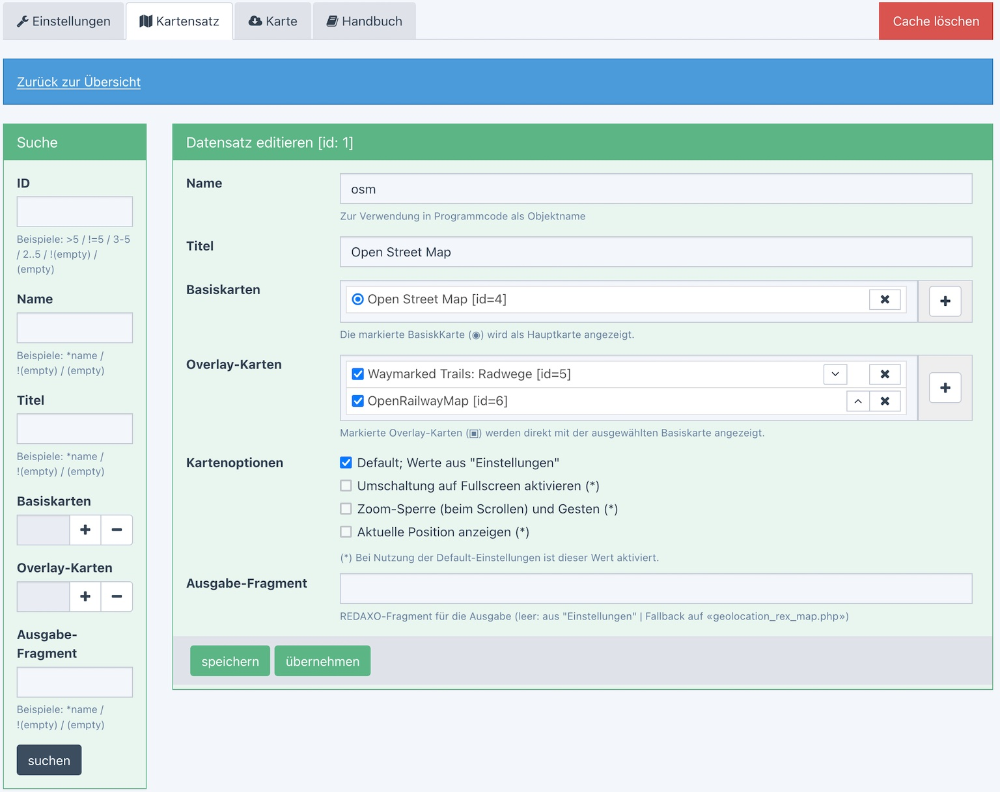
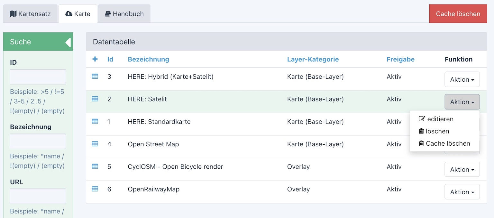
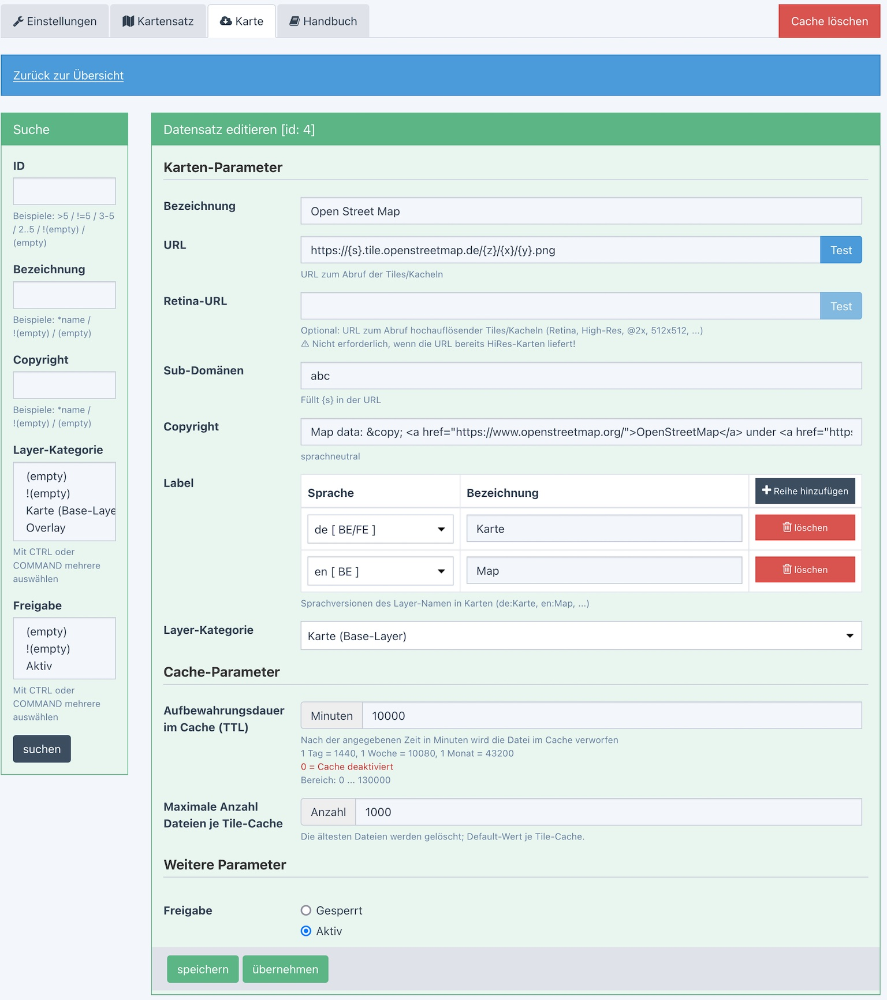

# Contribution to a planned<br>Geo-Addon for [REDAXO](https://redaxo.org) 5.13+

**Version 0.13.1 | 17.12.2021** - Änderungen siehe [Change-Log](CHANGELOG.md)

## Verwendung:

- Ideen-Beitrag für das [Geo](https://github.com/FriendsOfREDAXO/friendsofredaxo.github.io/issues/124)-Projekt von [Thomas Blum](https://github.com/tbaddade)
    - Tile-Proxy mit Cache
    - Custom-HTML-Element
- Ideen-Beitrag für das [Experimental-Proxy](https://github.com/FriendsOfREDAXO/experimental/tree/master/plugins/proxy)-Projekt
    - Tile-Proxy mit Cache
- Ansonsten zur gefälligen Benutzung
- benötigt [YForm](https://github.com/yakamara/redaxo_yform) 4.0+

>**nicht als [FOR](https://github.com/FriendsOfREDAXO-Addon)-Addon vorgesehen, es sollte m.E. nur __ein__ GEO-Addon bei FriendsOfREDAXO geben!**

## Quellen

Inspiriert von[Thomas Skerbis](https://github.com/skerbis) Addon "[osmproxy](https://github.com/FriendsOfREDAXO/osmproxy)" und gefüttert mit Ideen und Snippets aus anderen Addons und aus den Diskussionen dazu auf GitHub und im [Slack-Channel](https://friendsofredaxo.slack.com/).

Basiert [LeafletJS](https://leafletjs.com/) von [Vladimir Agafonkin](https://agafonkin.com/) und weiteren
Tools (siehe [CREDITS](CREDITS.md)).


## Features:

- Backend
    - [Karten-URLs](docs/admin.md#tile) zu Karten-Anbietern mit weiteren Parametern inkl. Sprachunterstützung und Cache-Verhalten
    - [Kartensätze](docs/admin.md#mapset) zusammenstellen und verwalten, die auf einer oder mehreren Karten-Urls basieren
    - Datenverwaltung mit YForm
    - [Proxy-Server](docs/proxy_cache.md#proxy) für Karten-Abrufe vom Browser
    - [Cache](docs/proxy_cache.md#cache) für Karten-Abrufe
    - Verschleierung der tatsächlichen Karten-Url ggü. dem Client / Schutz der ggf. kostenpflichtigen appId´s z.B. von Google oder HERE

- Frontend
    - LeafletJS als Kartensoftware integriert
    - Karten-HTML als [Custom-HTML-Element](#rm) `<rex-map .... ></rex-map>`
    - [Erweiterbare Tools](docs/devtools.md) zur Datendarstellung
    - Anwendungsbeispiel für [Module](docs/devphp.md#module)

- Demo
    - [Stand-alone-Demo](docs/example/demo.html) zur Demonstration des Custom-HTML-Elements und des Cache
    - *redaxo/src/addons/geolocation/docs/example/demo.html* bitte ins REDAXO-Root kopieren wg. der Pfade

- [Cache](docs/proxy_cache.md#cache)
    - Je Tile-URL ein eigenes Verzeichnis, separat löschbar
    - [Cronjob](docs/proxy_cache.md#cron) zum Aufräumen
        - Dateien löschen, die älter sind als die Time-to-live der Tile-URL
        - weitere ältere Dateien löschen wenn das Verzeichnis zu viele Dateien enthält

## Was fehlt?

- Karten interaktiv gestalten
- Zu einer Adresse oder die Koordinate ermitteln
- .....

## Installation

In das Verzeichnis `redaxo/src/addons/geolocation` entpacken und in der Addon-Verwaltung die
Installation durchführen.

Dabei werden Demo-Daten (4 Links zu Tile-Servern und 2 Kartensätze installiert). Die Here-Kartenlinks
sind ohne die nötige "appId", die nach Registrierung bei [HERE](https://developer.here.com/) erzeugt werden kann.
Die vorgesehene Stelle in der URL ist mit `..........` markiert.

Der Cronjob für die Cache-Bereinigung ist mit den Einstellungen
- Einmal am Tag (04:30)
- Backend/Frontend
- Scriptanfang
- aktiviert

Details - auch zu individualisierten Installationen - stehen in der [Installationsanleitung](docs/install.md)


## Beispielmasken:

### Allgemeine Konfiguration


### Kartensatz




### Layer-/Tile-Server




<a name="rm"></a>
### `<rex-map .... ></rex-map>`

Darstellung der Karte im Browser über ein [Custom-HTML-Element](docs/devphp#maphtml):

```html
<rex-map mapset="..." dataset="..."></rex-map>
```
Die Attribute sind zu Strings umgeformte Arrays/Objekte.

```html
<rex-map
    class="leaflet-map"
    mapset="[{&quot;tile&quot;:&quot;1&quot;,&quot;label&quot;:&quot;Karte&quot;,....}]"
    dataset="{&quot;position&quot;:[47.516669,9.433338],....}"
></rex-map>
```

Der JS-Code dazu ist ausbaufähig. Das HTML-Beispiel zeigt aber schon, wie mit setAttribute der Datensatz und die Kartenzusammenstellung ausgetauscht werden können.

Idee: komplexe interaktive Inputs für verschiedene Datensatz-Elemente in einer Web-Komponente gebündelt
```html
<rex-map-input class="..." name="..." value="«dataset»" tools="position,marker,bounds,..."></rex-map-input>
```


#### Datensatz

Die Karte wird über einen Datensatz gesteuert, der die relevanten Daten zur Karte enthält.

```javascript
datensatz = {
    position: [47.516669,9.433338],
    bounds: [[47.5,9.3],[47.7,9.7]],
    marker: [[47.611593,9.296344],[47.586204,9.560653],[47.54378,9.686559]],
}
```
Alle Angaben sind optional. Position ist der "Hauptmarker" in der Karte in rot. Alle anderen
zusätzlichen Marker sind blau. "Bounds" legt das Rechteck fest, dass auf jeden Fall in der
Karte sichtbar sein soll.

Grundidee: es gibt gleich strukturierte Klassen je "Tool", wobei alle Elemente im Datensatz (position,bounds,marker)
jeweils eine eigene Klasse haben. Die Klasse steuert die Anzeige auf der Karte toolspezifisch. Das System
ist einfach erweiterbar nur durch Bereitstellung einer neuen Toolklasse.


#### Kartensatz

Im Backend werden aus Layern(Tiles/Kacheln) Kartensätze zusammengestellt, die ihrerseits einen Datensatz bilden. Leaflet unterscheidet zwischen Basiskarten (type=b) und Overlays (type=o).
```javascript
kartensatz = [
    {
        "layer":"geolayer=1",
        "label":"Karte",
        "type" :"b",
        "attribution":"Map Tiles &copy; 2020 <a href=\"http:\/\/developer.here.com\">HERE<\/a>"
    },
    {
        "layer":"geolayer=2",
        "label":"Satelit",
        "type" :"b",
        "attribution":"Map Tiles &copy; 2020 <a href=\"http:\/\/developer.here.com\">HERE<\/a>"
    },
    {
        "layer":"geolayer=3",
        "label":"Hybrid",
        "type" :"b",
        "attribution":"Map Tiles &copy; 2020 <a href=\"http:\/\/developer.here.com\">HERE<\/a>"
    }
]
```
