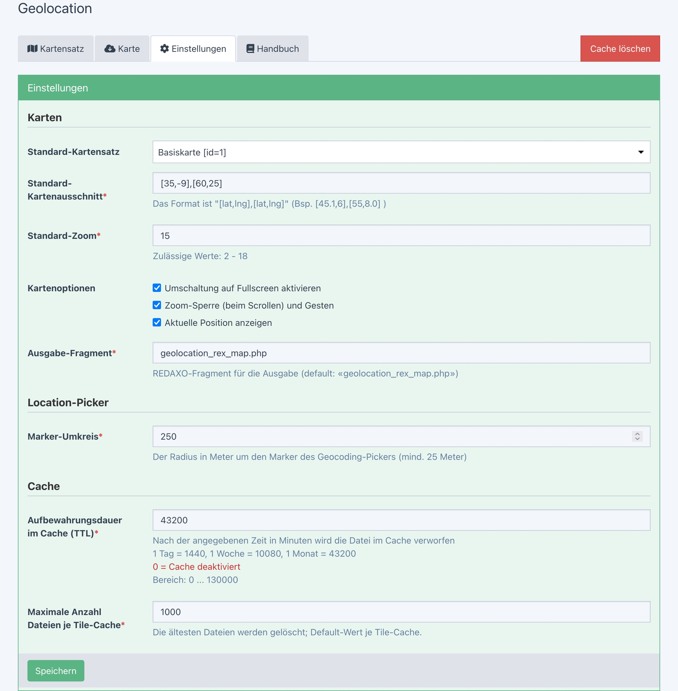

> - [Installation](install.md)
> - [Verwaltung und Konfiguration
> - [arten-Proxy und -Cache](proxy_cache.md)
> - Für Entwickler
>   - [PHP](devphp.md)
>   - [Javascript](devjs.md)
>   - [JS-Tools](devtools.md)

# Verwaltung und Konfiguration

## Inhalt

Die Konfigurationsseiten im Backend erlauben Grundeinstellungen, Karten eines Kartenanbieters und
deren Zusammenfassung zu Kartensätzen zu konfigurieren.

- [Einstellungen](#config)
- [Kartensatz](#mapset)
- [Karte](#tile)

<a name="config"></a>
## Einstellungen

Das Formular für allgemeine Einstellungen fasst Grundeinstellungen zusammen, die in anderen
Bereichen als Vorgabewerte herangezogen werden. Die Daten werden in der Systemkonfiguration (Tabelle
*rex_config*) gespeichert. Karten-Parameter werden direkt in die Javascript-Komponenten
übertragen, indem die [Asset-Dateien neu zusammengestellt](install.md#ownjscss) werden.



### Karten

**Hinweis:** Wenn das Addon als reines [Proxy-Addon](install.md#proxy) konfiguriert ist, sind die
Eingabefelder für Karten ausgeblendet.

Die Einstellungen sind Vorbelegungen bzw. für die Darstellung von Karten. Sofern **Geolocation**
nur als Karten-Proxy eingesetzt wird, sind die Einträge irrelevant.

- **Kartensatz**

    Der hier ausgewählte Kartensatz wird immer dann beim Aufbau einer Karte herangezogen, wenn
    kein individueller Kartensatz ausgewählt wurde bzw. dient als Vorbelegung in Auswahllisten.

    ```php
    // ID abrufen und Mapset öffnen
    $mapsetId = \rex_config::get(\Geolocation\ADDON,'default_map');
    $mapset = \Geolocation\mapset::get($mapsetId);

    // Mapset öffnen mit der Default-ID bzw. Fallback auf die Default-ID
    $mapset = \Geolocation\mapset::take();
    $mapsetId = $mapset->getId();
    ```

- **Kartenausschnitt**  
    Der angegebene Kartenausschnitt wird als Vorgabewert benutzt, wenn das Tool `bounds` keine
    gültigen Daten hat bzw. wenn die Karte anderweitig nicht auf einen gültigen Auschnitt
    positioniert werden kann.

    Die Angabe ist immer ein Satz aus zwei Koordinatenpaaren, die die gegenüberliegenden Ecken eines
    Rechtecks beschreiben. Die Schreibweise ist `[latA,lonA],[latB,lonB]`, also "Längengrad,
    Breitengrad".

    ```php
    // Koordinaten abrufen
    $bounds = \rex_config::get(\Geolocation\ADDON,'map_bounds');
    ```
    ```js
    // Koordinaten abrufen
    let bounds = Geolocation.default.bounds;
    ```

- **Zoom**  
    Der angegebene Zoom-Level wird als Vorgabewert benutzt. Zulässig sind Werte zwischen 2 und 18.

    ```php
    // Zoom-Level abrufen
    $zoom = \rex_config::get(\Geolocation\ADDON,'map_zoom');
    ```
    ```js
    // Zoom-Level abrufen
    let zoom = Geolocation.default.zoom;
    ```
    > Der Wert wird zur Zeit nicht benutzt, kann aber z.B. in eigenen Tools
    > ([Beispiel](devtools.md#tcenter) ) eingesetzt werden.

- **Kartenoptionen**  
    Die von **Geolocation** erzeugten Karten können mit unterschiedlichen Zusatzfunktionen versehen
    werden.

    - Im Zoom-Controll oben links in der Karte einen Button für Vollbild-Ansicht bereitstellen.
    - Eine Zoom-Sperre und Gestensteuerung aktivieren. Damit wird z.B. ungewollter Zoom beim
      Scrollen der Seite verhindert.
    - Im Zoom-Controll oben links in der Karte einen Button bereitstellen, über den die Karte auf
      die aktuell Position ausgerichtet wird.

    ```php
    // Liste der Optionen abrufen ('|fullscreen|gestureHandling|locateControl|')
    $options = \rex_config::get(\Geolocation\ADDON,'map_components');
    $hasFullscreen = false !== strpos($options,'|fullscreen|');
    $hasGestureHandling = false !== strpos($options,'|gestureHandling|');
    $hasLocateControl = false !== strpos($options,'|locateControl|');
    $optionsArray = explode('|',trim($options.'|'));
    ```
    ```js
    // Optionen abrufen (true/false)
    let hasFullscreen = Geolocation.default.mapOptions.fullscreen;
    let hasGestureHandling = Geolocation.default.mapOptions.gestureHandling;
    let hasLocateControl = Geolocation.default.mapOptions.locateControl;
    ```

- **Ausgabe-Fragment**  
    PHP-seitig verfügt **Geolocation** über leistungsfähige Methoden, das Karten-HTML einfach zu
    generieren. Dabei wird i.d.R. das Fragment *geolocation_rex_map.php* genutzt. Wenn eine andere
    HTML-Auslegung gewünscht ist, kann hier das alternative Standard-Fragment festgelegt werden.

    Die Eingabe darf nicht leer sein und muss auf `.php` enden.

    In den [Kartensätzen](#mapset_out) kann ein abweichendes Fragment als Default-Wert für den
    Kartensatz festgelegt werden.

    ```php
    // Default-Ausgabefragment abrufen
    // aus der Tabelle rex_config
    $fragment = \rex_config::get(\Geolocation\ADDON,'map_outfragment');
    // als Konstante
    $fragment = \Geolocation\OUT;
    ```

### Cache

Die hier angegebenen Werte dienen bei der Erfassung neuer Karten-Server als Vorbelegung für das
Cache-Verhalten.

- **Aufbewahrungsdauer im Cache (TTL)**  
    In Minuten wird angegeben, wie lange eine Datei im Cache verbleibt, bevor sie gelöscht wird.
    Dabei entsprechen
    - **0 = Cache ist deaktiviert**
    - 1440 = 1 Tag
    - 10080 = 1 Woche
    - 43200 = 1 Monat (30 Tage)

    Der Maximalwert ist 130000, also ein Quartal.
    ```php
    // Vorgabewert für die Time-to-live
    $ttl = \rex_config::get(\Geolocation\ADDON,'cache_ttl');
    // ... oder ...
    $ttl = \Geolocation\TTL_DEF;
    ```

- **Maximale Anzahl Dateien je Karten-Cache**  
    Um nicht insgesamt zu viel Plattenplatz mit Kartenbildern zu belegen, kann der Platz begrenzt
    werden über die Anzahl Dateien. Gelöscht wird erst über den [Cron-Job](proxy_cache.md#cron).

    Beim Speichern wird nicht überprüft, ob die Obergrenze erreicht ist. Erst der Cron-Job nutzt den
    Wert. Ein voller Cache (kein Plattenplatz) würde dazu führen, dass eine Datei nicht neu im Cache
    gespeichert wird; sie wird unabhängig vom Caching dennoch an den Client ausgeliefert.
    ```php
    // Vorgabewert für die maximale Anzahl Dateien im Cache
    $maxCacheFiles = \rex_config::get(\Geolocation\ADDON,'cache_maxfiles');
    // ... oder ...
    $maxCacheFiles = \Geolocation\CFM_DEF;
    ```

<a name="mapset"></a>
## Kartensatz

**Hinweis:** Wenn das Addon als reines [Proxy-Addon](install.md#proxy) konfiguriert ist, ist der
Bereich für Kartensätze ausgeblendet.

Kartensätze basieren auf einer oder mehreren Karten, die per Kartenanbieter-URLs bereitgestellt
werden. Jede URL bietet Zugriff auf einen Kartentyp, der auf der Karte als Layer erscheint.
Beispiel: Standardkarte, Satellitenbild, Kombination aus beidem.


- **Name**  
    > Der Name wird in späteren Versionen evtl. genutzt für JS-Klassen. Er muss daher angegeben
    > und eindeutig sein.

- **Titel**  
    Der Titel dient als prägnante Unterscheidung z.B. in der Kartensatz-Übersicht oder in
    Auswahlboxen für Kartensätze. Er muss angegeben und eindeutig sein.

- **Basiskarten / Overlay-Karten**  
    Die Unterscheidung von Basiskarten und Overlay-Karten reflektiert das Leaflet-Konzept. Wird
    **Geolocation** als Proxy für Karten eines anderen JS-Umfeldes genutzt, ist die Unterscheidung
    möglicherweise hinfällig. Nur wenn hier mehrere Karten ausgewählt sind, steht auch das
    Layer-Control zur Kartenauswahl in der Leaflet-Map zur Verfügung.

    In einer Leaflet-map kann immer nur ein Basiskarten-Layer aktiv sein. Im Unterschied dazu können
    mehrere Overlay-Karten auf dem aktuellen Basis-Layer übergeblendet werden.

    Das Widget ermöglicht die Auswahl von als Basiskarte bzw. als Overlay-Karte markierten
    Karten und deren Anordnung (Reihenfolge). In genau der Reihenfolge würden die Layer auf der
    Leaflet-Map bereitgestellt, der erste Basis-Layer wird zuerst aktiviert.

    ```php
    // Mapset abrufen (::get(id) bzw. ::take())
    $mapset = \Geolocation\mapset::get( $mapsetId );
    // Kartendaten (Layer) abrufen
    $layerset = $mapset->getLayerset();
    ```
    ```
    array:3 [▼
        0 => array:4 [▼
            "layer" => "geolayer=1"
            "label" => "Karte"
            "type" => "b"
            "attribution" => "Map Tiles &copy; 2020 <a href="http://developer.here.com">HERE</a>"
        ]
        1 => array:4 [▼
            "layer" => "geolayer=2"
            "label" => "Satelit"
            "type" => "b"
            "attribution" => "Map Tiles &copy; 2020 <a href="http://developer.here.com">HERE</a>"
        ]
        2 => array:4 [▼
            "layer" => "geolayer=3"
            "label" => "Hybrid"
            "type" => "b"
            "attribution" => "Map Tiles &copy; 2020 <a href="http://developer.here.com">HERE</a>"
        ]
    ]
    ```

- **Kartenoptionen**  
    Die von **Geolocation** erzeugten Karten können mit unterschiedlichen Zusatzfunktionen versehen
    werden. Die Standardwerte für alle Karten sind in den allgemeinen [Einstellungen](#config)
    vorbelegt.

    Hier kommt eine zusätzliche Checkbox **"Default; Werte aus Einstellungen"** in´s Spiel.
    Damit kann ausdrücklich die Grundeinstellung aktiviert werden; ändert sich die Grundeinstellung
    gilt es auch für diesen Kartensatz.

    ```php
    // Mapset abrufen (::get(id) bzw. ::take())
    $mapset = \Geolocation\mapset::take();
    // Liste der Optionen abrufen ('|fullscreen|gestureHandling|locateControl|')
    $mapOptions = $mapset->getMapOptions();
    ```


- <a name="mapset_out"></a>**Ausgabe-Fragment**  
    PHP-seitig verfügt **Geolocation** über einfach zu nutzende Methoden, das Karten-HTML zu
    generieren. Dabei wird i.d.R. das hier für diesen Kartensatz angegebene Fragment genutzt. Bleibt
    das Feld leer wird statt dessen das in den [allgemeinen Einstellungen](#config) hinterlegte
    Standard-Fragment genutzt.

    Wenn angegeben muss der Name auf `.php` enden.

    ```php
    // Mapset abrufen (::get(id) bzw. ::take())
    $mapset = \Geolocation\mapset::take( $mapsetId );
    // Ausgabe-Fragment abrufen inkl. Fallback
    $outFragment = $mapset->getOutFragment();
    ```

<a name="tile"></a>
## Karte

Diverse Kartenanbieter stellen URLs zur Verfügung, über die Karten unterschiedlichster Inhalte
abgerufen werden können. In diesem Formular werden solche URLs mit begleitenden Parametern erfasst.
Basierend darauf werden über eine Koordinatenangabe (x, y) und dem Zoom-Faktor (z) die Kacheln bzw.
Tiles genannten Kartenschnipsel abgerufen.

Das jeweilige Präsentationsmodul (z.B. LeafletJS) errechnet x, y und z und fügt sie in die
[Proxy-URL](proxy_cache.md#url) ein. Der interne Proxy übernimmt die Umsetzung in die Abruf-URL des
Kartenanbieters.


### Karten-Parameter

- **Bezeichnung**  
    Die Bezeichnung dient als prägnante Unterscheidung z.B. in der Karten-Übersicht oder in
    Auswahlboxen für Karten. Sie muss angegeben und eindeutig sein.

- **URL**  
    Der konkrete Aufbau der URL wird vom Kartenanbieter auf dessen Webseiten kommuniziert. Innerhalb
    der URL werden die Stellen, an denen die Parameter x, y und z stehen, mit `{x}`, `{y}` und `{z}`
    markiert. Sofern der Anbieter URLs mit Sub-Domänen verarbeitet, wird die entsprechende
    Stelle mit `{s}` markiert.

- **Sub-Domänen**  
    Die Sub-Domänen sind einzelne Ziffern oder Buchstaben, die als Zeichenfolge eingegeben werden.
    Beim Abruf eines Tiles mit der URL wird `{s}` durch eines der Zeichen, zufällig ausgewählt,
    ersetzt.

- **Copyright**  
    Der Copyright-Text wird i.d.R. vom Kartenanbieter vorgegeben und sollte übernommen werden. In
    den von **Geolocation** erzeugten Karten wird der Text unten rechts eingeblendet.

- **Label**  
    In der Layer-Auswahl der Karte werden die Namen der Karte angezeigt. Für die verschiedenen
    Sprachen können hier die Texte eingegeben werden. Alle für Backenend (BE) bzw. Frontend (FE)
    verfügbaren Sprachen sind auswählbar. Jede Sprache darf nur einmal belegt werden.
    Die erste Sprache in der Liste gilt als Default bzw. Fallback.

    ```php
    // Layer-Datensatz aufrufen
    $layer = \Geolocation\layer::get( $layerId );
    // Label passen zur aktuellen FE/BE-Sprache ermitteln
    $label = $layer->getLabel()
    ```

- **Layer-Kategorie**  
    LeafletJS unterscheidet bei den Karten-Layern zwischen Basiskarten und Overlay-Karten.
    Der Typ der Karte wird hier ausgewählt, was zugleich die Auswahlzuordnung beim Kartensatz
    steuert.

Die Daten für den Kartenaufbau werden für eine einzelne Karte oder für einen Kartensatz (z.B. von
`$mapset->getLayerset()` so abgerufen:

```php
// Layer-Datensatz aufrufen
$layer = \Geolocation\layer::get($id);
// Layer-Konfiguration zum Kartenaufbau abrufen
$layerConfig = $layer->getLayerConfig();
// oder Layer-Konfiguration für mehrere Layer zum Kartenaufbau abrufen (nur online)
$layerConfigSet = \Geolocation\layer::getLayerConfigSet( [1,2,3] );
```
```
array:4 [▼
    "layer" => "geolayer=1"
    "label" => "Karte"
    "type" => "b"
    "attribution" => "Map Tiles &copy; 2020 <a href="http://developer.here.com">HERE</a>"
]
```

### Cache-Parameter

Die Werte dienen bei der Steuerung des Cache-Verhaltens für den Proxy. Die Default-Werte für neue
Karten sind in den [Einstellungen](#config) vorbelegt.

- **Aufbewahrungsdauer im Cache (TTL)**  
    In Minuten wird angegeben, wie lange eine Datei im Cache verbleibt, bevor sie gelöscht wird.
    Dabei entsprechen
    - **0 = Cache ist deaktiviert**
    - 1440 = 1 Tag
    - 10080 = 1 Woche
    - 43200 = 1 Monat (30 Tage)

    Der Maximalwert ist 130000, also ein Quartal.

- **Maximale Anzahl Dateien je Tile-Cache**  
    Um nicht insgesamt zu viel Plattenplatz mit Kartenbildern zu belegen, kann der Platz begrenzt
    werden über die Anzahl Dateien. Gelöscht wird erst über den [Cron-Job](proxy_cache.md#cron).
    Ein voller Cache (kein Plattenplatz) würde dazu führen, dass eine Datei nicht neu im Cache
    gespeichert wird. Sie wird dennoch an den Client ausgeliefert; die Proxy-Funktionalität ist
    nicht beeinträchtigt. (nur [Proxy](proxy_cache.md#proxy) ohne [Cache](proxy_cache.md#cache))   

### Weitere Parameter

- **Freigabe**  
    Über den Parameter wird festgelegt, ob die Karte freigegeben ist zur Nutzung oder nicht.
    Der Status kann mit `\Geolocation\layer::get($id)->isOnline()` abgefragt werden. Abrufe des
    Layerset mit `\Geolocation\layer::get($id)->getLayerConfigSet(...)` bzw. mit indirekt über
    `\Geolocation\mapset::take( $mapsetId )->getLayerset()` berücksichtigt den Status.
