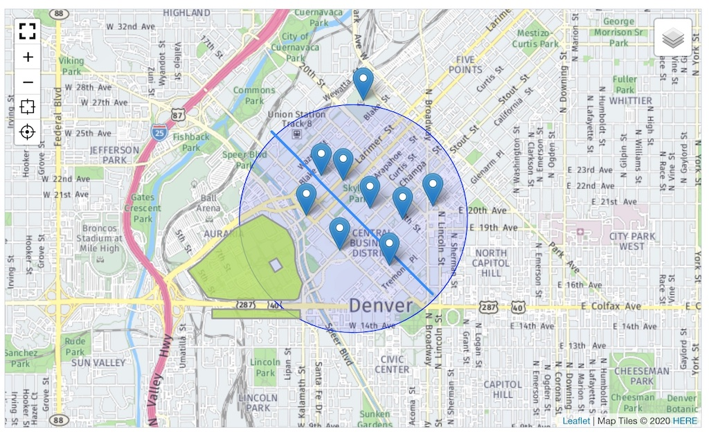
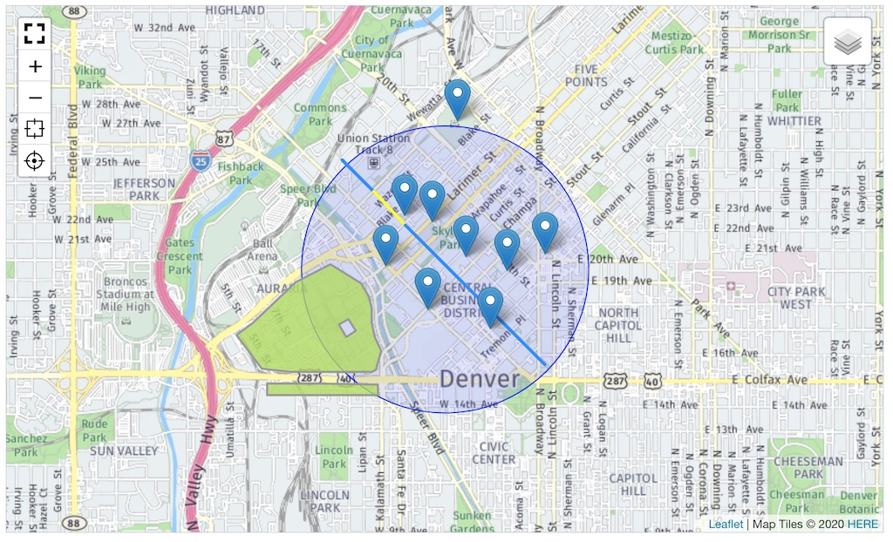
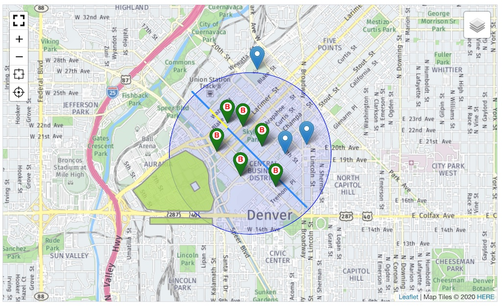
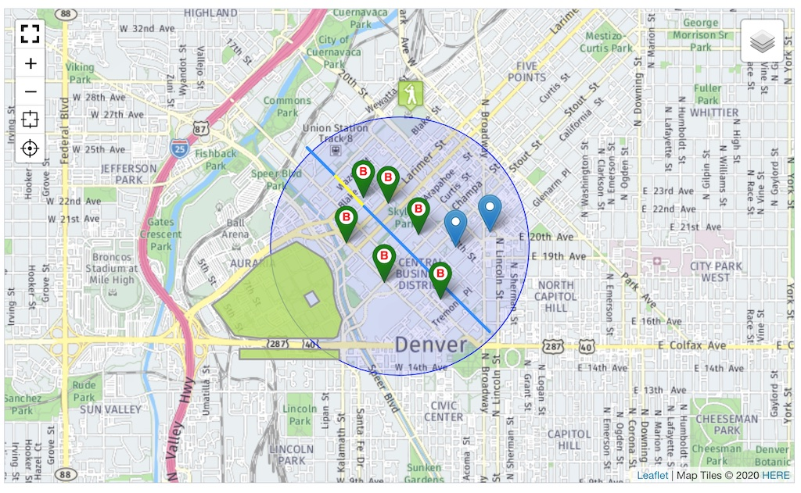

> - Installation und Einstellungen
>   - [Installation](install.md)
>   - [Einstellungen](settings.md)
> - [Kartensätze verwalten](mapset.md)
> - [Karten/Layer verwalten](layer.md)
> - [Karten-Proxy und -Cache](proxy_cache.md)
> - [Für Entwickler](devphp.md)
>   - [PHP](devphp.md)
>   - [Javascript](devjs.md)
>   - [JS-Tools](devtools.md)
>   - geoJSON
>   - [Rechnen (PHP)](devmath.md)

# Für Entwickler &dash; geoJSON und Kartentools

<a name="konzept"></a>
## Das Konzept

Das [geoJSON-Format](https://tools.ietf.org/html/rfc7946) ist eine standardisierte Form, Geo-Daten
als Datensatz darzustellen. Auf PHP-Seite ist es ein Array, auf der JS-Seite ein Objekt.

Einen Anwendungsüberblick liefert das [Tutorial](https://blog.codecentric.de/2018/03/geojson-tutorial/)
von [codecentric](https://www.codecentric.de/). Kenntnisse über geoJSON und die kleinen Unterschiede
zu LeafLetJS (z.B. `[lng,lat]` statt `[lat,lng]`) wird vorausgesetzt.

Diese Dokumentation setzt auf dem [Anwendungsbeispiel](https://leafletjs.com/examples/geojson/) in
der Leaflet-Dokumentation auf. Die Beispieldaten liegen als PHP-Array in der Datei
`redaxo/src/addons/geolocation/docs/example/geojsson_data.php`. Sie können einfach in ein Script (z.B.
Modul-Output) eingebunden werden:

```php
include \rex_path::addon(\Geolocation\ADDON,'docs/example/geojson_data.php');
dump(get_defined_vars());
```

```
^ array:6 [▼
    "__stream" => "rex:///module/7/output"
    "geosonLightRailStop" => array:2 [▶]
    "geojsonFreeBus" => array:2 [▶]
    "geojsonBicycleRental" => array:2 [▶]
    "geojsonCoorsField" => array:3 [▶]
    "geojsonCampus" => array:3 [▶]
]
```

> [Der Code für die Tools](#custom) ist in der Dokumentation enthalten. Die Datei
> `redaxo/src/addons/geolocation/docs/example/geolocation.js` enthält die Beispiele und kann als
> Basis für eigene Erweiterungen dienen.

> Im Modulbeispiel wird das [Tool "center"](devtools.md#tcenter) benötigt, das ebenfalls in der
> Beispieldatei enthalten ist.


## Das JS-Tool "geojson"

Im Javascript von **Geolocation** ist bereits ein "geoJSON"-Tool enthalten. Es überträgt einen
Datensatz im geoJSON-Format auf die Karte. Die eigentliche Ausführung übernimmt LeafLet mit einer
Universalmethode `L.geoJSON( geojsonData, options )`. Der Code in einem Demo-Ausgabemodul ist
übersichtlich:

```php
include \rex_path::addon(\Geolocation\ADDON,'docs/example/geojson_data.php');
$position = [39.747,-104.995];  // lat,lng
$zoom = 14;
$radius = 1000;
$color = 'blue';
echo $rex_map = \Geolocation\Mapset::take( )
    ->attributes( 'class', 'mymapclass' )
    ->dataset( 'center', [$position,$zoom,$radius,$color])
    ->dataset( 'geojson', [$geosonLightRailStop,$geojsonFreeBus,$geojsonBicycleRental,$geojsonCoorsField,$geojsonCampus] )
    ->parse();
```

Die Daten werden nach einer Art "best guess" auf der Karte platziert. Ein Punkt ist ein Punkt - ob
es eine Bushaltestelle ist oder eine Sehenswürdigkeit kann Leaflet nicht unterscheiden und setzt
daher immer einen einfachen Marker bzw. zeichnet Objekte im Standardformat. Der zweite Parameter
`options` ermöglicht optische Anpassungen gemäß Datenkontext. Dazu später mehr.



Die Tool-Klasse baut auf [`Geolocation.Tools.Template`](devtools.md#tools2) auf.

```javascript
Geolocation.Tools.GeoJSON = class extends Geolocation.Tools.Template
{
    setValue( geojsonData ){
        super.setValue( geojsonData );
        if( this.map ) {
            let map = this.map;
            this.remove();
            this.map = map;
        }
        this.geojsonLayer = L.geoJSON(
            geojsonData,
            this.setOptions( {style:this._style,onEachFeature:this._eachFeature} )
        );
        if( this.map ) this.show( this.map );
        return this;
    }
    show( map ){
        super.show( map );
        this.geojsonLayer.addTo( map );
        return this;
    }
    remove(){
        this.geojsonLayer.removeFrom(this.map);
        super.remove();
        return this;
    }
    getCurrentBounds(){
        return this.geojsonLayer.getBounds(); //rect;
    }
    //--- Sonderfunktionen
    setOptions( options ) {
        return options;
    }
    _style(feature) {
        return feature.properties && feature.properties.style;
    }
	_eachFeature(feature, layer) {
        let popupContent = feature.properties.popupContent || null;
        if( popupContent ) {
    		layer.bindPopup(popupContent);
        }
	}
}
Geolocation.tools.geojson = function(...args) { return new Geolocation.Tools.GeoJSON(args); };
```

Zwei Optionen sind bereits vorbelegt und nutzen über eine Klassenmethode Elemente im Datensatz.

- `style` / `_style`: feature.properties.style wird wenn vorhanden zur Formatierung benutzt. `style`wird nicht für alle Datentypen automatisch abgerufen. Ein Point z. B. kann nicht vis `style` formatiert werden. (siehe pointToLayer)
- `onEachFeature` / `_eachFeature`: Allen Elementen mit der Property `feature.properties.popupContent` wird ein Popup dieses Textes hinzugefügt.

Wie dieses Verhalten geändert oder erweitert werden kann, zeigen die nachfolgenden Beispiele eigener
geoJSON-Tools. Ein weiteres Beispiel ist in der [Demo-Modul](devphp.md#module) zu finden.


<a name="custom"></a>
## Custom-Tools &dash; geoJSON-Erweiterungen

Eigene Erweiterungen der Kartentools sind einfach möglich. Ein eigenes [Kapitel](devtools.md) in der
Dokumentation beschreibt ihren Grundaufbau und wie sie in den JS-Code von **Geolocation** integriert
werden.

Alle weiteren Tools sind spezialisierte Tools zur Anzeige der Demo-Datensätze. Sie sind nicht
allgemeingültig gedacht, bieten aber verschiedene Ansätze zur Entwicklung eigener Tools. Für
individuelle Karten muss i.d.R. eh eigener JS-Code geschrieben werden.

Für jeden der fünf Demo-Datensätze, der eine individuelle Darstellung erfordert, muss ein Tool
geschrieben werden.

### Buslinien ("geojsonfreebus")

Im Datensatz `$geojsonFreeBus` gibt es in den Properties das Flag `"underConstruction" => true|false`.
Für Streckenabschnitte "under construction" soll eine gelbe Linie zeichnet werden.

```
"properties" => array:3 [▼
    "popupContent" => "This is a free bus line that will take you across downtown."
    "underConstruction" => true
]
```

Ansatzpunkt ist die Methode `_style` im JS-Tool "geojson". In einer abgeleiteten Klasse wird die
Methode überschrieben und setzt die Farbe auf gelb.

```js
Geolocation.Tools.GeojsonFreeBus = class extends Geolocation.Tools.GeoJSON
{
    _style(feature) {
        // Normale Linie
        let style = super._style(feature) || {};
        // Sonderfall "Linie under Construction"
        if( feature.properties && true === feature.properties.underConstruction ) {
            style.color = 'yellow';
        }
        return style;
    }
}
Geolocation.tools.geojsonfreebus = function(...args) { return new Geolocation.Tools.GeojsonFreeBus(args); };
```
Das neue Tool wird als `dataset` mit den Daten zur Buslinie verknüpft der Karte zugeordnet:

```php
include \rex_path::addon(\Geolocation\ADDON,'docs/example/geojson_data.php');
$position = [39.747,-104.995];  // lat,lng
$zoom = 14;
$radius = 1000;
$color = 'blue';
echo $rex_map = \Geolocation\Mapset::take( )
    ->attributes( 'class', 'mymapclass' )
    ->dataset( 'center', [$position,$zoom,$radius,$color])
    ->dataset( 'geojson', [$geosonLightRailStop,$geojsonBicycleRental,$geojsonCoorsField,$geojsonCampus] )
    ->dataset( 'geojsonfreebus', $geojsonFreeBus )
    ->parse();
```



Alternative: In diesem Fall - Formatieren grafischer Elemente - kann bereits im PHP-Datensatz ein
`style`-Element in die Properties eingefügt werden, das vom Basistool "geolocation"
verarbeitet wird:

```php
foreach( $geojsonFreeBus['features'] as &$fb ) {
    if( true === ($fb['properties']['underConstruction'] ?? false) ) {
        $fb['properties']['style'] = ['color'=>'yellow'];
    }
}
```


### Fahradverleihstationen ("geojsonbicyclerental")

Im Datensatz `$geojsonBicycleRental` finden sich die Positionen von Fahrradverleihstationen.
Statt eines normalen Kartenmarkers soll ein grüner Marker mit einem "B" angezeigt werden.

LeafletJS nutzt dazu die Option `pointToLayer:callback`. Im Normalfall wird ein Standard-Marker
gesetzt. Über die Option kann eine eigene Funktion bereitgestellt werden, die ein beliebiges
grafisches Element für den Punkt zurückgibt (Marker, Circle, ...). Da diese Option noch nicht
im Tool "geojson" vorgesehen ist, muss sie zusätzlich aktiviert werden. Die Methode `setOptions`
ermöglicht Änderungen im Optionssatz.

```js
Geolocation.Tools.GeojsonBicycleRental = class extends Geolocation.Tools.GeoJSON
{
    icon = Geolocation.svgIconPin( 'green', 'B', 'red' )

    setOptions( options ) {
        // pointToLayer:callback hinzufügen
        options.pointToLayer = this._pointToLayer.bind(this);
        return options;
    }
    _pointToLayer(feature, latlng) {
        return L.marker( latlng,{icon:this.icon} );
    }
}
Geolocation.tools.geojsonbicyclerental = function(...args) { return new Geolocation.Tools.GeojsonBicycleRental(args); };
```
Das neue Tool wird als `dataset` mit den Daten der Verleihstationen verknüpft der Karte zugeordnet:

```php
include \rex_path::addon(\Geolocation\ADDON,'docs/example/geojson_data.php');
$position = [39.747,-104.995];  // lat,lng
$zoom = 14;
$radius = 1000;
$color = 'blue';
echo $rex_map = \Geolocation\Mapset::take( )
    ->attributes( 'class', 'mymapclass' )
    ->dataset( 'center', [$position,$zoom,$radius,$color])
    ->dataset( 'geojson', [$geosonLightRailStop,$geojsonCoorsField,$geojsonCampus] )
    ->dataset( 'geojsonfreebus', $geojsonFreeBus )
    ->dataset( 'geojsonbicyclerental', $geojsonBicycleRental )
    ->parse();
```




### Baseball-Stadion ("geojsoncoorsfield")

Im Datensatz `$geojsonCoorsField` ist nur ein einziger Eintrag, die Position des Baseball-Stadions
Coors Field. Für dieses Element soll ein spezieller Marker basierend auf einer Grafikdatei
angezeigt werden. Die Datei ist im Asset-Ordner.

Auch hier wird wie in "geojsonbicyclerental" auf `pointToLayer` zurückgegriffen, jedoch mit einem
komplett eigenen Icon:

```js
Geolocation.Tools.GeojsonCoorsField = class extends Geolocation.Tools.GeoJSON
{
    setOptions( options ) {
        // pointToLayer:callback hinzufügen
        options.pointToLayer = this._pointToLayer.bind(this);
        return options;
    }
    _pointToLayer(feature, latlng) {
        return L.marker( latlng,{
            icon: L.icon({
        		iconUrl: Geolocation.sPath + '/images/baseball-marker.png',
        		iconSize: [32, 37],
        		iconAnchor: [16, 37],
        		popupAnchor: [0, -28]
        	})
        } );
    }
}
Geolocation.tools.geojsoncoorsfield = function(...args) { return new Geolocation.Tools.GeojsonCoorsField(args); };
```
Das neue Tool wird als `dataset` mit den Daten des Coors Field verknüpft der Karte zugeordnet:

```php
include \rex_path::addon(\Geolocation\ADDON,'docs/example/geojson_data.php');
$position = [39.747,-104.995];  // lat,lng
$zoom = 14;
$radius = 1000;
$color = 'blue';
echo $rex_map = \Geolocation\Mapset::take( )
    ->attributes( 'class', 'mymapclass' )
    ->dataset( 'center', [$position,$zoom,$radius,$color])
    ->dataset( 'geojson', [$geosonLightRailStop,$geojsonCampus] )
    ->dataset( 'geojsonfreebus', $geojsonFreeBus )
    ->dataset( 'geojsonbicyclerental', $geojsonBicycleRental )
    ->dataset( 'geojsoncoorsfield', $geojsonCoorsField )
    ->parse();
```


