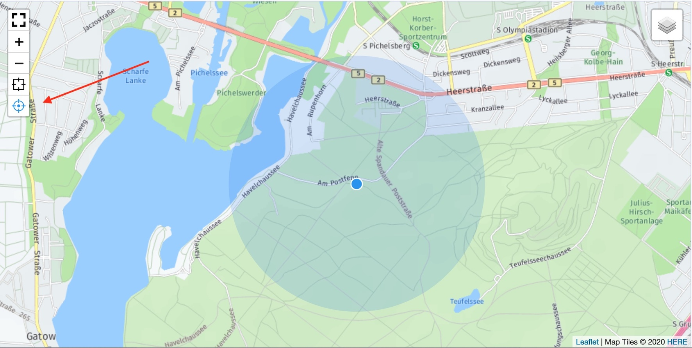

> - Installation und Einstellungen
>   - [Installation](install.md)
>   - [Einstellungen](settings.md)
> - [Kartensätze verwalten](mapset.md)
> - [Karten/Layer verwalten](layer.md)
> - [Karten-Proxy und -Cache](proxy_cache.md)
> - [Für Entwickler](devphp.md)
>   - [PHP](devphp.md)
>   - Javascript
>   - [JS-Tools](devtools.md)
>   - [geoJSON](devgeojson.md)
>   - [Rechnen (PHP)](devmath.md)

# Für Entwickler &dash; Javascript

<a name="namespace"></a>
## Namespace **Geolocation**

Ähnlich wie LeafletJS alle Komponenten (Objekte, Variablen, Klassen, Funktionen) in einer Variablen
`L` als Objekt sammelt, gibt es eine Objekt-Variable `Geolocation`. Alle Objekte, Variablen, Klassen
und Funktionen des Geolocation-Kosmos sind hier an definierter Stelle eingehängt.

```javascript
var Geolocation = {

    default: {},    // Default-Werte

    icon: {},       // Icons (SVG)

    Classes: {},    // Klassen
    classes: {},    // Factory-Funktionen für Klassen

    Tools: {},      // Die Klassen für Map-Tools
    tools: {},      // Factory-Funktionen für Map-Tools

};
```

Die spezifischen Klassen werden z.B. als `Geolocation.Classes.«Klasse»` definiert. Zusätzlich kann
als `Geolocation.classes.«klasse»` eine Factory-Funktion bereitgestellt werden. Dieses Schema ist
aus Leaflet entlehnt: für die Factory-Funktionen ist das erste Zeichen ein Kleinbuchstabe.

Meist wird es so aussehen:

```javascript
Geolocation.Classes.Xyz = class {
    ...
}
Geolocation.classes.xyz = function(...args) {
    return new Geolocation.Classes.Xyz (args);
}
```

In gleicher Weise werden **Tools** definiert, die die eigentlichen Karteninhalte darstellen. Über
neue Tools kann der Leistungsumfang einfach erweitert werden.

Da es sich um eine eigene Gruppe von Klassen handelt, die für den Aufbau der Karteninhalte nötig
sind, gibt es für sie eigene Container. Die wichtige Regel hier ist: für die Factory-Funktionen sind
insgesamt nur Kleinbuchstaben zulässig.

Weitere Informationen und Beispiele sind in einem [eigenen Kapitel](devtools.md) beschrieben.

<a name="def"></a>
## Defaut-Werte anpassen

Die Vorgabewerte werden an verschiedenen Stellen in den diversen **Geolocation**-Klassen genutzt.
Bei jeder Änderung der [Einstellungen](settings.md) werden die Assets neu generiert und die
aktuellen Einstellungen in die jeweiligen Platzhalter `%«name»%` geschrieben.

```js
var Geolocation = {

    default: {  // Default-Werte
                mapOptions:
                    {
                        minZoom:%zoomMin%,
                        maxZoom:%zoomMax%,
                        scrollWheelZoom:true,
                        gestureHandling:%defaultGestureHandling%,
                        locateControl: %defaultLocateControl%,
                        fullscreen:%defaultFullscreen%
                    },
                bounds: [%defaultBounds%],
                boundsRect: {fill:false,stroke:false},
                zoom: %defaultZoom%,
                locationMarker:
                    {
                        className:   'geolocation-locate-location',
                        weight:      3,
                        radius:      9
                    },
                locationMarkerCircle:
                    {
                        className:   'geolocation-locate-accuracy',
                    },
            },

    icon: {},       // Icons (SVG)

    Classes: {},    // Klassen
    classes: {},    // Factory-Funktionen für Klassen

    Tools: {},      // Die Klassen für Map-Tools
    tools: {},      // Factory-Funktionen für Map-Tools

    lang: {},       // Sprachen / Textübersetzung
    cLang: (window.navigator.userLanguage || window.navigator.language).substr(0,2),

    sPath: document.currentScript.src.substr(0,document.currentScript.src.lastIndexOf('/')+1),
};
```
<a name="def1"></a>
### Dauerhafte Änderungen

Grundlegende, also dauerhafte Änderungen der Default-Werte sollten nach fogenden Regeln erfolgen:
- Über die [Einstellungen](settings.md) geänderte Werte (`%«name»%`) sollten nicht noch einmal
  geändert werden. Dafür sind die _Einstellungen_ da.
- Alle anderen Änderungen der Defaultwerte sollten möglichst früh, also unmittelbar nach dem
  JS-Basiscode geladen werden. Das Verfahren an sich ist im Kapitel zur
  [Installation](install.md#ownjscss) beschrieben.

Im einfachen Fall wird eine Datei *redaxo/data/addons/geolocation/geolocation.js* mit dem eigenen
Custom-Code bereitgestellt. Sie wird bei jeder Neugenerierung der Assets automatisch geladen.
(außer es gibt ein Script *redaxo/data/addons/geolocation/load_assets.php*).

```js
/* Custom-JS */
// Im Backend das Bounds-Rechteck sichtbar machen
if( 'object' === typeof(rex) && true === rex.backend ){
    Geolocation.default.boundsRect={color:"#ff7800",weight:1,fillOpacity: 0.1};
}
```

<a name="def2"></a>
### Änderungen "on the fly"

Darüber hinaus ist es auch möglich, fallweise andere Einstellungen auszulösen, indem der JS-Code
zeitlich nach dem Geolocation-JS im HTML ausgegeben wird.

<a name="lm"></a>
### Location-Marker ändern

Im Zoom-Control der Karte oben links ist optional ein Button "Locate" (en) bzw. "Standort" (de), mit
dem die Karte auf die aktuelle Position des Devices positioniert wird. Das Aussehen des Markers kann
über die Klassen `geolocation-locate-location` und `geolocation-locate-accuracy` umkonfiguriert
werden bzw. durch Überschreiben der _locationMarker_-Einträge in den Default-Einstellungen.



<a name="lang"></a>
## Sprachanpassung (i18n)

Die interne Sprache ist Englisch, wie man am Zoom-Control sehen kann: "Zoom In" bzw. "Zoom Out".
Im Source-Code sind die Texte in einen i18n-Funktionsaufruf gekapselt:

```JS
... Geolocation.i18n('Zoom In') ...
```

Die Funktion `Geolocation.i18n` prüft in einer Textliste, ob für die eingestellte Sprache ein
Ersatztext vorkommt. Der gefundene Text wird zurückgemeldet, sonst das Original.

Die Textliste ist ein JS-Datenobjekt mit dem Sprachkürzel als oberstem Index und den englischen
Texten (kleingeschrieben) als Subindex.

```JS
Geolocation.lang = {
    de: {
            'home': 'Home',
            'fullscreen on': 'Vollbild ein',
            'fullscreen off': 'Vollbild aus',
            'zoom in': 'Vergrößern',
            'zoom out': 'Verkleinern',
            'locate': 'Standort',
        },
}
```

Der Browser ermittelt die aktuelle Sprache beim Initialisieren des **Geolocation**-JS.

```js
Var Geolocation = {
    ...
    cLang: (window.navigator.userLanguage || window.navigator.language).substr(0,2),
};
```

Die Übersetzungstabelle kann individuell bestückt werden z.B. mit den in der REDAXO-Instanz
vorgesehenen Sprachen. Die Sprachtabelle kann entweder im HTML mit ausgegeben werden oder
[in das JS kompiliert werden](install.md#ownjscss) (empfohlen).

Ggf. muss der automatisch ermittelte Sprachcode (Browser-Sprache) überschrieben werden, z.B. wenn
der Anwender im System eine andere Sprache ausgewählt hat. In dem Fall muss auf Basis der
eingestellten Sprache `Geolocation.cLang` im HTML der Seite überschrieben werden.

```HTML
<script type="text/javascript">
    Geolocation.cLang = '<?= \rex_clang::getCurrent()->getCode()?>';
</script>
```

<a name="evt"></a>
## Events

Die Events werden stets auf dem DOM-Element der Karte (Kartencontainer) ausgelöst. In `e.detail`
wird die Leaflet-Karteninstanz sowie der HTML-Container der Karte (i.d.R. also eine
`<rex-map>`-Instanz) zurückgegeben.

```JS
document.addEventListener( 'geolocation.create', function(e){
    console.log(e.detail.map);
    console.log(e.detail.container);
},false);
```

<a name="evtcreate"></a>
### geolocation.create

Die Karte kann auf Wunsch auch direkt als Leaflet-Karte ohne Zwischenschaltung von
**Geolocation**-Tools verwaltet werden. Dazu muss die Leaflet-Instanz identifiziert werden.
**Geolocation** triggert einen Custom-Event auf auf dem Karten-Container, nachdem die Karte geladen
wurde. Tatsächlich ist es ein verlängerter Load-Event der Leaflet-Karte.

```js
this.map.on( 'load', function(e){
    ...
    document.dispatchEvent(
        new CustomEvent('geolocation.create', { 'detail':{'container':container, 'map':this.map} })
    );
}, this);
```

Der Event wird von der `<rex-map>`-Instanz (Karten-Container) abgefeuert, während die Instanz
angelegt wird. Da der Event aufsteigt, kann er aber auf Ebene `document` abgefangen werden. Im
Event-Handler können weitere Aktionen und Events z.B. auf die Karte oder auf den Container gelegt
werden.

Hier ein Anwendungsbeispiel:

```JS
document.addEventListener( 'geolocation.create', function(e){
    if ( 'myid' === e.detail.container.id ){
        // Leaflet-Event "zoomend" belegen
        e.detail.map.on('zoomend', function(e){
            alert( Geolocation.i18n('Zoom finished') );
        });
        // setData abfangen
        e.detail.container.addEventListener( 'geolocation.setData', function(e){
            alert( Geolocation.i18n('Map updated') );
        },false);
    }
},false);
```

<a name="evtsetdata"></a>
### geolocation.setData

Der Event wird ausgelöst, wenn der Karte ein neuer Dataset hinzugefügt wurde. Der alte Dataset wurde
entfernt, die Tools des neuen Dataset auf die Karte geschrieben.

```JS
document.addEventListener( 'geolocation.setData', function(e){
    if ( 'myid' === e.detail.container.id ){
        alert( Geolocation.i18n('Map updated') );
    }
},false);
```

<a name="div"></a>
## &lt;div> statt &lt;rex-map>

**Geolocation** baut die Karte mittels eines Custom-HTML-Elements `<rex-map>` auf. Diese
HTML-Elemente werden von den relevanten Browsern im hier nötigen Umfang weitgehend
[unterstützt](https://caniuse.com/custom-elementsv1). Andere Browser können möglicherweise mittels
Pollyfill die Custo.HTML-Elemente anbieten oder das Standardfragment muss durch ein Fragment mittel
klassischem `<div>` als Map-Container ersetzt werden.

Unter weitgehender Nutzung der **Geolocation**-Struktur sind zwei Eingriffe notwendig:

- Ein neues REX-Fragment
- CSS zur Grundformatierung des Karten-Containers
- JS zur Initialisierung

CSS und JS können wie in der [Installationsbeschreibung](install.md#ownjscss) erklärt in das
**Geolocation**-JS bzw. -CSS kompiliert werden.

Das Fragment muss in einem zugänglichen, update-sicheren Verzeichnis liegen (z.B.im Projekt-Addon).
Das Fragment sollte als Default-Fragment in den [Einstellungen](settings.md) eingetragen
werden bzw. in der [individualisierten Installation](install.md#parameter).

### REX-Fragment

Das REX-Fragment zum Aufbau des kompletten HTML-Tags heißt *geolocation_rex_map.php* und wird per
default in allen [automatischen Prozessen](devphp.md#output) zum Aufbau der Karte genutzt. Zur
Nutzung eines div-Tags benötigt man ein Fragment, in dem lediglich die letzte Zeile zur Ausgabe des
Tags ausgetauscht wird.

Original:
```php
// Fragment-Variablen auswerten

...

// HTML-Tag generieren
echo '<rex-map',\rex_string::buildAttributes($attributes),'></rex-map>';
```

Der neue Code ist dem alten sehr ähnlich. Zusätzlich erhält der Tag ein Attribut `rex-map`, über
dass JS die Tags identifizieren kann, ohne dass man auf eine konkrete ID oder eine Klasse
zurückgreifen muss.

```php
// Fragment-Variablen auswerten wie in geolocation_rex_map.php

...

// HTML-Tag generieren
echo '<div rex-map ',\rex_string::buildAttributes($attributes),'></div>';
```

### CSS zur Grundformatierung des Karten-Containers

Leaflet-Karten erfordern, dass dem Container-Tag eine Mindesthöhe mitgegeben ist. Die Default-Höhe
eine DIV-Tags ist "0". Der Tag wird im CSS wie zuvor beschrieben über das Attribut `rex-map`
identifiziert.

```css
div[rex-map] {
    height:500px;
    border: 1px solid #c1c9d4; // $btn-default-border;
}
```

### JS zur Initialisierung

Eine allgemeine Initialisierung muss die infrage kommenden Container finden. Angenommen, die
Container werden über ein Attribut `rex-map` identifiziert, sähe der Code so aus:

```JS
document.addEventListener('DOMContentLoaded', (event) => {
    document.querySelectorAll( '[rex-map"]' ).forEach( (rm) => Geolocation.initMap( rm ) );
});
```

Prinzipiell gäbe es auch die Möglichkeit, das JS ebenfalls im Fragment ausgeben zu lassen.
Diesmal wird eine eindeutige Kennung erzeugt, über die der Karten-Container zur Initialisierung
identifiziert wird:

```php
// Fragment-Variablen auswerten wie in geolocation_rex_map.php

...

// HTML-Tag generieren
$id = 'rm-' . md5(microtime());
echo <<<CODE
<script type="text/javascript">
    document.addEventListener('DOMContentLoaded', (event) => {
        let rex_map = document.querySelector( '[rex-map="$id"]' );
        if( rex_map ) {
            Geolocation.initMap( rex_map );
        }
    });
</script>
CODE;
echo '<div rex-map="',$id,'" ',\rex_string::buildAttributes($attributes),'></div>';
```

<a name="wiw"></a>
## Wo ist was?

### Leaflet-Karteninstanz

Die Instanz der Karte und die Instanz des HTML-Containers könne [wie beschrieben](#evt) über einen
Event ermittelt werden.

Innerhalb des Containers findet sich eine Instanz `container.__rmMap` der Klasse
`Geolocation.Classes.Map`. Sie stellt auf dem Container die spezifische **Geolocation**-Funktionalität
bereit, z.B. den Inhalt des _datatset_-Attributes in die Karte zu überführen.

```JS
let container = document.getElementById( 'mymap' );
let leatletMap = container.__rmMap.map;
```

### Aktive Tools auf der Karte

```JS
let container = document.getElementById( 'mymap' );
let currentTools = container.__rmMap.tools;
```

### Liste der zulässigen Tools (Namen)

```JS
let tools = Object.keys(Geolocation.tools);
```

### Script-Pfad

```JS
let scriptPath = Geolocation.sPath;
```

Falls eigene Scripte, die in die Datei _geolocation.min.js_ kompiliert wurden, Ressourcen im
Asset-Verzeichnis zuverlässig finden sollen.
