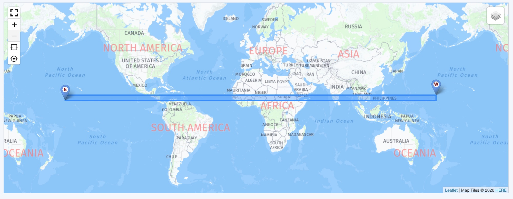
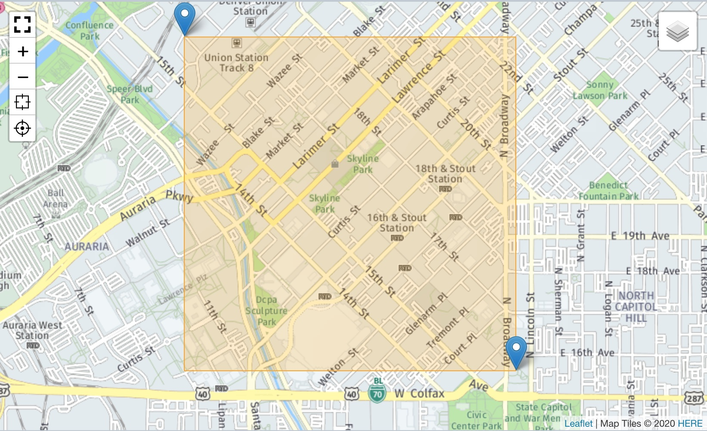
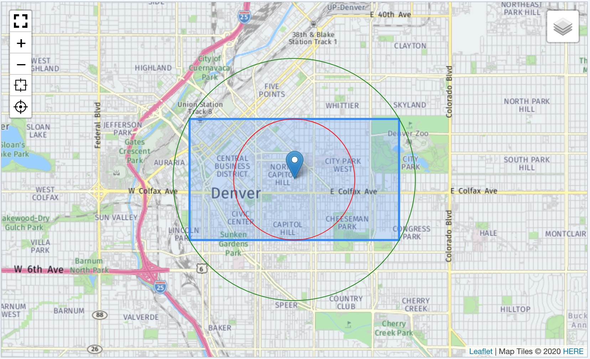
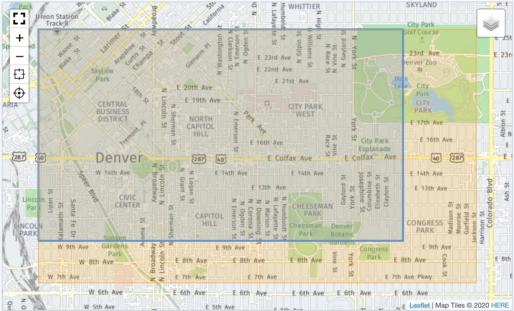

> - Installation und Einstellungen
>   - [Installation](install.md)
>   - [Einstellungen](settings.md)
> - [Kartensätze verwalten](mapset.md)
> - [Karten/Layer verwalten](layer.md)
> - [Karten-Proxy und -Cache](proxy_cache.md)
> - [Für Entwickler](devphp.md)
>   - [PHP](devphp.md)
>   - [Javascript](devjs.md)
>   - [JS-Tools](devtools.md)
>   - [geoJSON](devgeojson.md)
>   - Rechnen (PHP)

# Für Entwickler &dash; Rechnen mit Koordinaten (PHP)

## Die Erde ist eine Kugel - oder auch nicht

Die Erde ist ein [Rotationselipsoid](https://de.wikipedia.org/wiki/Rotationsellipsoid), also eine an
den Polen leicht abgeflachte Kugel. Das macht Rechenoperationen mit Koordinaten sowie die Abbildung
der kugeligen Realität noch etwas kompliziert.

In **Geolocation** ist die PHP-Bibliothek [**phpGeo**](https://github.com/mjaschen/phpgeo) von
[Markus Jaschen](https://github.com/mjaschen) enthalten. Sie stellt eine Reihe von Klassen zur
Verwaltung von und Rechnen mit Koordinaten (`Coordinate`), Rechtecken (`Bounds`) etc. im Namespace
`\Location` zur Verfügung. **Geolocation** baut darauf auf und stellt drei eigene Klassen bereit,
die erweiterte Funktionen im Namespace `\Geolocation` bereitstellen.

- `class Point`: Verwaltet einen geografischen Punkt
    - Factory-Methoden für verschiedene Quelldaten-Formate inkl. Zeichenketten
    - Ausgabe in verschiedenen Zielformaten
    - Rechenoperatinen (Distanz/Richtung/Ziel)
- `class Box`: Verwaltet einen rechteckigen Bereich
    - Anlegen aus zwei gegeüberliegenden Eckpunkten (Point)
    - Abfrage diverser Daten (Eckpunkte, Nord/Süd/Ost/West)
    - Rechenoperationen (Außenkreis, Innenkreis, Zentrum, Contains, ExtendBy)
- `class Math`: Auf phpGeo aufbauend eine Schnittstelle zu gängigen Rechenoperationen
    - Richtung und Distanz zwischen zwei Punkten
    - Formatumwandlung

<a name="caveat"></a>
## Hinweise

Leaflet selbst als Tool für die Darstellung hat Einschränkung in Bezug auf die
[Datumslinie](https://de.wikipedia.org/wiki/Datumsgrenze) oder präziser, dem dortigen Meridian
&#177;180°. Eine Box mit den Koordinaten `[[10,170],[15,-170];]` hat keine gezeichnete Breite von 20
Längengraden über den Datumsgrenzen-Meridian, sondern von 340 Längengraden über den Null-Meridian.



Andererseits berechnen die hier eingesetzten mathematischen Methoden eine Distanz von 553 km zwischen
den gegenüberliegenden Ecken; eindeutig die kürzeste Distanz über die Datumsgrenze.

Mit der Annahme, dass die mit diesem Addon gezeichneten Karten ohnehin fast ausschließlich deutlich
kleinere Bereiche abdecken, wird auf eine gesonderte Behandlung der geschilderten Problematik
aus Vereinfachungsgründen verzichtet.

(Wer möchte kann sich gerne einbringen und die Klassen entsprechend erweitern.)

Wenn Parameter außerhalb der Gültigkeitsbereiche liegen (z.B. > 90°N) oder in Berechnungen zu
ungültige Koordinaten führen würden, wird eine `InvalidParameter`-Exception ausgeworfen.


<a name="point"></a>
## class **Point**

### factory()

> static function factory( array $point, $keyLat, $keyLng ): self

Das ist die Basismethode zum Anlegen eines Punktes. Die (numerischen) Koordinaten müssen als Array
angegeben werden. Je nach Kontext gibt es verschiedene Varianten. LeafletJS z.B. behandelt Länge und
Breite anders als geoJSON (`[$lat,$lng]` vs. `[$lng,$lat]`).

Die konkreten Schlüssel (Array-Key) werden als Parameter `$keyLat, $keyLng` übergeben.

Beispiele:
- $point = Point::factory( [$lat,$lng], 0, 1 ); // LeafletJS
- $point = Point::factory( [$lng,$lat], 1, 0 ); // geoJSON
- $point = Point::factory( ['lat'=>$lat,'lng'=>$lng], 'lat', 'lng' ); // Text-Keys

```php
use \Geolocation\Calc\Point;

$coordinate = ['lat'=>39.753838434606,'lng'=>-105.00341892242];
$point = Point::factory( $coordinate, 'lat', 'lng' );

dump(get_defined_vars());
```
```
"coordinate" => array:2 [▼
    "lat" => 39,753838434606
    "lng" => -105,00341892242
]
"point" => Geolocation\Calc\Point {#391 ▼
    #lat: 39,753838434606
    #lng: -105,00341892242
}
```

### byLatLng()

> static function byLatLng( array $point ): self

### byLngLat()

> static function byLngLat( array $point ): self

Aus einem Array numerischer Werte wird der Punkt angelegt. Das Array muss entweder
LeafletJS-kompatibel sein (`[0=>latitude,1=>longitude]`) oder geoJSON-kompatibel
(`[0=>longitude,1=>latitude]`).

```php
use \Geolocation\Calc\Point;

$coordinate = [39.753838434606,-105.00341892242];
$reverse = [-105.00341892242,39.753838434606];

$leafletJS = Point::byLatLng( $coordinate );
$geoJSON = Point::byLngLat( $reverse );

dump(get_defined_vars());
```
```
"coordinate" => array:2 [▼
    0 => 39,753838434606
    1 => -105,00341892242
]
"reverse" => array:2 [▼
    0 => -105,00341892242
    1 => 39,753838434606
]
"leafletJS" => Geolocation\Calc\Point {#391 ▼
    #lat: 39,753838434606
    #lng: -105,00341892242
}
"geoJSON" => Geolocation\Calc\Point {#395 ▼
    #lat: 39,753838434606
    #lng: -105,00341892242
}
```


### byText()

> static function byText( string $point ): self

Die Koordinaten werden aus einem Textfeld ermitelt. Die Auswertung erfolgt mit
\Location\Factory\CoordinateFactory nach "Best Guess". Die Routine erkennt zahlreiche Varianten,
kommt aber irgendwann an ihre Grenzen. Für weitere Informationen sei auf die
[Original-Dokumentation](https://github.com/mjaschen/phpgeo/blob/master/docs/700_Parsing_and_Input/110_Coordinates_Parser.md)
verwiesen.

Sofern die Einzelwerte nicht aus der Schreibweise als Länge bzw. Breite erkannt werden können, gilt
die Reihenfolge "Länge,Breite".

```php
use \Geolocation\Calc\Point;

$ddString = '[39.753838434606,-105.00341892242]';
$dmsString = '39° 45′ 13.818″ N,105° 00′ 12.308″ W';
$pointA = Point::byText( $ddString );
$pointB = Point::byText( $dmsString );

dump(get_defined_vars());
```
```
"ddString" => "[39.753838434606,-105.00341892242]"
"dmsString" => "39° 45′ 13.818″ N,105° 00′ 12.308″ W"
"pointA" => Geolocation\Calc\Point {#391 ▼
    #lat: 39,753838434606
    #lng: -105,00341892242
}
"pointB" => Geolocation\Calc\Point {#395 ▼
    #lat: 39,753838333333
    #lng: -105,00341888333
}
```

### lat()

> function lat( ?int $precision=null ): float

### lng()

> function lng( ?int $precision=null ): float

Die Methode liefert die geografische Breite bzw. Länge des Koordinatenpunktes. Sofern `$precision`
angegeben ist, wird die Anzahl der Nachkommastellen reduziert. Das hilt, das Datenvolumen zu
reduzieren, da spätestens nach der sechsten Stelle die Darstellungsgenauigkeitauf der Karte meist
nicht mehr zunimmt.

```php
use \Geolocation\Calc\Point;

$coordinate = [-105.00341892242,39.753838434606];
$point = Point::byLngLat( $coordinate );

$latitude = $point->lat(6);
$longitude = $point->lng();

dump(get_defined_vars());
```
```
"coordinate" => array:2 [▼
    0 => -105,00341892242
    1 => 39,753838434606
]
"point" => Geolocation\Calc\Point {#391 ▼
    #lat: 39,753838434606
    #lng: -105,00341892242
}
"latitude" => 39,753838
"longitude" => -105,00341892242]
```

### latLng()
> function latLng( ?int $precision=null ): float

### lngLat()

> function lngLat( ?int $precision=null ): float

Die Methode liefert die geografische Breite bzw. Länge des Koordinatenpunktes. Sofern `$precision`
angegeben ist, wird die Anzahl der Nachkommastellen reduziert.

```php
use \Geolocation\Calc\Point;

$coordinate = [39.753838434606,-105.00341892242];
$point = Point::byLatLng( $coordinate );

$leafletJS = $point->latLng( 6 );
$geoJSON = $point->lngLat( );

dump(get_defined_vars());
```
```
"coordinate" => array:2 [▼
    0 => 39,753838434606
    1 => -105,00341892242
]
"point" => Geolocation\Calc\Point {#391 ▼
    #lat: 39,753838434606
    #lng: -105,00341892242
}
"leafletJS" => array:2 [▼
    0 => 39,753838
    1 => -105,003419
]
"geoJSON" => array:2 [▼
    0 => -105,00341892242
    1 => 39,753838434606
]
```

### pos()

> function pos( $keyLat, $keyLng, ?int $precision=null ): array

Die Funktion ist das Gegenstück zu `Point::factory` und erlaubt, die Koordinaten in ein beliebig
indiziertes Array zu überführen. Sofern `$precision` angegeben ist, wird die Anzahl der
Nachkommastellen reduziert. Die beiden Werte erhalten die in `$keyLat,$keyLng` angegebenen Schlüssel.

```php
use \Geolocation\Calc\Point;

$coordinate = [39.753838434606,-105.00341892242];
$point = Point::byLatLng( $coordinate );
$position = $point->pos( 'latitude', 'longitude', 8 );


dump(get_defined_vars());
```
```
"coordinate" => array:2 [▼
    0 => 39,753838434606
    1 => -105,00341892242
]
"point" => Geolocation\Calc\Point {#391 ▼
    #lat: 39,753838434606
    #lng: -105,00341892242
}
"position" => array:2 [▼
    "latitude" => 39,75383843
    "longitude" => -105,00341892
]
```

### text()

> function text( int $formatter=self::DD, ?string $delimiter=null, ?int $precision=null ): string

Die Funktion ist das Gegenstück zu `Point::byText` und erlaubt, die Koordinaten in eine Zeichenkette
zu überführen. Sofern `$precision` angegeben ist, wird die Anzahl der Nachkommastellen bei der
Ausgabe reduziert. Drei Ausgabeformate sind möglich:

- `Point::DD`: Grad mit Dezimalstellen => `39.753838434606,-105,00341892242`
- `Point::DM`: Grad | Minuten mit Dezimalstellen => `39° 45.2303′,-105° 0.2051′`
- `Point::DMS`: Grad | Minuten | Sekunden mit Dezimalstellen => `39° 45′ 13.818″ N,105° 00′ 12.308″ W`

Zahlen erhalten einen Dezimalpunkt, kein Komma.

```php
use \Geolocation\Calc\Point;

$coordinate = [39.753838434606,-105.00341892242];
$point = Point::byLatLng( $coordinate );

$dd = $point->text( Point::DD );
$dm = $point->text( Point::DM, null, 4 );
$dms = $point->text( Point::DMS, ',', 3 );

dump(get_defined_vars());
```
```
"coordinate" => array:2 [▼
    0 => 39,753838434606
    1 => -105,00341892242
]
"point" => Geolocation\Calc\Point {#391 ▼
    #lat: 39,753838434606
    #lng: -105,00341892242
}
"dd" => "39.753838434606 -105.00341892242"
"dm" => "39° 45.2303′ -105° 0.2051′"
"dms" => "39° 45′ 13.818″ N,105° 00′ 12.308″ W"
```

### geoJSON()

> function geoJSON( ?int $precision=null ): array

Die Methode erzeugt einen Point-Eintrag für einen geoJSON-Datensatz. Ohne individuelle Formatierung
wird LeafletJS lediglich einen Punkt-Marker setzen. Sofern `$precision` angegeben ist, wird die
Anzahl der Nachkommastellen bei der Ausgabe reduziert.


```php
use \Geolocation\Calc\Point;
use \Geolocation\Calc\Box;

$point = Point::byLatLng( [39.741052354709,-104.98689651489] );

$dataset = [
    'type' => 'FeatureCollection',
    'features' => [
        0 => [
            'type' => 'Feature',
            'geometry' => $point->geoJSON(),
            'properties' => [],
        ],
   ]
];

dump(get_defined_vars());
```
```
"point" => Geolocation\Calc\Point {#396 ▼
    #lat: 39,741052354709
    #lng: -104,98689651489
}
"dataset" => array:2 [▼
    "type" => "FeatureCollection"
    "features" => array:1 [▼
        0 => array:3 [▼
            "type" => "Feature"
            "geometry" => array:2 [▼
                "type" => "Point"
                "coordinates" => array:2 [▼
                    0 => -104,98689651489
                    1 => 39,741052354709
                ]
            ]
            "properties" => []
        ]
    ]
]
```

### distanceTo()

> function distanceTo( self $point ): float

Die Funktion ermittelt die kürzeste Distanz in Meter zwischen `$point` und dem als Parameter angegebenen
Zielpunkt. Die Distanz wird auf dem [Großkreis](https://de.wikipedia.org/wiki/Gro%C3%9Fkreis)
ermittelt.

```PHP
use \Geolocation\Calc\Point;

$northWest = [39.753838434606,-105.00341892242];
$southEast = [39.741052354709,-104.98689651489];
$NW = Point::byLatLng( $northWest );
$SE = Point::byLatLng( $southEast );

$distanz = $NW->distanceTo( $SE );

dump(get_defined_vars());
```
```
"northWest" => array:2 [▼
    0 => 39,753838434606
    1 => -105,00341892242
]
"southEast" => array:2 [▼
    0 => 39,741052354709
    1 => -104,98689651489
]
"NW" => Geolocation\Calc\Point {#391 ▼
    #lat: 39,753838434606
    #lng: -105,00341892242
}
"SE" => Geolocation\Calc\Point {#395 ▼
    #lat: 39,741052354709
    #lng: -104,98689651489
}
"distanz" => 2005,167
```

### bearingTo()

> function bearingTo( self $point ): float

Die Funktion ermittelt die Kompassrichtung der kürzesten Distanz zum Zielpunkt `$point` bei der
"Abfahrt" (am Ausgangspunkt) auf dem Großkreis (0°...360°).

### bearingAt()

> function bearingAt( self $point ): float

Die Funktion ermittelt die Kompassrichtung der kürzesten Distanz zum Zielpunkt `$point` bei der
"Ankunft" (am Zielpunkt) auf dem Großkreis (0°...360°).

```PHP
use \Geolocation\Calc\Point;

$northWest = [39.753838434606,-105.00341892242];
$southEast = [39.741052354709,-104.98689651489];
$NW = Point::byLatLng( $northWest );
$SE = Point::byLatLng( $southEast );

$brearingTo = $NW->bearingTo( $SE );
$bearingAt = $NW->bearingAt( $SE );

dump(get_defined_vars());
```
```
"northWest" => array:2 [▼
    0 => 39,753838434606
    1 => -105,00341892242
]
"southEast" => array:2 [▼
    0 => 39,741052354709
    1 => -104,98689651489
]
"NW" => Geolocation\Calc\Point {#391 ▼
    #lat: 39,753838434606
    #lng: -105,00341892242
}
"SE" => Geolocation\Calc\Point {#395 ▼
    #lat: 39,741052354709
    #lng: -104,98689651489
}
"brearingTo" => 135,06623096152
"bearingAt" => 135,07679546701
```

### moveBy()

> function moveBy( float $bearing, float $distance ): self

Aus den Parametern Distanz (in Meter) und Kompasskurs (0°...360°) am Ausgangspunkt wird der
Zielpunkt über den Großkreis berechnet.

```PHP
use \Geolocation\Calc\Point;

$northWest = [39.753838434606,-105.00341892242];
$bearing = 135.06623096152;
$distance = 2005.167;
$NW = Point::byLatLng( $northWest );

$SE = $NW->moveBy( $bearing, $distance );

dump(get_defined_vars());
```
```
"northWest" => array:2 [▼
    0 => 39,753838434606
    1 => -105,00341892242
]
"bearing" => 135,06623096152
"distance" => 2005,167
"NW" => Geolocation\Calc\Point {#391 ▼
    #lat: 39,753838434606
    #lng: -105,00341892242
}
"SE" => Geolocation\Calc\Point {#394 ▼
    #lat: 39,741052353721
    #lng: -104,98689651361
}
```

### equals()

> function equals( self $point, float $allowedDistance=0.1 ): bool

Die Funktion ermittelt, ob der Abstand zum Referenzpunkt nicht größer ist als die zulässige Distanz,
angegeben in Meter. Der Vorgabewert ist 10 cm. Je nach Zoom-Faktor können so zu vernachlässigende
Punkte ermittelt werden.

```PHP
use \Geolocation\Calc\Point;

$NW = Point::byLatLng( [39.753838434606,-105.00341892242] );
$SE = Point::byLatLng( [39.741052354709,-104.98689651489] );
$distanceA = 2005;
$distanceB = 2005.167;
$targetA = $NW->moveBy( 135.06623096152, $distanceA );
$targetB = $NW->moveBy( 135.06623096152, $distanceB );
$SE_equals_A = $targetA->equals( $SE );
$SE_equals_B = $targetB->equals( $SE );

dump(get_defined_vars());
```
```
"NW" => Geolocation\Calc\Point {#391 ▼
    #lat: 39,753838434606
    #lng: -105,00341892242
}
"SE" => Geolocation\Calc\Point {#395 ▼
#coord: Location\Coordinate {#393 ▼
    #lat: 39,741052354709
    #lng: -104,98689651489
}
"distanceA" => 2005
"distanceB" => 2005,167
"targetA" => Geolocation\Calc\Point {#397 ▼
    #lat: 39,741053418707
    #lng: -104,98689788943
}
"targetB" => Geolocation\Calc\Point {#399 ▼
    #lat: 39,741052353721
    #lng: -104,98689651361
}
"SE_equals_A" => false
"SE_equals_B" => true
```

### extendBox()

> function extendBox( Box $box ): self

Der Punkt wird der Box hinzugefügt. Liegt der Punkt außerhalb der Box, wird die Box entsprechend
vergrößert. Die neue Breite der Box muss unter 180° liegen. Ansonsten wird eine `InvalidBoxException`
ausgelöst. Es ist nicht notwendig, vorher [isInBox()](#isinbox) abzufragen.


```php
use \Geolocation\Calc\Point;
use \Geolocation\Calc\Box;

$corner = Point::byLatLng( [39.753838434606,-105.00341892242] );
$oppositeCorner = Point::byLatLng( [39.75189180397,-105.0008225441] );
$coordinate = Point::byLatLng( [39.741052354709,-104.98689651489] );

$rectA = Box::byCorner( $corner, $oppositeCorner );
$rectB = clone $rectA;
$coordinate->extendBox( $rectB );

dump(get_defined_vars());
```
```
"corner" => Geolocation\Calc\Point {#391 ▼
    #lat: 39,753838434606
    #lng: -105,00341892242
}
"oppositeCorner" => Geolocation\Calc\Point {#395 ▼
    #lat: 39,75189180397
    #lng: -105,0008225441
}
"coordinate" => Geolocation\Calc\Point {#398 ▼
    #lat: 39,741052354709
    #lng: -104,98689651489
}
"rectA" => Geolocation\Calc\Box {#399 ▼
    #nw: Geolocation\Calc\Point {#402 ▼
        #lat: 39,753838434606
        #lng: -105,00341892242
    }
    #se: Geolocation\Calc\Point {#405 ▼
        #lat: 39,75189180397
        #lng: -105,0008225441
    }
}
"rectB" => Geolocation\Calc\Box {#407 ▼
    #nw: Geolocation\Calc\Point {#417 ▼
        #lat: 39,753838434606
        #lng: -105,00341892242
    }
    #se: Geolocation\Calc\Point {#419 ▼
        #lat: 39,741052354709
        #lng: -104,98689651489
    }
}
```
<a name="isinbox"></a>
### isInBox()

> function isInBox( Box $box ): bool

Die Funktion liefert TRUE, wenn der Punkt Teil der Box ist.

```php
use \Geolocation\Calc\Point;
use \Geolocation\Calc\Box;

$corner = Point::byLatLng( [39.753838434606,-105.00341892242] );
$oppositeCorner = Point::byLatLng( [39.75189180397,-105.0008225441] );
$coordinate = Point::byLatLng( [39.741052354709,-104.98689651489] );

$rect = Box::factory( [$corner, $oppositeCorner] );
$coordinate->isInBox( $rect );

dump(get_defined_vars());
```
```
"corner" => Geolocation\Calc\Point {#391 ▼
    #lat: 39,753838434606
    #lng: -105,00341892242
}
"oppositeCorner" => Geolocation\Calc\Point {#395 ▼
    #lat: 39,75189180397
    #lng: -105,0008225441
}
"coordinate" => Geolocation\Calc\Point {#398 ▼
    #lat: 39,741052354709
    #lng: -104,98689651489
}
"rectA" => Geolocation\Calc\Box {#399 ▼
    #nw: Geolocation\Calc\Point {#402 ▼
        #lat: 39,753838434606
        #lng: -105,00341892242
    }
    #se: Geolocation\Calc\Point {#405 ▼
        #lat: 39,75189180397
        #lng: -105,0008225441
    }
}
"isInBox" => false
```

<a name="box"></a>
## class **Box**

Das Problem bei Boxen (Leaflet: 'bounds' bzw. 'rect') ist das Überschreiten der Datumslinie, also
dass sich die Box über die Datumslinie bei  &#177;180° geografischer Länge erstreckt. Daher gelten
hier für Boxen vereinfachende Annahmen:

- Eine Box muss weniger als 180° Längengrade in der Breite umfassen.
- Die Eck-Koordinaten werden so umgerechnet, dass stets die Ecke mit dem kleineren Längengrad die
  westliche Grenze ergibt und der größere Längengrad die östliche Grenze.
- Punkte, mit Distanzen zwischen westlicher und östlicher Grenze ab 180° werden abgelehnt und eine
  `InvalidBoxException` ausgelöst.

I.d.R sind das keine relevanten Einschränkungen, da Boxen selten so groß sein dürften und meist
Europa abdecken.

### factory()

> static function factory( array $points ): self

Boxen werden aus eine Liste (array) von Punkten erzeugt. Aus den Punkten werden die jeweils größten
und kleinsten Werte (Nord/Süd, Ost/West) ermittelt, die dann die Eck-Koordinaten ergeben.

```php
use \Geolocation\Calc\Point;
use \Geolocation\Calc\Box;

$bikeRental = [
    Point::byLngLat(-104,9998241,39,7471494),
    Point::byLngLat(-104,9983545,39,7502833),
    Point::byLngLat(-104,9963919,39,7444271),
];

$rect = Box::factory( $bikeRental );

dump(get_defined_vars());
```
```
"bikeRental" => array:3 [▼
    0 => Geolocation\Calc\Point {#391 ▼
        #lat: 39,7471494
        #lng: -104,9998241
    }
    1 => Geolocation\Calc\Point {#395 ▼
        #lat: 39,7502833
        #lng: -104,9983545
    }
    2 => Geolocation\Calc\Point {#398 ▼
        #lat: 39,7444271
        #lng: -104,9963919
    }
]
"rect" => Geolocation\Calc\Box {#399 ▼
    #nw: Geolocation\Calc\Point {#402 ▼
        #lat: 39,7502833
        #lng: -104,9998241
    }
    #se: Geolocation\Calc\Point {#405 ▼
        #lat: 39,7444271
        #lng: -104,9963919
    }
}
```

### byCorner()

> static function byCorner( Point $cornerA, Point $cornerB ): self

Die Box wird aus Punkten zwei diagonal gegenüberliegenden Punkten erzeugt.

```php
use \Geolocation\Calc\Point;
use \Geolocation\Calc\Box;

$northWest = [39.753838434606,-105.00341892242];
$southEast = [39.741052354709,-104.98689651489];
$NW = Point::byLatLng( $northWest );
$SE = Point::byLatLng( $southEast );

$rect = Box::byCorner( $SE, $NW );

dump(get_defined_vars());
```
```
"northWest" => array:2 [▼  
    0 => 39,753838434606  
    1 => -105,00341892242  
]
"southEast" => array:2 [▼
    0 => 39,741052354709
    1 => -104,98689651489
]
"NW" => Geolocation\Calc\Point {#391 ▼
    #lat: 39,753838434606
    #lng: -105,00341892242
}
"SE" => Geolocation\Calc\Point {#395 ▼
    #lat: 39,741052354709
    #lng: -104,98689651489
}
"rect" => Geolocation\Calc\Box {#396 ▼
    #nw: Geolocation\Calc\Point {#399 ▼
        #lat: 39,753838434606
        #lng: -105,00341892242
    }
    #se: Geolocation\Calc\Point {#402 ▼
        #lat: 39,741052354709
        #lng: -104,98689651489
    }
}
```

### byInnerCircle()

> static function byInnerCircle( Point $center, float $radius ): self

Die Box wird aus dem Mittelpunkt und einem darum gezogenen Kreis gebildet. Die Box umschließt den
Kreis. Der Radius (in Meter) ist die Distanz vom Mittelpunkt auf der SN- bzw. WE-Achse zum
Mittelpunkt der Box-Seiten.

```php
use \Geolocation\Calc\Point;
use \Geolocation\Calc\Box;

$center = Point::byLatLng( [39.747445394658,-104.99515771866] );
$radius = 710;
$rect = Box::byinnerCircle( $center, $radius );

dump(get_defined_vars());
```
```
"center" => Geolocation\Calc\Point {#394 ▼
    #lat: 39,747445394658
    #lng: -104,99515771866
}
"radius" => 710
"rect" => Geolocation\Calc\Box {#413 ▼
    #nw: Geolocation\Calc\Point {#416 ▼
        #lat: 39,75384007172
        #lng: -105,00344169592
    }
    #se: Geolocation\Calc\Point {#419 ▼
        #lat: 39,741050717595
        #lng: -104,98687374139
    }
}
```

### byOuterCircle()

> static function byOuterCircle( Point $center, float $radius ): self

Die Box wird aus dem Mittelpunkt und einem darum gezogenen Kreis gebildet. Die Kreis umschließt die
Box. Der Radius (in Meter) ist die Distanz vom Mittelpunkt zu den Ecken der Box.

```php
use \Geolocation\Calc\Point;
use \Geolocation\Calc\Box;

$center = Point::byLatLng( [39.747445394658,-104.99515771866] );
$radius = 710;
$rect = Box::byOuterCircle( $center, $radius );

dump(get_defined_vars());
```
```
"center" => Geolocation\Calc\Point {#394 ▼
    #lat: 39,747445394658
    #lng: -104,99515771866
}
"radius" => 1003
"box" => Geolocation\Calc\Box {#413 ▼
    #nw: Geolocation\Calc\Point {#416 ▼
        #lat: 39,753833119553
        #lng: -105,00343268974
    }
    #se: Geolocation\Calc\Point {#419 ▼
        #lat: 39,741057669762
        #lng: -104,98688274757
    }
}
```

### bySize()

> static function bySize( Point $center, float $width, float height ): self

Die Box wird um den Mittelpunkt gezeichnet. Breite und Höhe in Meter bestimmen die Größe.

Anmerkung: Wenn Höhe und Breite identisch sind entspricht das `Box::byInnerCircle($center,$breite)`.

```php
use \Geolocation\Calc\Point;
use \Geolocation\Calc\Box;

$center = Point::byLatLng( [39.747445394658,-104.99515771866] );
$height = 700;
$width = 1000;
$rect = Box::bySize( $center, $width, $height );

dump(get_defined_vars());
```
```
"center" => Geolocation\Calc\Point {#394 ▼
    #lat: 39,747445394658
    #lng: -104,99515771866
}
"height" => 700
"width" => 1000
"rect" => Geolocation\Calc\Box {#413 ▼
    #nw: Geolocation\Calc\Point {#416 ▼
        #lat: 39,750597701135
        #lng: -105,00099150548
    }
    #se: Geolocation\Calc\Point {#419 ▼
        #lat: 39,744293088181
        #lng: -104,98932393184
    }
}
```

### north()

> function north(): float

### south()

> function south(): float

### west()

> function west(): float

### east()

> function east(): float

Die vier Methoden liefern jeweils die Längen- bzw. Breitengrade, die die Box begrenzen.

### width()

> function width( ?int $precision=null ): float

Die Funktion berechnet die Breite der Box in Längengraden. Sofern `$precision` angegeben ist, wird die
Anzahl der Nachkommastellen bei der Ausgabe reduziert.

### height()

> function height( ?int $precision=null ): float

Die Funktion berechnet die Höhe der Box in Breitengraden. Sofern `$precision` angegeben ist, wird die
Anzahl der Nachkommastellen bei der Ausgabe reduziert.

```php
use \Geolocation\Calc\Point;
use \Geolocation\Calc\Box;

$rect = Box::byCorner(
    Point::byLatLng( [39.741052354709,-104.98689651489] ),
    Point::byLatLng( [39.753838434606,-105.00341892242] )
);

$north = $rect->north();
$south = $rect->south();
$west = $rect->west();
$east = $rect->east();
$width = $rect->width();
$height = $rect->height();

dump(get_defined_vars());
```
```
"rect" => Geolocation\Calc\Box {#396 ▼
    #nw: Geolocation\Calc\Point {#399 ▼
        #lat: 39,753838434606
        #lng: -105,00341892242
    }
    #se: Geolocation\Calc\Point {#402 ▼
        #lat: 39,741052354709
        #lng: -104,98689651489
    }
}
"north" => 39,753838434606
"south" => 39,741052354709
"west" => -105,00341892242
"east" => -104,98689651489
"width" => 0,01652240752999
"height" => 0,012786079897005
```

### northWest()

> function northWest(): Point

### southEast()

> function southEast(): Point

Faktisch wird mit `northWest()` und `southEast()` der Pointer auf die in der Box-Instanz geführten
Point-Instanzen geliefert. Wurde die Box z.B. durch Hinzufügen eines Punktes erweitert, wurden auch
neue Instanzen von `$nw `bzw. `$se` angelegt. Statt zwischengespeicherte Pointer zu benutzen, sollten
die Punkte im Bedarfsfall jeweils neu abgefragt oder die Einzelwerte abgerufen werden.

### northEast()

> function northEast(): Point

### southWest()

> function southWest(): Point

Innerhalb der Box-Instanz sind `northEast()` und `southWest()` nicht existent da überflüssig.
Die hier übergebenen Point-Instanzen sind für den Abruf neu angelegte Punkte. Wurde die Box z.B.
durch Hinzufügen eines Punktes erweitert, sind auch diese Point-Instanzen nicht mehr verwertbar.
Die Punkte sollten im Bedarfsfall jeweils neu abgefragt oder ggf. die Einzelwerte abgerufen werden.

```php
use \Geolocation\Calc\Point;
use \Geolocation\Calc\Box;

$rect = Box::factory(
    Point::byLatLng( [39.741052354709,-104.98689651489] ),
    Point::byLatLng( [39.753838434606,-105.00341892242] )
);

$northWest = $rect->northWest();
$southEast = $rect->southEast();
$northEast = $rect->northEast();
$southWest = $rect->southWest();

dump(get_defined_vars());
```
```
"rect" => Geolocation\Calc\Box {#396 ▼
    #nw: Geolocation\Calc\Point {#399 ▼
        #lat: 39,753838434606
        #lng: -105,00341892242
    }
    #se: Geolocation\Calc\Point {#402 ▼
        #lat: 39,741052354709
        #lng: -104,98689651489
    }
}
"northWest" => Geolocation\Calc\Point {#399 ▼
    #lat: 39,753838434606
    #lng: -105,00341892242
}
"southEast" => Geolocation\Calc\Point {#402 ▼
    #lat: 39,741052354709
    #lng: -104,98689651489
}
"northEast" => Geolocation\Calc\Point {#394 ▼
    #lat: 39,753838434606
    #lng: -104,98689651489
}
"southWest" => Geolocation\Calc\Point {#291 ▼
    #lat: 39,741052354709
    #lng: -105,00341892242
}
```

### latLng()

> function latLng(  ?int $precision=null ): array

Die Funktion liefert die Koordinaten der nordwestlichen und der südöstlichen Ecke in der typischen
LeafletJS-Reihenfolge als 2-dimensionales Array. Sofern `$precision` angegeben ist, wird die
Anzahl der Nachkommastellen bei der Ausgabe reduziert.

### lngLat()

> lngLat(  ?int $precision=null ): array

Die Funktion liefert die Koordinaten der nordwestlichen und der südöstlichen Ecke in der typischen
geoJSON-Reihenfolge als 2-dimensionales Array. Sofern `$precision` angegeben ist, wird die
Anzahl der Nachkommastellen bei der Ausgabe reduziert.

```php
use \Geolocation\Calc\Point;
use \Geolocation\Calc\Box;

$rect = Box::factory(
    Point::byLatLng( [39.741052354709,-104.98689651489] ),
    Point::byLatLng( [39.753838434606,-105.00341892242] )
);

$leafletJS = $rect->latLng();
$geoJSON = $rect->lngLat();

dump(get_defined_vars());
```
```
"rect" => Geolocation\Calc\Box {#396 ▼
    #nw: Geolocation\Calc\Point {#399 ▼
        #lat: 39,753838434606
        #lng: -105,00341892242
    }
    #se: Geolocation\Calc\Point {#402 ▼
        #lat: 39,741052354709
        #lng: -104,98689651489
    }
}
"leafletJS" => array:2 [▼
    0 => array:2 [▼
        0 => 39,753838434606
        1 => -105,00341892242
    ]
    1 => array:2 [▼
        0 => 39,741052354709
        1 => -104,98689651489
    ]
]
"geoJSON" => array:2 [▼
    0 => array:2 [▼
        0 => -105,00341892242
        1 => 39,753838434606
    ]
    1 => array:2 [▼
        0 => -104,98689651489
        1 => 39,741052354709
    ]
]
```

### geoJSONMultipoint()

> function geoJSONMultipoint( ?int $precision=null ): array

Die Methode erzeugt einen Multipoint-Eintrag für einen geoJSON-Datensatz. Da LeafletJSs geoJSON nicht
weiß, wie der Punkt dargestellt wird, muss der Code zur Darstellung des Datensatzes (1) erfahren,
dass dieser Multipoint-Eintrag eine Box repräsentiert und (2) die Darstellung entsprechend
durchführen. Beide Informationen müssten über die Properties übermittelt werden. Ohne individuelle
Formatierung wird LeafletJS lediglich zwei Punkt-Marker setzen. Sofern `$precision` angegeben ist,
wird die Anzahl der Nachkommastellen bei der Ausgabe reduziert.

### geoJSONPolygon()

> function geoJSONPolygon( ?int $precision=null ): array

Die Funktion erzeugt einen Polygon-Eintrag für einen geoJSON-Datensatz. Über die Eckpunkte zeichnet
LeafletJS ein Rechteck. Sofern `$precision` angegeben ist, wird die Anzahl der Nachkommastellen bei
der Ausgabe reduziert.

```php
use \Geolocation\Calc\Point;
use \Geolocation\Calc\Box;

$rect = Box::byCorner(
    Point::byLatLng( [39.741052354709,-104.98689651489] ),
    Point::byLatLng( [39.753838434606,-105.00341892242] )
);

$dataset = [
    'type' => 'FeatureCollection',
    'features' => [
        0 => [
            'type' => 'Feature',
            'geometry' => $rect->geoJSONMultipoint(),
            'properties' => [],
        ],
        1 => [
            'type' => 'Feature',
            'geometry' => $rect->geoJSONPolygon(),
            'properties' => [
                'style' => ['color' => 'orange','weight' => 1,'fill' => false]                
            ],
        ],
    ]
];

dump(get_defined_vars());
```
```
"rect" => Geolocation\Calc\Box {#452 ▼
    #nw: Geolocation\Calc\Point {#449 ▼
        #lat: 39,753838434606
        #lng: -105,00341892242
    }
    #se: Geolocation\Calc\Point {#446 ▼
        #lat: 39,741052354709
        #lng: -104,98689651489
    }
}
"dataset" => array:2 [▼
    "type" => "FeatureCollection"
    "features" => array:2 [▼
        0 => array:3 [▼
            "type" => "Feature"
            "geometry" => array:2 [▼
                "type" => "MultiPoint"
                "coordinates" => array:2 [▼
                    0 => array:2 [▼
                        0 => -105,00341892242
                        1 => 39,753838434606
                    ]
                    1 => array:2 [▼
                        0 => -104,98689651489
                        1 => 39,741052354709
                    ]
                ]
            ]
            "properties" => []
        ]
        1 => array:3 [▼
            "type" => "Feature"
            "geometry" => array:2 [▼
                "type" => "Polygon"
                "coordinates" => array:1 [▼
                    0 => array:5 [▼
                        0 => array:2 [▼
                            0 => -105,00341892242
                            1 => 39,753838434606
                        ]
                        1 => array:2 [▼
                            0 => -104,98689651489
                            1 => 39,753838434606
                        ]
                        2 => array:2 [▼
                            0 => -104,98689651489
                            1 => 39,741052354709
                        ]
                        3 => array:2 [▼
                            0 => -105,00341892242
                            1 => 39,741052354709
                        ]
                        4 => array:2 [▼
                            0 => -105,00341892242
                            1 => 39,753838434606
                        ]
                    ]
                ]
            ]
            "properties" => []
        ]
    ]
```


### center()

> function center(): Point

Die Methode berechnet den Mittelpunkt der Box und gibt ein neu generiertes Point-Objekt zurück.

```php
use \Geolocation\Calc\Point;
use \Geolocation\Calc\Box;

$rect = Box::factory(
    Point::byLatLng( [39.741052354709,-104.98689651489] ),
    Point::byLatLng( [39.753838434606,-105.00341892242] )
);

$center = $rect->center();

dump(get_defined_vars());
```
```
"rect" => Geolocation\Calc\Box {#396 ▼
    #nw: Geolocation\Calc\Point {#399 ▼
        #lat: 39,753838434606
        #lng: -105,00341892242
    }
    #se: Geolocation\Calc\Point {#402 ▼
        #lat: 39,741052354709
        #lng: -104,98689651489
    }
}
"center" => Geolocation\Calc\Point {#394 ▼
    #lat: 39,747445394658
    #lng: -104,99515771866
}
```

### outerRadius()

> function outerRadius(): float

Der Außenradius beschreibt einen Kreis um die Box mit deren Mittelpunkt als Zentrum. Ermittelt wird
der Radius als halbe Distanz zwischen der nordwestlichen und der südöstlichen Ecke.

Der Radius ist in Meter angegeben.

### innerRadius()

> function innerRadius(): float

Der Innenradius beschreibt einen Kreis in der Box mit deren Mittelpunkt als Zentrum, der die Ränder
berührt. Ermittelt wird der Radius als halbe Distanz zwischen gegenüberliegenden Seiten. Nur bei
einer quadratischen Box berührt der Innenkreis alle vier Seiten. Ist die Box nicht quadratisch, wird
die kürzere Distanz herangezogen (siehe [Bild](#inner_ouer_circle_pic)).

Der Radius ist in Meter angegeben.

```php
<script>
// Zuerst ein kleine Tool definieren, dass den Demo-Datensatz darstellt
// konkret: wenn Property.radius dann Kreis
Geolocation.Tools.MyOnTheFlyTool = class extends Geolocation.Tools.GeoJSON
{
    _pointToLayer(feature, latlng) {
        if( feature.properties && feature.properties.radius ) {
            return L.circle( latlng,{radius:feature.properties.radius} );
        }
        return super._pointToLayer(feature, latlng);
    }
}
Geolocation.tools.myontheflytool = function(...args) { return new Geolocation.Tools.MyOnTheFlyTool(args); };
</script>
<?php
use \Geolocation\Calc\Point;
use \Geolocation\Calc\Box;

$rect = Box::byCorner([ [39.753838434606,-105.00341892242], [39.731310943247,-104.95290862481] ]);
$center = $rect->center();
$outerRadius = $rect->outerRadius();
$innerRadius = $rect->innerRadius();

$dataset = [
    'type' => 'FeatureCollection',
    'features' => [
        [   // die Box als Polygon; Standarddarstellung
            'type' => 'Feature',
            'geometry' => $rect->geoJSONPolygon(),
        ],
        [   // Kreis um die Box; Darstellung über das obige MyOnTheFlyTool statt "Marker"
            'type' => 'Feature',
            'geometry' => $center->geoJSON(),
            'properties' => [
                'radius' => $outerRadius,
                'style' => ['color' => 'green','weight' => 1,'fill' => false]
            ],
        ],
        [   // Kreis in der Box; Darstellung über das obige MyOnTheFlyTool statt "Marker"
            'type' => 'Feature',
            'geometry' => $center->geoJSON(),
            'properties' => [
                'radius' => $innerRadius,
                'style' => ['color' => 'red','weight' => 1,'fill' => false]
            ],
        ],
        [   // Mittelpunkt der Box und der Kreise; Standarddarstellung
            'type' => 'Feature',
            'geometry' => $center->geoJSON(),
        ],
   ]
];

echo $rex_map = \Geolocation\mapset::take( )
    ->attributes( 'class', 'mymapclass' )
    ->dataset( 'bounds', [[39.765091145043,-105.00733065303],[39.72005823281,-104.9489968942]])
    ->dataset( 'myontheflytool', $dataset )
    ->parse();

dump(get_defined_vars());
```
```
"rect" => Geolocation\Calc\Box {#394 ▼
    #nw: Geolocation\Calc\Point {#397 ▼
        #lat: 39,753838434606
        #lng: -105,00341892242
    }
    #se: Geolocation\Calc\Point {#400 ▼
        #lat: 39,731310943247
        #lng: -104,95290862481
    }
}
"center" => Geolocation\Calc\Point {#392 ▼
    #coord: Location\Coordinate {#393 ▼
        #lat: 39,742574688927
        #lng: -104,97816377361
    }
}
"outerRadius" => 2500,0
"innerRadius" => 1250,61
```
<a name="inner_ouer_circle_pic"></a>


### contains()

> function contains( Point $point ): bool

Die Funktion liefert TRUE, wenn der Punkt Teil der Box ist.

```php
use \Geolocation\Calc\Point;
use \Geolocation\Calc\Box;

$rect = Box::factory(
    Point::byLatLng( [39.741052354709,-104.98689651489] ),
    Point::byLatLng( [39.753838434606,-105.00341892242] )
);
$coordinate = Point::byLatLng( [39.741052354709,-104.98689651489] );

$isInBox = $rect->contains( $coordinate );

dump(get_defined_vars());
```
```
"rect" => Geolocation\Calc\Box {#396 ▼
    #nw: Geolocation\Calc\Point {#399 ▼
        #lat: 39,753838434606
        #lng: -105,00341892242
    }
    #se: Geolocation\Calc\Point {#402 ▼
        #lat: 39,741052354709
        #lng: -104,98689651489
    }
}
"coordinate" => Geolocation\Calc\Point {#394 ▼
    #coord: Location\Coordinate {#395 ▼
        #lat: 39,741052354709
        #lng: -104,98689651489
        #ellipsoid: Location\Ellipsoid {#393 ▶}
    }
}
"isInBox" => false
```


### extendBy()

> function extendBy ( mixed $data ): self

Die Box wird so vergrößert, dass alle angegebenen Punkte in den Boy-Grenzen liegen. Punkte, die
bereits in der Box sind, werden ausgelassen. Eine Prüfung vorab ist nicht erforderlich. Die neue
West-Ost-Distanz muss kleiner als 180° sein. Andernfalls bricht der Vorgang ebenfalls mit einer
Exception ab.

Der Parameter `$data` muss entweder ein einzelner `Point` sein oder ein `Array of Point`. Andere
Parameter führen zu einer Exception.  

Bei einem Abbruch bleibt die Box unverändert.

```php
use \Geolocation\Calc\Point;
use \Geolocation\Calc\Box;

$rect = Box::factory(
    Point::byLatLng( [39.741052354709,-104.98689651489] ),
    Point::byLatLng( [39.753838434606,-105.00341892242] )
);

$center = $rect->center();
$a = Point::byLatLng( [$northWest[0]+0.01,$center->lng()] );
$b = Point::byLatLng( [$center->lat(),$northWest[1]-0.01] );

$rect->extendBy( [$a,$b,$center] );

dump(get_defined_vars());
```
```
"rect" => Geolocation\Calc\Box {#396 ▼
    #nw: Geolocation\Calc\Point {#409 ▼
        #lat: 39,753838434606
        #lng: -105,00341892242
    }
    #se: Geolocation\Calc\Point {#411 ▼
        #lat: 39,741052354709
        #lng: -104,98689651489
    }
}
"center" => Geolocation\Calc\Point {#394 ▼
    #coord: Location\Coordinate {#395 ▼
        #lat: 39,747445394658
        #lng: -104,99515771866
    }
}
"a" => Geolocation\Calc\Point {#291 ▼
    #coord: Location\Coordinate {#391 ▼
        #lat: 39,763838434606
        #lng: -104,99515771866
    }
}
"b" => Geolocation\Calc\Point {#406 ▼
    #coord: Location\Coordinate {#404 ▼
        #lat: 39,747445394658
        #lng: -105,01341892242
    }
}
"resized" => Geolocation\Calc\Box {#396 ▼
    #nw: Geolocation\Calc\Point {#409 ▼
        #lat: 39,763838434606
        #lng: -105,01341892242
    }
    #se: Geolocation\Calc\Point {#411 ▼
        #lat: 39,741052354709
        #lng: -104,98689651489
    }
}

```

### resizeBy()

> function resizeBy ( float $factorLat, ?float $factorLng=null, int $reference=self::HOOK_CE ): self

Die Methode erweitert die Box um einen angegebenen Faktor in der Länge oder Breite bezogen auf
einen der Bezugspunkte:

- Box::HOOK_NW: ab dem nord-westlichen Punkt verschieben sich die Ost- und Südgrenze.
- Box::HOOK_NE: ab dem nord-östlichen Punkt verschieben sich die West- und Südgrenze.
- Box::HOOK_SE: ab dem süd-östlichen Punkt verschieben sich die West- und Nordgrenze.
- Box::HOOK_SW: ab dem süd-westlichen Punkt verschieben sich die Ost- und Nordgrenze.
- Box::HOOK_CE: ab dem Mittelpunkt verschieben sich alle Außengrenzen.

Wird nur `$faktorLat` angegeben, werden Höhe und Breite um den gleichen Faktor geändert
(`resizeBy( 1.5, null, Box::HOOK_NW)`).

```php
// Die Box
$rect = Box::byCorner(
    Point::byLatLng( [39.753838434606,-105.00341892242] ),
    Point::byLatLng( [39.731310943247,-104.95290862481] )
);
// Box klonen für den vorher/nachher-Vergleich
$rect2 =clone $rect;
// Resize der zweiten Box
$rect->resizeBy( 1.2, null, Box::HOOK_NW );

dump(get_defined_vars());
```
```
"rect" => Geolocation\Calc\Box {#394 ▼
    #nw: Geolocation\Calc\Point {#397 ▼
        #lat: 39,753838434606
        #lng: -105,00341892242
    }
    #se: Geolocation\Calc\Point {#400 ▼
        #lat: 39,731310943247
        #lng: -104,95290862481
    }
}
"rect2" => Geolocation\Calc\Box {#405 ▼
    #nw: Geolocation\Calc\Point {#419 ▼
        #lat: 39,753838434606
        #lng: -105,00341892242
    }
    #se: Geolocation\Calc\Point {#421 ▼
        #lat: 39,726805444975
        #lng: -104,94280656529
    }
}
```



<a name="math"></a>
## class **Math**

Die Klasse stellt statische Methoden für Berechnungen zur Verfügung. Die eigentlichen Rechenmethoden
sind im Vendor `phpGeo` bereitgestellt. Die Klassen `Geolocation\Calc\Point` und `Geolocation\Calc\Box`
nutzen i.d.R. die Schnittstellen in der Math-Klasse.

Das Konzept von `phpGeo` sieht vor, für Berechnungen unterschiedliche Kugelmodelle oder
unterschiedliche Rechenmethoden zu verwenden, die ihrerseits über Klassen implementiert sind.

`Math` nutzt automatisch

- Einen Rotations-Elipsoiden als Erdkugelmodel (WGS84); Alternative: Kugel
- Distanzberechnungen mit der Vincenty-Formel; Alterative: Haversine

Die Default-Einstellung ist in `Math` abgelegt und kann im Bedarfsfall geändert und zurückgesetzt
werden.

### setBearingCalculator()

> function setBearingCalculator( BearingInterface $bearingCalculator ): BearingInterface

Die Methode ersetzt den Kalkulator durch das angegebene neue Interface. Der neue Kalkulator wird
zurückgegeben, so dass Methodenverkettung möglich ist. Der zuvor gültige Kalkulator kann mit der
nachfolgenden Methode `bearingCalculator` abgerufen werden.

Voreingestellt ist `\Location\Bearing\BearingEllipsoidal`;

### bearingCalculator()

> function bearingCalculator( ): BearingInterface

Die Methode liefert den aktuell eingestellten Kompasskalkulator. Sie wird in `Point` und `Box` für
richtungsbezogene Operationen benutzt.

```php
use \Geolocation\Calc\Point;
use \Geolocation\Calc\Math;
use \Location\Bearing\BearingSpherical;

$NW = Point::byLatLng( [39.753838434606,-105.00341892242] );
$SE = Point::byLatLng( [39.741052354709,-104.98689651489] );

$bearingCalculator = Math::bearingCalculator();
Math::setBearingCalculator( new BearingSpherical() );
$bearingTo_Spherical = $NW->bearingTo( $SE );
$bearingAt_Spherical = $NW->bearingAt( $SE );

Math::setBearingCalculator( $bearingCalculator );
$bearingTo_Default = $NW->bearingTo( $SE );
$bearingAt_Default = $NW->bearingAt( $SE );

dump(get_defined_vars());
```
```
"NW" => Geolocation\Calc\Point {#391 ▼
    #lat: 39,753838434606
    #lng: -105,00341892242
}
"SE" => Geolocation\Calc\Point {#395 ▼
    #lat: 39,741052354709
    #lng: -104,98689651489
}
"bearingCalculator" => Location\Bearing\BearingEllipsoidal {#396}
"bearingTo_Spherical" => 135,18013993855
"bearingAt_Spherical" => 135,19070444404
"bearingTo_Default" => 135,06623096152
"bearingAt_Default" => 135,07679546701
```

### setDistanceCalculator()

> function setDistanceCalculator( DistanceInterface $distanceCalculator ): DistanceInterface

Die Methode ersetzt den Distanzberechner durch das angegebene neue Interface. Der neue Kalkulator
wird zurückgegeben, so dass Methodenverkettung möglich ist. Der zuvor gültige Kalkulator kann mit
der nachfolgenden Methode `distanceCalculator` abgerufen werden.

Voreingestellt ist `\Location\Distance\Vincenty;`;

### distanceCalculator()

> function distanceCalculator( ): BearingInterface

Die Methode liefert den aktuell eingestellten Distanzkalkulator Sie wird in `Point` und `Box` für
distanzbezogene Operationen benutzt.

```php
use \Geolocation\Calc\Point;
use \Geolocation\Calc\Math;
use use \Location\Distance\Haversine;

$NW = Point::byLatLng( [39.753838434606,-105.00341892242] );
$SE = Point::byLatLng( [39.741052354709,-104.98689651489] );

$distanceCalculator = Math::distanceCalculator();
Math::setDistanceCalculator( new BearingSpherical() );
$distance_Spherical = $NW->distanceTo( $SE );

Math::setDistanceCalculator( $distanceCalculator );
$distance_Default = $NW->distanceTo( $SE );

dump(get_defined_vars());
```
```
"NW" => Geolocation\Calc\Point {#391 ▼
    #lat: 39,753838434606
    #lng: -105,00341892242
}
"SE" => Geolocation\Calc\Point {#395 ▼
    #lat: 39,741052354709
    #lng: -104,98689651489
}
"distanceCalculator" => Location\Distance\Vincenty {#396}
"distance_Spherical" => 2004,181
"distance_Default" => 2005,167
```

### bearingTo()

> function bearingTo( Point $from, Point $to ): float

Die Funktion berechnet die Kompass-Richtung am Startpunkt in Richtung Zielpunkt auf dem kürzesten
Weg (Großkreis). Liegen die Punkte ungünstig, wird die Formel die Richtung über den Pol oder über
die Datumslinie (180°) berechnen (siehe [Hinweise weiter oben](#caveat)).

Das Ergebnis ist eine Angabe in Grad (0°...360°).

### bearingFrom()

> function bearingFrom( Point $from, Point $to ): float

Die Funktion berechnet die Kompass-Richtung am Zielpunkt aus Richtung Startpunkt kommend auf dem
kürzesten Weg (Großkreis). Liegen die Punkte ungünstig, wird die Formel die Richtung über den Pol
oder über die Datumslinie (180°) berechnen (siehe [Hinweise weiter oben](#caveat)).

Das Ergebnis ist eine Angabe in Grad (0°...360°).

### distance()

> function distance( Point $from, Point $to ): float

Die Funktion berechnet die Distanz in Meter zwischen Startpunkt und Zielpunkt auf dem kürzesten
Weg (Großkreis). Liegen die Punkte ungünstig, wird die Formel die Distanz über den Pol oder über
die Datumslinie (180°) berechnen (siehe [Hinweise weiter oben](#caveat)).

### goBearingDistance()

> function goBearingDistance( Point $from, float $bearing, float $distance ): Point

Die Funktion berechnet ausgehend vom Startpunkt den Zielpunkt. Angegeben sind die Distanz in Meter
und der Kompasskurs am Startpunkt in Grad (0°...360°). Die Funktion wählt den kürzesten Weg
(Großkreis). Liegen die Punkte ungünstig, wird die Formel die Weg über den Pol oder über die
Datumslinie (180°) nehmen (siehe [Hinweise weiter oben](#caveat)).

```php
use \Geolocation\Calc\Point;
use \Geolocation\Calc\Math;

$NW = Point::byLatLng( [39.753838434606,-105.00341892242] );
$SE = Point::byLatLng( [39.741052354709,-104.98689651489] );

$bearingTo = Math::bearingTo( $NW, $SE );
$bearingAt = Math::bearingFrom( $NW, $SE );
$distance = Math::distance( $NW, $SE );
$target = Math::goBearingDistance( $NW, $bearingTo, $distance );

dump(get_defined_vars());
```
```
"NW" => Geolocation\Calc\Point {#391 ▼
    #lat: 39,753838434606
    #lng: -105,00341892242
}
"SE" => Geolocation\Calc\Point {#395 ▼
    #lat: 39,741052354709
    #lng: -104,98689651489
}
"bearingTo" => 135,06623096152
"bearingAt" => 135,07679546701
"distance" => 2005,167
"target" => Geolocation\Calc\Point {#398 ▼
    #lat: 39,741052353721
    #lng: -104,98689651361
}
```

### dd2dm()

> function dd2dm( float $degree, ?int $precision=null ): array

Die Funktion zerlegt die Positionsangabe (Dezimalgrad) in Einzelteile. Die Teile können genutzt
werden um individuelle Zeichenkettendarstellungen zu erzeugen.

- 'degree' => Grad mit Vorzeichen (Minus (-) entspricht westlicher Länge bzw. südliche Breite)
- 'minute' => Bogenminuten ohne Nachkommastellen
- 'second' => Bogensekunde mit Nachkommastellen
- 'sec' => Bogensekunde ohne Nachkommastellen

Im Normalfall werden alle Dezimalstellen angegeben, sofern nicht `$precision` einen anderen Wert
festlegt.

### dd2dms()

> function dd2dms( float $degree, ?int $precision=null ): array

Die Funktion zerlegt die Positionsangabe in Dezimalgrad in Einzelteile. Die Teile können genutzt
werden um individuelle Zeichenkettendarstellungen zu erzeugen.

- 'degree' => Grad mit Vorzeichen (Minus (-) entspricht westlicher Länge bzw. südliche Breite)
- 'minute' => Bogenminuten mit Nachkommastellen
- 'min' => Bogenminuten ohne Nachkommastellen

Im Normalfall werden alle Dezimalstellen angegeben, sofern nicht `$precision` einen anderen Wert
festlegt.

```php
use \Geolocation\Calc\Point;
use \Geolocation\Calc\Math;

$dm = Math::dd2dm( 39.753838434606 );
$dms = Math::dd2dm( 39.753838434606, 3 );

dump(get_defined_vars());
```
```
"dm" => array:3 [▼
    "degree" => 39
    "minute" => 45,23030607636
    "min" => 45
]
"dms" => array:4 [▼
    "degree" => 39
    "minute" => 45
    "second" => 13,818
    "sec" => 14
]
```

### normalizeLatitude()

> function normalizeLatitude( float $latitude ): float

Bei Pol-Überschreitung (Breite größer 90° oder kleiner -90°) wird lediglich der Wert auf 90° bzw.
-90° reduziert.

```php
use \Geolocation\Calc\Math;

dump([
    '95°'       => Math::normalizeLatitude( 95 ),
    '90°'       => Math::normalizeLatitude( 90 ),
    '-90°'      => Math::normalizeLatitude( -90 ),
    '-90.123°'  => Math::normalizeLatitude( -90.123 ),
]);
```
```
^ array:4 [▼
    "95°" => 90,0
    "90°" => 90,0
    "-90°" => -90,0
    "-90.123°" => -90,0
]
```

### normalizeLongitude()

> function normalizeLongitude( float $latitude ): float

Bei Überschreiten des Datumsgrenzen-Meridians (±180°) wird der Wert umgerechnet auf die Gegenseite.
"-200°" entspricht "+160°".

```php
use \Geolocation\Calc\Math;

dump([
    '181.123°'  => Math::normalizeLongitude( 181.123 ),
    '179.5°'    => Math::normalizeLongitude( 179.5 ),
    '-179.5°'   => Math::normalizeLongitude( -179.5 ),
    '-181.123°' => Math::normalizeLongitude( -181.123 ),
]);
```
```
^ array:4 [▼
    "181.123°" => -178,877
    "179.5°" => 179,5
    "-179.5°" => -179,5
    "-181.123°" => 178,877
]
```

### normalizeBearing()

> function normalizeBearing( float $bearing ): float

Die Funktion rechnet positive oder negative Kompasskurse in Werte 0°...360° um. Z.B. wird aus -90°
wieder 270° oder aus 450° werden 90°.

```php
use \Geolocation\Calc\Math;

dump([
    '90°'   => Math::normalizeBearing( 90 ),
    '-90°'  => Math::normalizeBearing( -90 ),
    '450°'  => Math::normalizeBearing( 450 ),
]);
```
```
^ array:3 [▼
    "90°" => 90,0
    "-90°" => 270,0
    "450°" => 90,0
]
```
