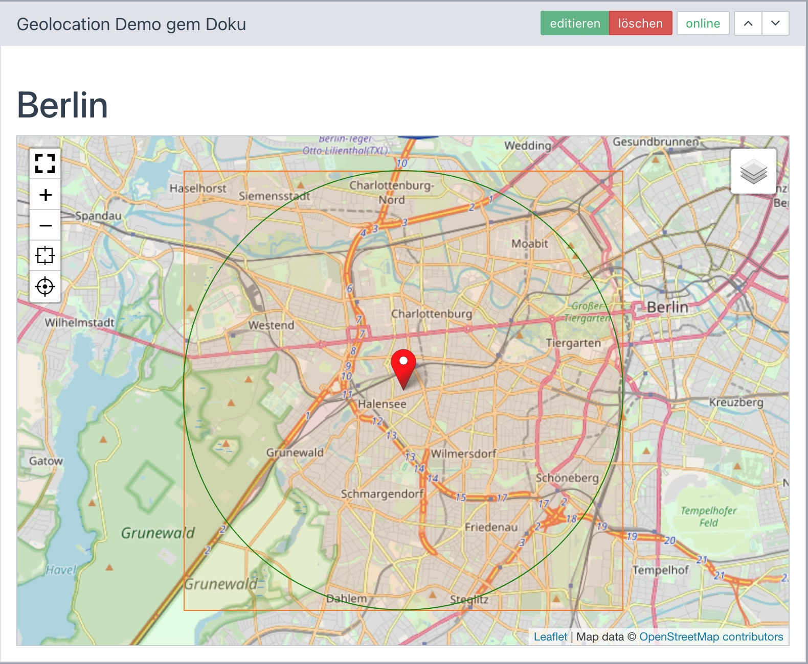

> - Installation und Einstellungen
>   - [Installation](install.md)
>   - [Einstellungen](settings.md)
> - [Kartensätze verwalten](mapset.md)
> - [Karten/Layer verwalten](layer.md)
> - [Karten-Proxy und -Cache](proxy_cache.md)
> - Für Entwickler
>   - PHP
>   - [Javascript](devjs.md)
>   - [JS-Tools](devtools.md)
>   - [geoJSON](devgeojson.md)
>   - [Rechnen (PHP)](devmath.md)

# Für Entwickler &dash; PHP

<a name="namespace"></a>
## Namespace **Geolocation**

Alle PHP-Komponenten der serverseitigen Verarbeitung liegen im Namespace `Geolocation`. Das betrifft
die Klassen und globalen Konstanten. Hier die wichtigsten:

| Objekt | Anmerkung |
| --- | --- |
| \Geolocation\layer.php | YOrm-Dataset-Klasse für die einzelnen Karten-URLs |
| \Geolocation\mapset.php | YOrm-Dataset-Klasse für die Kartensätze aus mehreren Karten-URLs |
| \Geolocation\cache.php | Klasse mit Methoden zur Verwaltung des Karten-Cache |
| \Geolocation\config_form.php | rex_form-Klasse für das Formular "[Einstellungen](settings.md#config)" |
| \Geolocation\cronjob.php |rex_cronjob-Klasse für Cronjobs zum Cache-Hauskeeping |
| \Geolocation\tools.php | Diverse statische Methoden, die immer mal wieder hilfreich sind.|
| \Geolocation\Exception.php | Exception-Klasse für von **Geolocation** ausgelöste \RuntimeException  |
| \Geolocation\Calc\point.php | Rechnen mit Koordinaten: repräsentiert einen Punkt  |
| \Geolocation\Calc\box.php | Rechnen mit Koordinaten: repräsentiert einen rechteckigen Bereich  |
| \Geolocation\Calc\math.php | Rechnen mit Koordinaten: Klasse mit diversen Rechenmethoden  |
| \Geolocation\ADDON | "geolocation" |
| \Geolocation\TTL_DEF | Time-to-live im Cache: Default-Wert  |
| \Geolocation\TTL_MIN | Time-to-live im Cache: Untergrenze-Wert |
| \Geolocation\TTL_MAX | Time-to-live im Cache: Obergrenze-Wert |
| \Geolocation\CFM_DEF | Maximale Anzahl Dateien im Cache: Default-Wert |
| \Geolocation\CFM_MIN | Maximale Anzahl Dateien im Cache: Untergrenze-Wert |
| \Geolocation\CFM_MAX | Maximale Anzahl Dateien im Cache: Obergrenze-Wert |
| \Geolocation\KEY_TILES | Name im der URL für Kachelabrufe |
| \Geolocation\KEY_MAPSET | Name im der URL für Kartensatzabrufe |
| \Geolocation\OUT | Name des Default-Ausgabefragments |
| \Geolocation\LOAD | FALSE: Die Assets `geolocation.min.js|css` werden nicht geladen |


Hier ein Beispiel:

```PHP
$id = \rex_request( \Geolocation\KEY_MAPSET, 'integer', 1 );
$mapset = \Geolocation\mapset::take( $id );

dump(get_defined_vars());
```

<a name="snippets"></a>
## Snippets

Nachfolgend finden sich einige Code-Schnipsel für verschiedene Zwecke, die den Einsatz von
**Geolocation** demonstrieren.

<a name="maphtml"></a>
### Karten-HTML generieren

Für die Kartenausgabe stehen verschiedene Methoden zur Verfügung. Einerseits kann der HTML-Code
eigenständig gebaut werden oder unter Einsatz eines Fragments. Empfehlenswert ist der Rückgriff auf
Methoden der YOrm-Dataset-Klasse `mapset`. Der Kartensatz-Datensatz verfügt über alle relevanten
Informationen für den grundsätzlichen Aufbau der Karte.

Über einige Zusatzmethoden werden die auf der Karte darzustellenden Inhalte eingesteuert und das HTML
per Fragment generiert:

| Methode | Verwendung | Anmerkung |
| --- | --- | --- |
| ::take($id) | Ruft den per $id angegebenen Datensatz ab.<br>Falls $id fehlt wird der Default-Kartensatz herangezogen | fehlertolerantes `mapset::get()` |
| ->attributes($name,$value)<br>->attributes([$name1=>$value1,..]) | Ein HTML-Attribut oder ein Array mit HTML-Attributen, dass dem Karten-Tag zugefügt wird (`name="value" ...`) | nicht zulässig: mapset, dataset, map |
|->dataset($tool,$data)<br>->dataset([$tool1=>data1,..]) | Kartendaten je Tool. Alle Angaben werden konsolidiert in ein Array an das Ausgabe-Fragment übergeben. | Toolnamen müssen klein geschrieben sei |
| ->parse($fragment) | Die Methode erzeugt auf Basis der zuvor angegebenen Daten das HTML. Dazu wird entweder das angegebene Fragment genutzt oder das für den Kartensatz voreingestellte. | |

Tools sollten je Karte nur einmal vorkommen. Wenn trotzdem mehrere Instanzen einer Tool-Klasse
erforderlich sind, kann der Name durch ein Suffix eindeutig gemacht werden. Das Suffix wird mit
`|` angehängt (`position|eins`).  

Die Methoden können verkettet werden:
```PHP
echo \Geolocation\mapset::take( $mapsetId )
    ->attributes( 'id', 'my-map-id' )
    ->attributes( 'class', 'mymapclass' )
    ->dataset( 'bounds', [ $latLngSW,$latLngNO ] )
    ->dataset( 'position', $latLng )
    ->parse();
```

Das Resultat ist ein HTML-Tag mit fünf Attributen:
```html
<rex-map
    id="my-map-id"
    class="mymapclass"
    mapset="[{...mapset-json für Karten-Layer 1...},...]"
    dataset="{&quot;bounds&quot;=....}"
></rex-map>
```

Alternatives Vorgehen:
```PHP
$mapset = \Geolocation\mapset::take( $mapsetId ):

$fragment = new \rex_fragment();
$fragment->setVar( 'mapset', $mapset->getLayerset(), false );
$fragment->setVar( 'dataset', [
        'bounds' => [ $latLngSW,$latLngNO ],
        'position' => $latLng
    ], false );
$fragment->setVar( 'class', 'mymapclass', false );
$fragment->setVar( 'attributes', ['id' => 'my-map-id'], false );
$fragment->setVar( 'map', $mapset->getMapOptions(false), false );

echo $fragment->parse( $mapset->getOutFragment() );
```

<a name="epgmd"></a>
### ExtensionPoint GEOLOCATION_MAPSET_DELETE

Löschen eines Kartensatzes (mapset) ist nur zulässig, wenn der Kartensatz nicht in Benutzung ist.
Die Verwendung als Default-Mapset wird intern abgefangen. Die Verwendung in VALUE-Feldern der Slices
hingegen muss individuell geprüft werden. Dazu steht der Extension-Point `GEOLOCATION_MAPSET_DELETE`
zur Verfügung.

Der Rückgabewert `TRUE` signalisiert, dass der Kartensatz-Datensatz gelöscht werden darf.

```PHP
$delete = \rex_extension::registerPoint(new \rex_extension_point(
    'GEOLOCATION_MAPSET_DELETE',
    true,
    ['id'=>$this->id',mapset'=>$this]
));
```

Das Anwendungsbeispiel referenziert auf das weiter unten beschriebene Modul, bei dem in `value2`
die Auswahl des Kartensatzes gespeichert ist.

```PHP
\rex_extension::register('GEOLOCATION_MAPSET_DELETE', function( \rex_extension_point $ep ){
    $id = $ep->getParam('id');
    $sql = rex_sql::factory();
    $sql->setQuery( 'SELECT id FROM '.rex::getTable('article_slice').' WHERE value2 = ? LIMIT 1', [$id] );
    return !$sql->getRows();
});
```


<a name="template"></a>
## Template: CSS und JS einbinden

Die Html-Tags zum Einbinden der Assets können über eine Hilfsfunktion generiert werden. Dabei wird
berücksichtigt, dass möglicherweise gar keine Assets geladen werden sollen. Näheres ist in den
Erklärungen zur [Installation](install.md) zu finden.

Der erzeugte HTML-Code ist

```html
<link rel="stylesheet" type="text/css" media="all" href="./assets/addons/geolocation/geolocation.min.css?buster=1234567890" />
<script type="text/javascript" src="./assets/addons/geolocation/geolocation.min.js?buster=1234567890" ></script>
```

Im Template wird an geeigneter Stelle der Aufruf der Methode `\Geolocation\tools::echoAssetTags();`
eingebaut:

```HTML
<!DOCTYPE html>
<html lang="<?= rex_clang::getCurrent()->getCode() ?>">
<head>
    ...

<?php

    // Geolocation- und Leaflet-Assets einbinden
    \Geolocation\tools::echoAssetTags();

?>

</head>

<body>
    REX_ARTICLE[]
</body>
</html>
```

<a name="module"></a>
## Module

### Übersicht

**Geolocation** hat derzeit keine Tools, mit denen Karteninhalte interaktiv gestaltet werden können.
Es geht hier nur um die Ausgabe.

Das folgende Modul dient nur der Verdeutlichung und als Proof-of-Conzept. Das Modul basiert auf vier
Werten:

- in `REX_VALUE[1]` steht eine Kartenüberschrift
- in `REX_VALUE[2]` steht die ID des für die Ausgabe heranzuziehenden Kartensatzes
- in `REX_VALUE[3]` steht die eine Koordinate (Position) der Form `lat,lng` (Zahlen mit Dezimalpunkt)
- in `REX_VALUE[4]` steht die Größe des darzustellenden Umkreises um den Punkt in km.

<a name="input"></a>
### Modul-Eingabe

Eingabetechnische Feinheiten wie Feldvalidierung sind im Beispiel nicht enthalten.

Die verfügbaren Kartensätze werden über die YOrm-Dataset-Klasse abgerufen `mapset::query()`.
Zusätzlich zu den verfügbaren Kartensätzen wird die Auswahl "Standardkarte" eingefügt.

```html
<fieldset class="form-horizontal">
    <legend>Kartenkonfiguration</legend>

    <div class="form-group">
        <label class="col-sm-2 control-label" for="headline">Überschrift</label>
        <div class="col-sm-10">
            <input class="form-control" id="headline" type="text" name="REX_INPUT_VALUE[1]" value="REX_VALUE[1]" />
        </div>
    </div>

    <div class="form-group">
        <label class="col-sm-2 control-label" for="mapset-select">Kartentyp</label>
        <div class="col-sm-10">
            <select name="REX_INPUT_VALUE[2]" id="mapset-select" class="form-control">
            <option value="">(Standardkarte)</option>
            <?php
            $mapsets = \Geolocation\mapset::query()
                ->orderBy('title')
                ->findValues( 'title', 'id' );
            foreach( $mapsets as $k=>$v ){
                echo '<option value="',$k,'"',($k == REX_VALUE[2] ? ' selected="selected"' : ''),'>',$v,'</option>';
            }
			?>
			</select>
        </div>
    </div>

    <div class="form-group">
        <label class="col-sm-2 control-label" for="marker-input">Marker</label>
        <div class="col-sm-10">
            <input class="form-control" id="marker-input" type="text" name="REX_INPUT_VALUE[3]" value="REX_VALUE[3]" />
        </div>
    </div>

    <div class="form-group">
        <label class="col-sm-2 control-label" for="radius-input">Radius um den Marker (km)</label>
        <div class="col-sm-10">
            <input class="form-control" id="radius-input" type="text" name="REX_INPUT_VALUE[4]" value="REX_VALUE[4]" />
        </div>
    </div>
</fieldset>
```

<a name="output"></a>
### Modul-Ausgabe

Im Beispiel werden die Daten wie folgt aufbereitet:
- Die Koordinatenangabe in `REX_VALUE[3]` wird in ein Point-Objekt `$center` umgewandelt
- Der Radius aus `REX_VALUE[4]` wird von km in m umgerechnet
- Als Kartenauschnitt wird ein Rechteck `$bounds` über Mittelpunkt und Radius errechnet

Als Beispiel für (1) die individualisierte Darstellung von geoJSON-Datensätzen und (2) für die
Bereitstellungen eigener [Darstellungstools](devtools.md) direkt im Code wird ein
- geoJSON-Datensatz mit Mittelpunkt und Radius zur Kreisdarstellung angelegt,
- ein Tool als Erweiterung des [geoJSON-Basistools](devgeojson.md) zur passgenauen Darstellung
  ausgegeben,
- sichergestellt, dass das Tool im Javascript nur einmal angelegt wird.

Die Kartenausgabe beinhaltet
- Mapset abrufen mit Fallback auf den Default-Kartensatz
- eigene CSS-Klasse festlegen
- Karteninhalte mit den Standard-Tools `bounds`und `position` sowie dem eigenen Tool `myprivatetool`
  hinzufügen.
- HTML generieren über das für den Kartensatz hinterlegte Fragment. Die Karte hat automatisch den
  Zoom-Level, der am besten zu `$bounds` passt.

Wie das Bounds-Rechteck sichtbar gemacht wird, ist [hier beschrieben](devtools.md#boundsvisible).

```PHP
<?php
// Kartendaten aus dem Slice abrufen
$mapsetId = (int) 'REX_VALUE[2]';
$center =\Geolocation\Calc\Point::byText( 'REX_VALUE[3]' );
$radius = max( (float)'REX_VALUE[4]', 1) * 1000; // Kilometer in Meter umrechnen
$bounds = \Geolocation\Calc\Box::byInnerCircle( $center, $radius );

// Beispieldatensatz für die geoJSON-Darstellung von Elementen, hier Kreis
$geoJSON = [
    'type' => 'FeatureCollection',
    'features' => [
        0 => [
            'type' => 'Feature',
            'geometry' => $center->geoJSON(),
            'properties' => [
                'radius' => $radius,
                'style' => [
                    'color' => 'green',
                    'weight' => 1,
                    'fill' => false,
                ]
            ],
        ],
   ]
];

// Beispiel für ein On-The-Fly-Tool zur individualisierten Darstellung des geoJSON-Datensatzes
if( !\rex::getProperty('MyPrivateTool',false)) {
    \rex::setProperty('MyPrivateTool',true);
?>
<script>
Geolocation.Tools.MyPrivateTool = class extends Geolocation.Tools.GeoJSON
{
    setOptions( options ) {
        // pointToLayer:callback belegen
        options.pointToLayer = this._pointToLayer.bind(this);
        return options;
    }
    _pointToLayer(feature, latlng) {
        return L.circle( latlng,{radius:feature.properties.radius} );
    }
}
Geolocation.tools.myprivatetool = function(...args) { return new Geolocation.Tools.MyPrivateTool(args); };
</script>
<?php
}

// Kartensatzdaten in den HTML-Tag überführen
$rex_map = \Geolocation\mapset::take( $mapsetId )
    ->attributes( 'class', 'mymapclass' )
    ->dataset( 'bounds', $bounds->latLng() )
    ->dataset( 'position', $center->latLng() )
    ->dataset( 'myprivatetool', $geoJSON )
    ->parse();

// Ausgabe
echo '<h1>REX_VALUE[1]</h1>';
echo $rex_map;
```



<a name="fout"></a>
## Fragment *geolocation_rex_map.php*

Das Default-Fragment `geolocation_rex_map.php` erzeugt einen Custom-HTML-Tag `<rex-map ...></rex-map>`
mit den Attributen für den Kartenaufbau. Das Fragment kann problemlos in den
[Kartensatz-Einstellungen](mapset.md) bzw. den [Basiseinstellungen](settings.md) durch ein
anderes Fragment ersetzt werden. Lediglich die Schnittstellen müssen eingehalten werden:

| Variable| Erklärung | Beispiel |
| --- | --- | --- |
| mapset | Die Kartenlayer des Kartensatzes als Array | $mapset->getLayerset() |
| dataset | Ein Array mit den Daten für die diversen Tools | ['position'=>[52.5,13.3],'bounds'=>[[52.59,13.45],[52.41,13.15]]]|
| map | optionale Kartenoptionen | $this->getMapOptions()<br>['fullscreen',...] |
| class | optionale CSS-Klasse | |
| attributes | Hierüber können weitere beliebige Attribute (außer mapset, dataset, map und class) hinzugefügt weden.| ['id'=>'map4711'] |

Die Variablen des Fragments können bei Bedarf einzeln aus dem mapset befüllt werden:

```php
$fragment = new \rex_fragment();
$fragment->setVar( 'mapset', $mapset->getLayerset(), false );
$fragment->setVar( 'dataset', $dataset, false );
$fragment->setVar( 'map', $mapset->getMapOptions(false), false );
echo $fragment->parse( $mapset->getOutFragment() );
```
