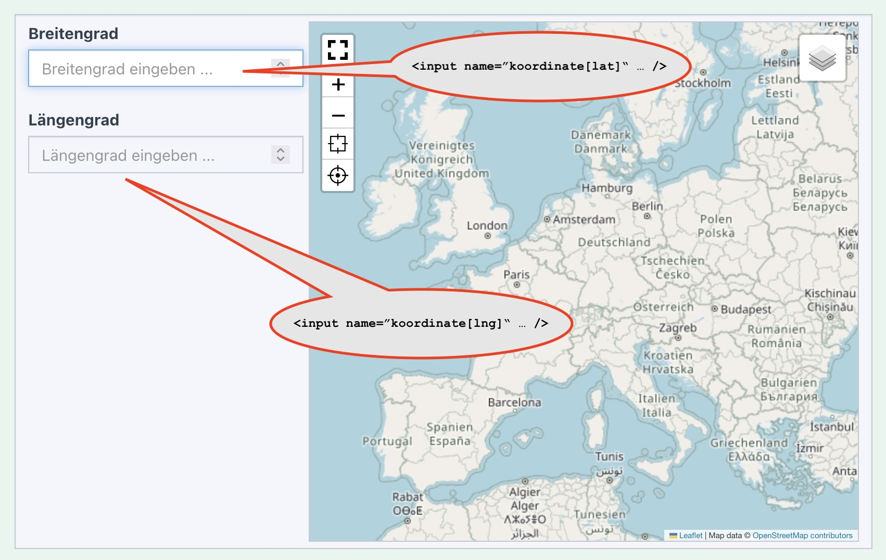
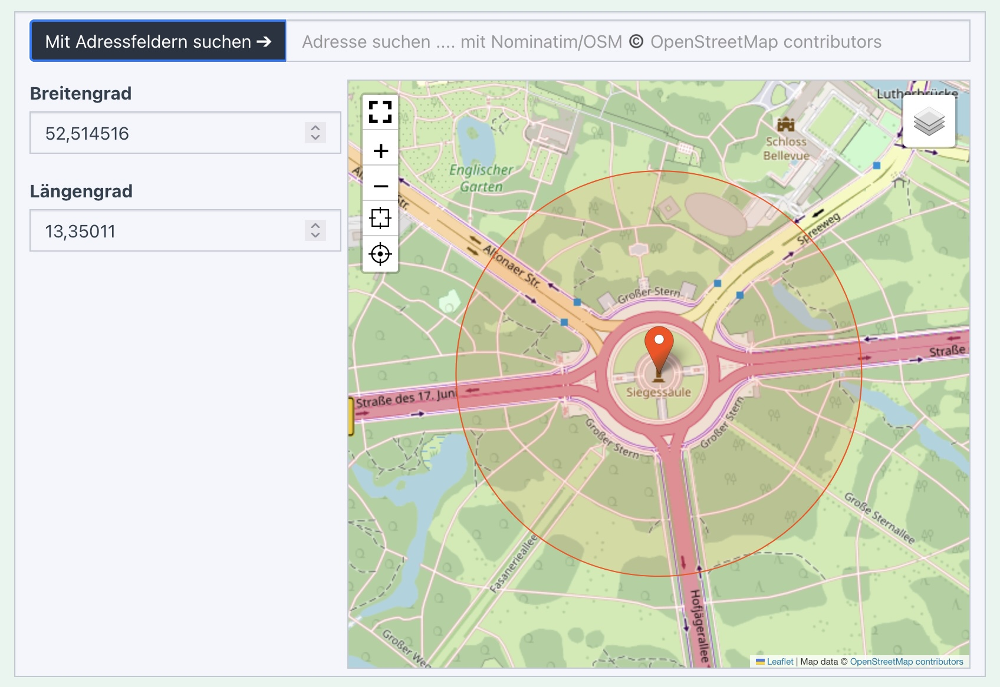
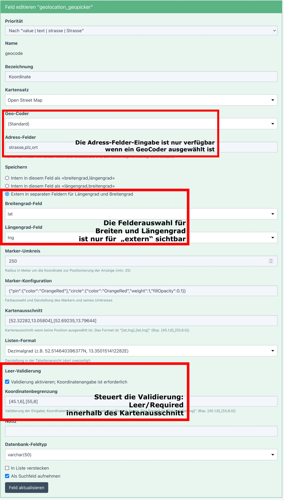
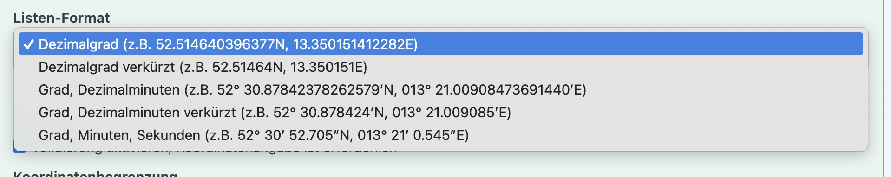
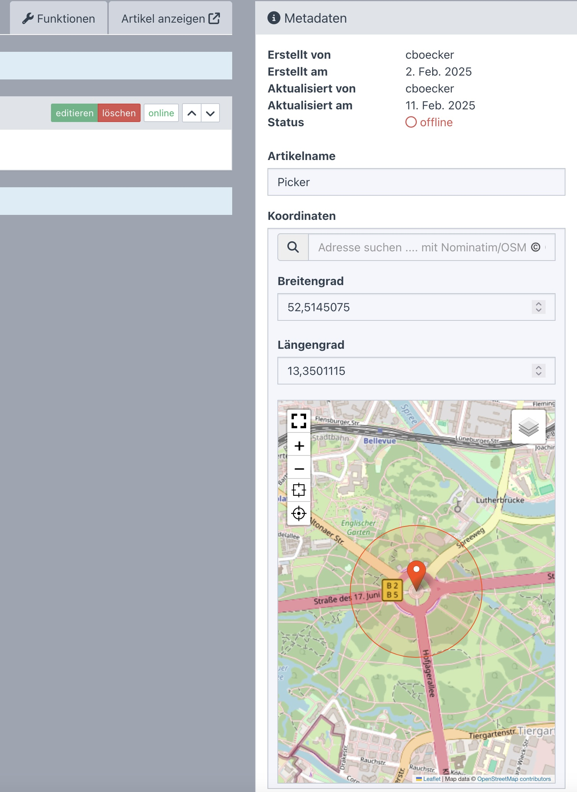

> - [Installation und Einstellungen](install.md)
>   - [Installation](install.md)
>   - [Einstellungen](settings.md)
> - [Kartensätze verwalten](mapset.md)
> - [Karten/Layer verwalten](layer.md)
> - [Karten-Proxy und -Cache](proxy_cache.md)
> - Für Entwickler
>   - [PHP Basis](devphp.md)
>   - __PHP LocationPicker__
>   - [Javascript](devjs.md)
>   - [JS-Tools](devtools.md)
>   - [geoJSON](devgeojson.md)
>   - [Rechnen (PHP)](devmath.md)

# Für Entwickler &dash; PHP LocationPicker

Diese ausführliche Beschreibung gilt einem Wisget, dass in verschiedenen Zusammenhängen als Eingabeelement
bzw. Auswahlelement für Koordinaten dient. Grundlage ist ein klassisches Redaxo-Fragment (Datei
`.../fragment/geolocation/picker.php`). Dazu gehört eine Klasse `PickerWidget`, die auf `rex_fragment`
basiert und zahlreiche Get- und Set-Methoden zur sicheren Eingabe der Parameter und adäquatem Fallback
auf Standardwerte bereithält.

> Stand heute ist der LocationPicker in allen Varianten nur für die Nutzung im Backend vorgesehen. Das notwendige
CSS und JS steht in den Asset-Dateien `geolocation_be.min.css` und `geolocation_be.min.js`.

Das Widget bietet
- Marker auf die aktuelle GPS-Position setzen (sofern im Browser freigegeben)
- Marker per Doppel-Klick auf die gewählte Position legen
- Marker per Maus verschieben
- direkte Koordinateneingabe in Eingabefeldern für Breitengrad und Längengrad
- Per Geocoding-Service Koordinaten zu Adressen suchen lassen (optional)
- Adressen für die Suche aus Adressfelern im Formular auslesen (optional)

Wie die Speicherung der Daten erfolgt, wie die Validierung und vieles mehr varriert je nach
Verwendungszweck und wird in den nachfolgenden Kapiteln beschrieben.

## Beispieldaten

Um die vielfältigen Konfigurationsvarienten anschaulich zeigen zu können, wird stets mit denselben
Beispieldaten gearbeitet. Hier die Beschreibung:

### Basiskartenauschnitt
Wenn keine gültige Koordinate vorliegt, wird ein Basiskartenauschnitt ausgewählt. Das ist entweder die
in Geolocation hinterlegte Basiskarte (z.B. "Europa") oder ein individueller anderer Auschnitt. Das Beipiel hier ist
Berlin:
```php
use FriendsOfRedaxo\Geolocation\Calc\Box;
use FriendsOfRedaxo\Geolocation\Calc\Point;

$baseBounds = Box::byCorner(
    Point::byLatLng([52.69235,13.05804]),
    Point::byLatLng([52.32282,13.79644])
);
```

### Koordinate

Als Beispielpunkt dient die Siegessäule in Berlin
```php
use FriendsOfRedaxo\Geolocation\Calc\Point;

$goldElse = Point::byLatLng([52.514516,13.350110]);
```

### Location-Picker umgestalten

An der grundsätlichen Auslegnung (Pin in der Mitte, Kreis drumherum) kann man nichts ändern. Aber die Farben lassen sich anpassen
bis hin zu einem unsichtbaren Kreis.
```php
$markerStyle = [
    'pin' => [
        'color' => 'OrangeRed',
    ],
    'circle' => [
        'color' => 'OrangeRed',
        'weight' => 1,
        'fillOpacity' => 0.1,
    ],
];
```
Mit `$markerStyle['circle']['weigt']=0` verschwindet der äußere Kreis und mit `$markerStyle['circle']['fillOpacity']=0`
verschwindet die Innenfläche.


<a name="fragment"></a>
## Basis: Das Fragment

Die Schnittstelle zum Fragment `.../fragment/geolocation/picker.php` bildet die Klasse `PickerWidget`. Im einfachsten Fall, also
unter Nutzung aller Default-Einstellungen, wird ein Widget erzeugt, dass über interne, selbst generierte Eingabefelder für
Breiten- und Längengrad verfügt. 

Die Minderstangabe ist der Typ (interne oder externe Eingabefelder) und entweder den Namen (intern: name-Attribut für den Input-Tag)
oder die HTML-Id (extern: ID als Referenz zum Aufinden der Felder)

```php
use FriendsOfRedaxo\Geolocation\PickerWidget;

$geoPicker = PickerWidget::factoryInternal (
    'koordinate[lat]', 
    'koordinate[lng]',
);
echo $geoPicker->parse();
```


Bei der Nutzung externer Felder ist es ähnlich, allerdings werden die Felder über ihre HTML-Id identifiziert und stehen außerhalb des Widgets

```php
use FriendsOfRedaxo\Geolocation\PickerWidget;

$geoPicker = PickerWidget::factoryExternal (
    'koordinate-lat', 
    'koordinaten-lng',
);
echo $geoPicker->parse();
```

Über weitere Methoden kann das Widget angepasst werden:

- `setValue(float|int|string $lat, float|int|string $lng)`

   Setzt den Wert für Breiten- und Längengrad. Dieser Wert wird in die internen Eingabefelder übertragen.
   Das ist insofern wichtig wenn die Überprüfung der Eingaben (z.B. in Value-Konstruktionen mit Validierung)
   zwar ergibt, dass keine valide Koordinate vorliegt, aber denoch die Eingabe wieder zur Korrektur angezeigt
   werden soll.

   > Die Feldwerte werden **nicht** über den Inhalt der Eingabefelder an das Widget gegeben.

   Wenn bisher noch keine valide initiale Koordinate gesetzt wurde (`setLocation($point)`), wird versucht, aus den
   Angaben auch die Koordinate zu ermitteln. Der zusätzliche Aufruf von `setLocation` kann dann entfallen.

- `setLocation(?Point $location = null)`

   Setzt die initiale Position der Karte unabhängig von der Variante interne vs. externe Eingabefelder.
   Da im Falle externer Eingebefelder deren Inhalt nicht vom Widget geändert wird, greift `setValue(..)` nicht.
   Statt dessen wird die Kartenposition mit `setLocation(..)` übermittelt. 
   
- `setContainer(string $id = '', array|string $class = [])`

   Gibt dem  Widget-Container (Custom-HTML-Tag `<geolocation-geopicker>`) eine ID und eine Klasse mit

- `setMapset(int $mapset = 0, string $id = '', array|string $class = [])`

   Hier wird die Datensatz-Id des Geolocation-Kartensatzes erwartet und ggf. um eigene Kartenformatierungen (meist Höhe/Breite/Rand)
   eine HTML-Id und eine Klasse. I.d.m. Fällen kann man auf den Default setzen.

- `setBaseBounds(?Box $voidBounds = null)`

   Setzt den initialen Kartenausschnitt.

- `setLocationMarker(int $radius = 0, array $style = [])`

   Gibt dem Marker alternative Optionen mit, siehe Beispiel oben. Der Radius von 0 bedeutet "Standard".

- `setLocationRange(?Box $range = null, bool $required=false)`

   Gibt einen Kartenauschnitt an, innerhalb dessen am Ende die ausgewählte Koordinate liegen muss. Über den Parameter
   `$required` kann den Eingabefeldern auch das Required-Attribut hinzugefügt werden. In dem Fall MUSS eine Koordinate
   eingegeben werden.

- `setGeoCoder(?int $geoCoder = null)`

   Wenn die ID eines GeoCoders angegeben (egal ob existent oder nicht), wird die Funktion für das GeoCoding aktiviert.
   Mit `null` oder ohne Angabe wird bzw. bleibt das GeoCoding deaktiviert. `0` bietet sich an für "aktivieren mit dem
   Standard-Geocoder". Initial ist das GeoCoding deaktiviert.

- `setAdressFields(array $addressFields = [])`

   Wenn das GeoCoding aktiviert ist, kann über das Array eine Reihe von Eingabefeldern für Adress-Bestandteile angegeben werden.
   ([HTML-Id => Label]). In dem Fall erhält de GeoCoder einen Button, mit dem die Inhalte der Felder für die Suche benutzt werden.

- `setLatError(string $errorClass, string $error = '')`

   Relevant nach der Formularrückgabe. Hat die Rückgabeauswertung Breitengrad-Fehler ergeben, werden die Fehlerklasse (`has-error`) und ggf. ein
   Fehlertext bei der Wiget-Ausgabe berücksichtigt (nur sinnvoll bei internen Eingabefeldern; externe Felder müssen eigenständig formatiert werden). 

- `setLngError(string $errorClass, string $error = '')`

   siehe setLatError, aber für Längengrad-Fehler.

Und hier ein Beispiel:

```php
use FriendsOfRedaxo\Geolocation\PickerWidget;

$geoPicker = PickerWidget
    ::factoryInternal ('koordinate[lat]', 'koordinate[lng]')
    ->setValue ($goldElse->lat(), $goldelse->lng())
    ->setMapset (2)
    ->setBaseBounds ($baseBounds)
    ->setLocationMarker (250, $markerStyle)
    ->setGeoCoder (0)
    ->setAdressFields (['field-01' => 'Straße', 'field-02' => 'Ort'])
    ;

echo $geoPicker->parse();
```



<a name="yform"></a>
## YForm-Value `rex_yform_value_geolocation_geopicker`

### Konfiguration und Features

Das YForm-Value wird prinzipiell wie die beschrieben mittels des PickerWidget aufgebaut. Die auf der
Konfigurationsseite eingegebenen Parameter werden entweder direkt an das PickerWidget gegeben oder
daraus den YForm-Kontext berücksichtigend Feld- und Formulardaten abgeleitet.

Z.B. werden die IDs externer Breitengrad/Längengrad-Felder nicht direkt eingegeben, sondern die Felder
aus der Feldliste ausgewählt. Die tatsächliche ID ermittelt das Value selbst

Um das Picker-Widget herum wird ein "übliches" YForm-Feld-HTML aufgebaut.

Die Daten können auf drei Arten gespeichert werden:
- intern im Format "lat,lng", also komma-separiert zwei Dezimalzahlen zunächst mit dem Breitengrad und danach
  mit dem Längengrad.
- intern im Format "lng,lat", also komma-separiert zwei Dezimalzahlen zunächst mit dem Längengrad und danach
  mit dem Breitengrad.
- in zwei externen Feldern; jeweils eines für den Längengrad und eines für den Breitengrad.

Die Validierung erfolgt für interne wie externe Felder innerhalb des YForm-Values. Weder das Picker-Feld noch die
externen Koordinaten-Felder sollten daher mit weitern Validatoren versehen werden! Fehler bezgl. externer Felder
werden dem jeweiligen externen Feld zugeordnet, bei internen Feldern wird das jeweilige interne Feld markiert.



### Listen

Die Anzeige in Listen kann aktiviert werden. In dem Fall stehen drei Darstellungsvarianten für die Koordinaten
zur Verfügung. Dabei wird nicht zwischen internen oder externen Koordinatenfeldern unterschieden. Im Falle
externer Felder sollten diese für die Liste deaktiviert werden.



### Suche

Im YForm-Suchfenster kann ein einfaches Eingabefeld für die Umkreissuche eingeblendet werden.
Als Eingabe werden drei Werte erwartet:

- Breitengrad (als Dezimalwert)
- Längengrad (als Dezimalwert)
- Umkreis-Radius (in Meter)

Beispiel: `52.514516 13.350110 1000`

Anstelle eines Dezimalpunktes (PHP-internes Dezimalformat) kann man auch ein Komma setzen (`52,514516 13,350110 1000`).

Auch hier übernimmt das Value die Suche in den externen Feldern.

> **Hinweis**: Die Suche nutzt die seit einnigen Jahren in Datenbankabfragen verfügbaren Spatial-Funktionen in
[Mysql](https://dev.mysql.com/doc/refman/8.4/en/spatial-types.html) (Version 5.7 seit 10/2015) bzw.
[MariaDB](https://mariadb.com/kb/en/geographic-geometric-features/) (Version 10.5.10 seit 12/2019).
In Redaxo-Installationen mit Datenbankservern älterer Versionen ist die Umkreissuche nicht verfügbar.

Die GeoCoder-Klasse bietet statische Methoden an, die möglicherweise auch in eigenen Anwendungen hilffeich
sind bim Aufbau von Umkreissuchen. Das Beispiel zeigt eine YOrm-Query; die Where-Klausel können auch
mit rex_sql-Abfragen genutzt werden.

```php
use FriendsOfRedaxo\Geolocation\GeoCoder;

// Die YOrm-Query
$query = MyDatasetClass:.query();
$tableAlias = $query->getTableAlias();

// Die Suchdaten
$lat = 52.514516;
$lng = 13.350110;
$radius = 1000;

// Tabellenfeld mit der Koordinate im Format «breitengrad,längengrad»
$latLngField = 'location';
$where = GeoCoder::circleSearchLatLng($lat, $lng, $radius, $latLngField, $tableAlias);

// Alternativ: Tabellenfeld mit der Koordinate im Format «längengrad,breitengrad»
$lngLatField = 'location';
$where = GeoCoder::circleSearchLngLat($lat, $lng, $radius, $lngLatField, $tableAlias);

// Alternativ: Getrennte Tabellenfelder für Breiten- und Längengrad
$latField = 'latitude';
$lngField = 'longitude';
$where = GeoCoder::circleSearch($lat, $lng, $radius, $latField, $lngField, $tableAlias);

// Umkreissuche zur Query hinzufügen
$query->whereRaw($where);

```

<a name="rexform"></a>
## RexForm-Element

RexForm-Formulare können um eigene Feldtypen ("Elemente") erweitert werden, auch wenn es etwas kompliziert erscheint.
Die Klasse `PickerElement` stellt ein solches Formular-Element zur Verfügung, dass ähnlich wie das [YForm-Value](#yform)
ausgestaltet ist:

- Speicherung der Koordinate intern als Array `['lat'=>...,'lng' => ...]`
- Speicherung der Koordinate extern in zwei Einzelfeldern
- Validierung inklusive (Bereich, nicht Leer)

Die Konfiguration des PickerWidget erfolgt wie im Kapitel zum [Fragment](#fragment) beschrieben. Der Picker wird über die
Methode `$field->setPickerWidget()` aktiviert. Je nach Parametrisierung entsteht ein Widget mit interner oder externer Speicherung.

**Beispiel: Interne Speicherung im eigenen Feld als Array**

```php
use FriendsOfRedaxo\Geolocation\Picker\PickerElement;

// Feld "koordinate" als Picker-Element anlegen
$pickerField = $this->addField('', 'koordinate', null, ['internal::fieldClass' => PickerElement::class], true);
$pickerField->setLabel('Location');

// PickerWidget für die interne Speicherung aktivieren
$geoPicker = $pickerField->setPickerWidget();

// Picker-Widget konfogurieren
$geoPicker->setMapset(2);
$geoPicker->setGeoCoder(1);
$geoPicker->setBaseBounds($baseBounds);
```

**Beispiel: Externe Speicherung in separaten Feldern für Breitengrad und Längengrad**

Die Instanzen der beiden Felder werden mit `SetPickerWidget` an das Picker-Feld übergeben.
Daraus leitet der Picker die intern nötigen Daten (z.B. die ID) ab bzw. entnimmt den Wert
für die Initialisierung der Karte. 

Optional werden die Felder ähnlich wie die internen Eingabefelder konfiguriert
(`type="number"`, `min="..."`, `max="..."` usw.).

```php
use FriendsOfRedaxo\Geolocation\Picker\PickerElement;

// Eingabefelder für Breiten- und Längengrad
$latField = $field = $this->addTextField('lat');
$field->setLabel('Breitengrad');

$lngField = $field = $this->addTextField('lng');
$field->setLabel('Längengrad');

// Feld "koordinate" als Picker-Element anlegen
$pickerField = $this->addField('', 'koordinate', null, ['internal::fieldClass' => PickerElement::class], true);
$pickerField->setLabel('Location');

// PickerWidget für die externe Speicherung aktivieren
// True für $latField und $lngField konfigurieren (type, min, max, required, ...)
$geoPicker = $pickerField->setPickerWidget($latField, $lngField, true);

// Picker-Widget konfigurieren
$geoPicker->setMapset(2);
$geoPicker->setGeoCoder(1);
$geoPicker->setBaseBounds($baseBounds);
```

<a name="modul"></a>
## Module

In Modulen ist es relativ schwierig, ähnlich wie in YForm-Values und RexForm-Elementen Formulare mit Validierung
zu implementieren. Grundsätzlich besteht die Möglichkeit, mit Modul-Aktionen (konkret `preSave`) eine
Nachbearbeitung durchzuführen. Mann kann sich vereinfachend auf die formularinterne HTML-Validierung im
Input-Tag einlassen, die bei den internen Eingabefeldern stets eingebaut wird.

Die Unterscheidung auf externe oder interne Felder macht im Modul-Kontext ergibt wenig Sinn.

### Beispiel: Nur eine Kordinate erfassen

Breitengrad und Längengrad werden getrennt in den Values 1 und 2 gespeichert. Für die Karte wird das GeoCoding aktiviert. 

#### Modul-Input

```php
<?php

use FriendsOfRedaxo\Geolocation\Calc\Box;
use FriendsOfRedaxo\Geolocation\Calc\Point;
use FriendsOfRedaxo\Geolocation\Picker\PickerWidget;

/** @var rex_article_content_editor $this */

/**
 * Der PIN soll Orange sein, der Umkreis um den Pin
 * transparent Orange und mit einem dünnen Rand.
 */
$markerStyle = ... siehe oben

/**
 * Die Basiskarte zeigt Berlin.
 */
$baseBounds = ... siehe oben

/**
 * Das GeoPicker-Fragment konfigurieren
 * - Eingabefeld-Namen für Value 1 und 2 setzen
 * - Basis-Kartenausschnitt für Berlin
 * - LocationMaker anders einfärben; Radius ist Standard
 * - Standard-GeoCoder
 * - Default-Mapset (muss daher nicht angegeben werden)
 */
$geoPicker = PickerWidget::factoryInternal('REX_INPUT_VALUE[1]', 'REX_INPUT_VALUE[2]')

    ->setBaseBounds($baseBounds)
    ->setGeoCoder(0)
    ->setLocationMarker(style: $markerStyle)
    ->setValue('REX_VALUE[1]', 'REX_VALUE[2]')
;

echo $geoPicker->parse();
```

#### Modul-Output

Die Ausgabe erfolgt wiederum mit dem Standard-Kartensatz und einem mindestens
sichtbaren Bereich von 1000 Meter Radius um die Koordinate. 

Wenn keine gültige Koordinate angegeben ist, wird im BE ein Hinweis angezeigt.

```php
<?php

use FriendsOfRedaxo\Geolocation\Calc\Box;
use FriendsOfRedaxo\Geolocation\Calc\Point;
use FriendsOfRedaxo\Geolocation\Mapset;

/**
 * Feldwerte abrufen, Vorbelegungen
 */
$lat = 'REX_VALUE[1]';
$lng = 'REX_VALUE[2]';
$radius = 1000;
$mapsetId = 0;

/**
 * Aktuelle Position aus $lat und $lng berechnen.
 * Wenn die Werte keine gültige Koordinate ergeben, wirft Point eine Exception.
 */
try {
    $location = Point::byLatLng([$lat, $lng$]);
} catch (Throwable $th) {
    if (rex::isBackend()) { 
        $msg = sprintf(
            'Aus den Werten (Breitengrad: «%s», Längengrad: «%s») kann keine gültige Koordinate gebildet werden.',
            $lat,
            $lng);
        echo rex_view::error($msg);
        echo   rex_view::info('Die Karte wird nicht angezeigt; Bitte die Koordinaten korrigieren');
    }
    return;
}

/**
 * Auf Basis der gültigen Koordinate die Karte zeichnen
 * - Koordinate im Mittelpunkt
 * - Kartenausschnitt auf einen Umkreis im gegebenen Radius einstellen
 * - Kartenausschnitt im BE zur Kontrolle sichtbar machen.
 */
$bounds = Box::byInnerCircle($location, $radius);

if (rex::isBackend()) {
    echo '<script type="text/javascript">
    Geolocation.default.boundsRect={color:"OrangeRed",weight:1,fillOpacity: 0.1};
    </script>';
}

echo Mapset::take($mapsetId)
    ->dataset('position', $location->latLng())
    ->dataset('bounds', $bounds->latLng())
    ->parse();
```

### Beispiel: Koordinate und Zusatzdaten erfassen

Zusätzlich zur reinen Koordinatenauswahl werden hier in zusätzlichen Feldern Adress-Informationen
erfasst und darauf die Adresssuche im Geocoding ermöglicht.

#### Modul-Input

```php
<?php
use FriendsOfRedaxo\Geolocation\Calc\Box;
use FriendsOfRedaxo\Geolocation\Calc\Point;
use FriendsOfRedaxo\Geolocation\Picker\PickerWidget;

/** @var rex_article_content_editor $this */

/**
 * Der PIN soll Orange sein, der Umkreis um den Pin
 * transparent Orange und mit einem dünnen Rand.
 */
$markerStyle = ... siehe opben

/**
 * Die Basiskarte zeigt Berlin.
 */
$baseBounds = ... siehe oben

/**
 * Für die Verknüpfung der Adressfelder zum Geocoding
 */
$adr = [
    'input-street' => 'Strasse',
    'input-town' => 'PLZ und Ort',
];
    
/**
 * Das GeoPicker-Fragment konfigurieren
 * - Eingabefeld-Namen für Value 5 und 6 setzen
 * - Basis-Kartenausschnitt für Berlin
 * - LocationMaker anders einfärben; Radius ist Standard
 * - Standard-GeoCoder
 * - Default-Mapset (muss daher nicht angegeben werden)
 */
$geoPicker = PickerWidget::factoryInternal('REX_INPUT_VALUE[5]', 'REX_INPUT_VALUE[6]')

    ->setContainer('input-pos')
    ->setBaseBounds($baseBounds)
    ->setGeoCoder(0)
    ->setAdressFields($adr)
    ->setLocationMarker(style: $markerStyle)
    ->setValue('REX_VALUE[5]', 'REX_VALUE[6]')
;

?>
<div class="form-group">
    <label class="control-label" for="input-name">Name/Bezeichnung</label>
    <input class="form-control" id="input-name" type="text" name="REX_INPUT_VALUE[1]" value="REX_VALUE[1]">
</div>

<div class="form-group">
    <label class="control-label" for="input-street"><?= $adr['input-street'] ?></label>
    <input class="form-control" id="input-street" type="text" name="REX_INPUT_VALUE[2]" value="REX_VALUE[2]">
</div>

<div class="form-group">
    <label class="control-label" for="input-town"><?= $adr['input-town'] ?></label>
    <input class="form-control" od="input-town" type="text" name="REX_INPUT_VALUE[3]" value="REX_VALUE[3]">
</div>

<div class="form-group">
    <label class="control-label" for="input-radius">Radius um die Koordinate (Meter) </label>
    <input class="form-control" id="input-radius" type="number" min="100" name="REX_INPUT_VALUE[4]" value="REX_VALUE[4]">
</div>

<div class="form-group">
    <label class="ccontrol-label" for="input-pos">Koordinate</label>
    <?= $geoPicker->parse() ?>
</div>
```
#### Modul-Output

```php
<?php

use FriendsOfRedaxo\Geolocation\Calc\Box;
use FriendsOfRedaxo\Geolocation\Calc\Point;
use FriendsOfRedaxo\Geolocation\Mapset;

/**
 * Feldwerte abrufen, Vorbelegungen
 */
$name = 'REX_VALUE[1]';
$street = 'REX_VALUE[2]';
$town = 'REX_VALUE[3]';
$radius = (int) 'REX_VALUE[4]';
$lat = 'REX_VALUE[5]';
$lng = 'REX_VALUE[6]';

$radius = max ($radius, (int) rex::getConfig('geolocation','picker_radius',500));
$mapsetId = 0;

?>
<dl>
    <dt>Name:</dt>
    <dd><?= $name ?></dd>
    <dt>Straße:</dt>
    <dd><?= $street ?></dd>
    <dt>Ort:</dt>
    <dd><?= $town ?></dd>
</dl>

<?php
/**
 * Aktuelle Position aus $lat und $lng berechnen.
 * Wenn die Werte keine gültige Koordinate ergeben, wirft Point eine Exception.
 */
try {
    $location = Point::byLatLng([$lat,$lng]);
} catch (Throwable $th) {
    if(rex::isBackend()) {
        $msg = sprintf(
            'Aus den Werten (Breitengrad: «%s», Längengrad: «%s») kann keine gültige Koordinate gebildet werden.',
            $lat,
            $lng);
        echo rex_view::error($msg);
        echo rex_view::info('Die Karte wird nicht angezeigt; Bitte die Koordinaten korrigieren');
    }
    return;
}

/**
 * Auf Basis der gültigen Koordinate die Karte zeichnen
 * - Koordinate im Mittelpunkt
 * - Kartenausschnitt auf einen Umkreis im vorgegebenen Radius einstellen
 * - Kartenausschnitt im BE zur Kontrolle sichtbar machen.
 */
$bounds = Box::byInnerCircle($location, $radius);

if (rex::isBackend()) {
    echo '<script type="text/javascript">
    Geolocation.default.boundsRect={color:"OrangeRed",weight:1,fillOpacity: 0.1};
    </script>';
}

echo Mapset::take($mapsetId)
    ->dataset('position', $location->latLng())
    ->dataset('bounds', $bounds->latLng())
    ->parse();
```

<a name="meta"></a>
## Metafelder

Bei der Installation wird ein Meta-Feldtyp **"LocationPicker (Geolocation)"** angelegt. Dazu können individuelle
MetaFelder kreiert werden. Ein solches Metafeld verfügt über ein PickerWidget in der Grundausstattung:
- Default-Mapset
- ohne GeoCoding
- Standard-Kartenausschnitt
- Standard-Markerformatierung

Weitere individuelle Formatierungen lassen sich über einen Callback hinzufügen. Die Funktion wird im Feld Params eingegeben und
erhält als einzigen Parameter das aktuelle PickerWidget, das im Callback angepasst werden kann.

Der Name der Callback-Methode wie hier mit einem Namespace ist nur ein Beispiel.


Die Beispiel-Methode der Datei `project/lib/MyGeoTools.php` sieht so aus:

```PHP
namespace MyName\MyRepo\Project;

use FriendsOfRedaxo\Geolocation\Calc\Box;
use FriendsOfRedaxo\Geolocation\Calc\Point;
use FriendsOfRedaxo\Geolocation\Picker\PickerWidget;

class MyGeoTools
{
    public static function metaFieldConfig(PickerWidget $picker): void
    {
        /**
         * Den Pin optisch umgestalten sowie den Umkreis.
         */
        $markerStyle = [
            'pin' => [
                'color' => 'OrangeRed',
            ],
            'circle' => [
                'color' => 'OrangeRed',
                'weight' => 1,
                'fillOpacity' => 0.1,
            ],
        ];
        $picker->setLocationMarker(250, $markerStyle);

        /**
         * Der Basiskartenausschnitt ist "Berlin".
         */
        $baseBounds = Box::byCorner(
            Point::byLatLng([52.32282, 13.05804]),
            Point::byLatLng([52.69235, 13.79644]),
        );
        $picker->setBaseBounds($baseBounds);

        /**
         *  GeoCoding mit dem Standard-GeoCoder aktivieren.
         */
        $picker->setGeoCoder(0);
    }
}

```

Und das ist das Resultat:


