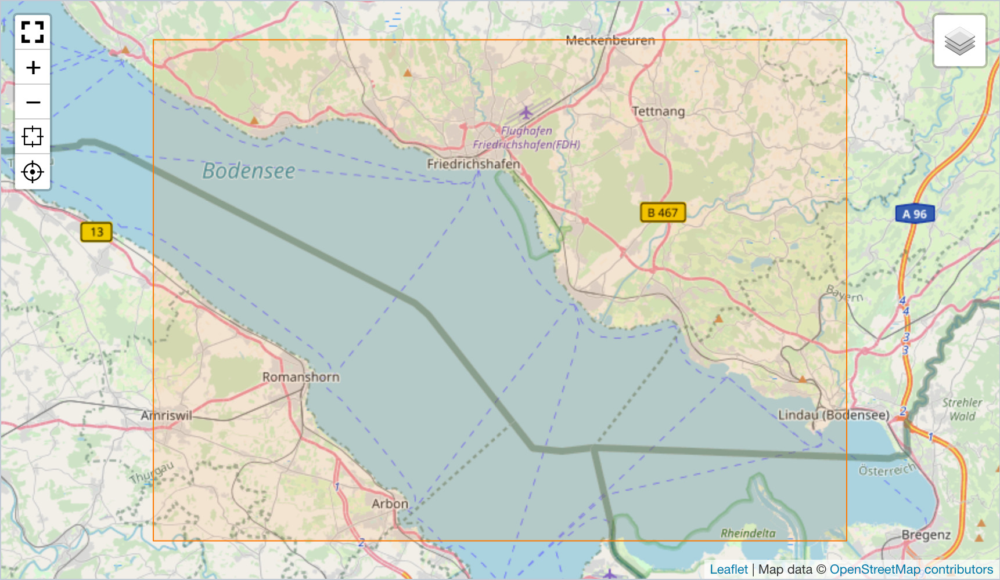
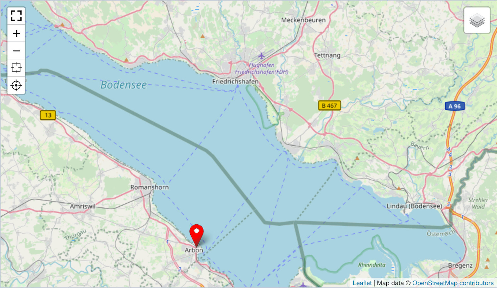
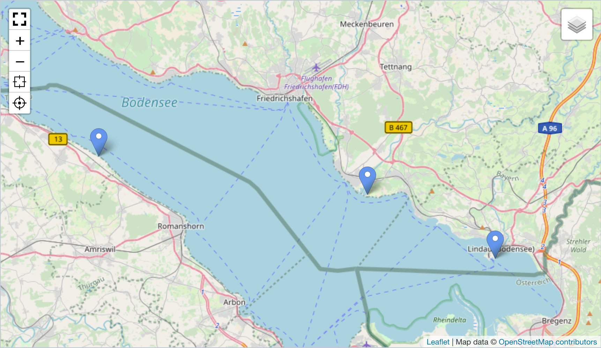
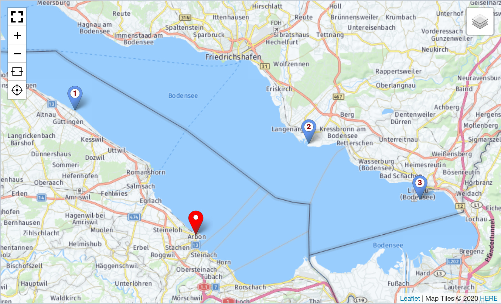

> - Installation und Einstellungen
>   - [Installation](install.md)
>   - [Einstellungen](settings.md)
> - [Kartensätze verwalten](mapset.md)
> - [Karten/Layer verwalten](layer.md)
> - [Karten-Proxy und -Cache](proxy_cache.md)
> - [Für Entwickler](devphp.md)
>   - [PHP](devphp.md)
>   - [Javascript](devjs.md)
>   - JS-Tools
>   - [geoJSON](devgeojson.md)
>   - [Rechnen (PHP)](devmath.md)

# Für Entwickler &dash; JS-Kartentools

<a name="konzept"></a>
## Das Konzept

Die Karte wird mit dem Custom-HTML-Tag `<rex-map>` erzeugt. Im Attribut `dataset` werden die
Karteninhalte als JSON-Array angegeben. Der Name jedes Dataset-Elements ist der Name eines
Darstellungs-Tools. Alle Tools haben eine einheitliche Struktur. Sie setzen auf der Template-Klasse
`Geolocation.Tools.Template` auf. Vier Tools sind bereits in **Geolocation** enthalten
([bounds, position, marker, geojson](#tools1)). Jedes Tool stellt seinen Datensatz auf der Karte dar.

```javascript
datensatz = {
    position: [47.51666,9.43333],
    bounds: [[47.5,9.3],[47.7,9.7]],
    marker: [[47.61159,9.29634],[47.58620,9.56065],[47.54378,9.68655]],
}
```

Die Grundidee: es gibt gleich strukturierte Klassen je "Tool", wobei alle Elemente im Datensatz
(position,bounds,marker,geojson) jeweils eine eigene Klasse haben. Die Klasse steuert die Anzeige
auf der Karte toolspezifisch. Das System kann flexibel durch Bereitstellung einer
[neuen Tool-Klasse erweitert](#new_tool) werden.

Der Sinn dieser Vereinfachung zeigt sich auf der PHP-Ebene. Man übergibt die Kombination
"Toolname/Parameter" an die Karte, den Rest machen die Tools ohne dass weitere Programmierung auf
JS-Ebene erforderlich ist. Die Einarbeitung in Leaflet kann bei einfachen Karten entfallen. Ein
Beispiele, auch für den Einsatz in einem Modul, findet sich im [PHP-Kapitel](devphp.md).

```php
echo \Geolocation\Mapset::take( $mapsetId )
    ->attributes( 'id', 'my-map-id' )
    ->attributes( 'class', 'mymapclass' )
    ->dataset( 'position', [47.51666,9.43333] )
    ->dataset( 'bounds', [[47.5,9.3],[47.7,9.7]] )
    ->dataset( 'marker', [[47.61159,9.29634],[47.58620,9.56065],[47.54378,9.68655]] )
    ->parse();
```

Eigene Tools für weitere Anwendungsfälle sind einfach programmierbar. Es reicht aus, den JS-Code
des Tools zeitlich nach **Geolocation** zu laden oder in das [Geolocation-JS](install.md#ownjscss)
einzubauen. Die gesamte Steuerungslogik im Javascript und im Backend basiert letztlich auf dem
Tool-Namen und erfordert keine weiteren Eingriffe.

> [Beispiele für eigene Tools](#tools2) sind in der Dokumentation enthalten. Die Datei
> `redaxo/src/addons/geolocation/docs/example/geolocation.js` enthält die Beispiele und kann als
> Basis für eigene Erweiterungen dienen.
> Sollen die Beispielstools produktiv eingesetzt werden, sollten sie in das
> [Geolocation-JS](install.md#ownjscss) einkompiliert werden.

Diese Tools sind bereits in **Geolocation** enthalten:

| Bounds<sup>*</sup> | Position | Marker |
| - | - | - |
|  |  |  |
<small><sup>\*</sup> Der Bereich ist nur zur Veranschaulichung farbig markiert.</small>

Ein weiteres Tool zur Darstellung von [geoJSON-Daten](devgeojson) hat ein eigenes Kapitel.

Alle Tools im Datensatz sind optional. Allerdings sollte Bounds auf jeden Fall angegeben werden,
denn sonst wird die Karte mit den Default-Werten für die initiale Karte angezeigt. Dann liegen die
Marker möglicherweise außerhalb des sichtbaren Bereichs der Karte bzw. die Karte wird mit einem zu
niedrigen Zoom-Level angezeigt. Eine Alternative zu Bounds ist [hier](#tcenter) als Beipiel für eine
eigene Tools-Klasse zu finden.

Die Klasse `Geolocation.Classes.Map` steuert den Aufbau der Karte. Sie versucht zu jedem Eintrag
über die Factory-Klasse `Geolocation.tools.«toolname»` das Tool zu instanzieren. Existiert die
Factory-Klasse nicht, wird der Eintrag im Datensatz ignoriert.

Tools sollten je Karte nur einmal vorkommen. Wenn trotzdem mehrere Instanzen einer Tool-Klasse
erforderlich sind, kann der Name durch ein Suffix eindeutig gemacht werden. Das Suffix wird mit
`|` angehängt (`position|eins`). Alternativ kann eine Tool-Klasse unter neuem Namen geklont werden.

```javascript
Geolocation.Tools.Xyz = class extends Geolocation.Tools.Abc {}
Geolocation.tools.xyz = function(...args) { return new Geolocation.Tools.Xyz(args); };
```

<a name="access"></a>
## Zugriff auf die Tools


<a name="tools1"></a>
## Vorinstallierte Tools

<a name="tbounds"></a>
### "bounds"

Das "Bounds"-Tool legt einen Bereich fest, der auf jeden Fall angezeigt werden soll. So wird
sichergestellt, das Leaflet einen passenden Zoom-Faktor wählt, unabhängig von der Kartenausrichtung.

Karten gleichen Typs stets mit demselben Zoom-Faktor anzuzeigen, ist gerne ungünstig. Was für die
Kleinstadt passt ("wo ungefähr ist die Location?"), zeigt in der Großstadt einen viel zu kleinen
Teil der Stadt.

Bounds erwartet als Parameter zwei gegenüberliegende Eck-Koordinaten eines Rechtecks. Die
Koordinaten werden als
Array zweier Koordinaten erwartet:
```javascript
let rect = [ [latNW,lngNW], [latSO,lngSO] ]
```
Darüber wird die Karte so positioniert, dass der Kartenmittelpunkt der Mittelpunkt des Rechtecks
ist. Der **initiale** Zoomfaktor wird von Leaflet so gewählt, dass der gewünschte Ausschnitt
komplett in der Karte sichtbar ist.

Das Rechteck wird tatsächlich als Rechteck gezeichnet (Leaflet-Klasse `L.Rectangle`), Trotzdem ist
es nicht sichtbar und stört damit nicht. Das wird über die Default-Einstellung erreicht:

```JS
Geolocation.default.boundsRect: {fill:false,stroke:false};
```

<a name="boundsvisible"></a>
Es gibt auch Situationen, in denen das Rechteck sichtbar sein sollte, z.B. um im Backend sehen zu
können wie der eingegebene Wert wirkt. Dazu muss vor der Ausgabe der Default-Wert z.B. via Modul
geändert werden.

Der Beispiel-Code ergänzt das im PHP-Kapitel beschriebene [Modul](devphp.md#output).

```PHP
if( rex::isBackend() ){
    echo '<script type="text/javascript">
    Geolocation.default.boundsRect={color:"#ff7800",weight:1,fillOpacity: 0.1};
    </script>';
}
// Ausgabe
echo '<h1>REX_VALUE[1]</h1>';
echo $rex_map;
```
<a name="tbcolor"></a>
Alternativ kann das Feature allgemein in das JS eingebaut werden. Das Verfahren an sich ist im
Kapitel zur [Installation](install.md#ownjscss) beschrieben. Im einfachen Fall wird eine Datei
_redaxo/data/addons/geolocation/geolocation.js_ mit dem eigenen Custom-Code bereitgestellt. Sie wird
bei jeder Neugenerierung der Assets automatisch geladen.

```js
/* Custom-JS */
/* im BE bounds zu Kontrollzwecken sichtbar machen */
if( 'object'===typeof(rex) && true===rex.backend){
    Geolocation.default.boundsRect = {
        color:"#ff7800",
        weight:1,
        fillOpacity:0.1
    };
}
```


<a name="tposition"></a>
### "position"

Das "Position"-Tool setzt einen einzelnen Marker auf die Karte. Er gilt als Haupt-Marker und ist
rot eingefärbt.

"Position" erwartet als Parameter ein Koordinaten-Array mit Länge und Breite.

```javascript
let pos = [lat,lng]
```
Die Karte wird **nicht** automatisch um den Punkt positioniert. Dazu ist die Kombination z.B.
mit einem geeignet konfigurierten "Bounds" notwendig (oder ein anderes Tool, das die Karte
[positioniert](#tcenter))

<a name="tmarker"></a>
### "marker"

Das "Marker"-Tool setzt mehrere Marker auf die Karte. Sie fungieren als zusätzliche Marker und sind
zur Unterscheidung blau eingefärbt.

"Marker" erwartet als Parameter ein Array aus Koordinaten-Arrays mit jeweils Länge und Breite.

```javascript
let marker = [ [lat1,lng1], [lat2,lng2], .... ]
```
Die Karte wird **nicht** automatisch so positioniert, dass alle Marker sichtbar sind. Dazu ist die
Kombination z.B. mit einem geeignet konfigurierten "Bounds" notwendig (oder ein anderes Tool, das
die Karte [positioniert](#tcenter))

<a name="tgeojson"></a>
### "geojson"

Das "geoJSON"-Tool setzt überträgt einen Datensatz im [geoJSON-Format](https://blog.codecentric.de/2018/03/geojson-tutorial/) auf die Karte. Die eigentliche Ausführung übernimmt LeafLet mit einer Universalmethode:

```js
let layer = L.geoJSON( geojsonData, options );
```

Da es vielfältige Möglichkeiten gibt, Daten zu visualisieren, deckt das Tool "geoJSON" über
`L.geoJSON` nur die Basisdarstellung ab.

Details zum Tool selbst und zur Entwicklung angepasster Darstellungen je nach Datensatz gibt es ein
eigenes [Kapitel](devgeojson.md).


<a name="tools2"></a>
## Custom-Tools (Beispiele)

Tools basieren auf der Template-Klasse `Geolocation.Tools.Template`. (Zu ihr gibt es keine
Factory-Funktion.)

```javascript
Geolocation.Tools.Template = class {

    constructor ( ...args ){
        this.rawdata = null;
        this.map = null;
        this.args = args;
        return this;
    }
    setValue( data ){
        this.rawdata = data;
        return this;
    }
    show( map ){
        this.map = map;
        return this;
    }
    remove(){
        this.map = null;
        return this;
    }
    getCurrentBounds(){
        return null;
    }

}
```

| Element | Funktion |
|---|---|
|constructor| Legt die Tool-Instanz an und belegt die Variablen |
|setValue|Erhält die Tool-spezifischen Daten im korrekten Format. Sofern machbar werden die Daten zu Kartenelementen aufbereitet und falls möglich sofort auf die Karte gebracht.  |
|show|Bringt die vorbereiteten Elemente auf die Karte und merkt sich die Karteninstanz. Bei folgenden `setValue` können die Daten auf der Karte nun direkt aktualisiert werden. |
|remove|Löscht die Elemente aus der Karte, hält sie aber für ein erneutes `show` weiter vor.|
|getCurrentBounds|Liefert die Koordinate (Beispiel [`position`](#)) oder des Bereichs (Beispiel: [`marker`](#)) oder null (Beispiel: leere Markerliste)|

Eigene Tools müssen die Methoden ggf. überschreiben.

> ```return this``` ist wichtig!

<a name="tnrmarker"></a>
### "nrmarker"

Hier ein **Beispiel**, dass auf dem Marker-Tool aufsetzt und statt des Standard-Icons für Marker ein
Icon mit Nummer aufbaut. Die übrige Funktionalität des Marker-Tools kann übernommen werden. Das neue
Tool erhält den Namen `nrmarker`.



Der Datensatz ist ein Array mit einem Sub-Array je Marker. Jedes der Sub-Array enthält zwei Felder:

|Element|Aufbau|Beispiel|
|-|-|-|
|[lat,lng]| Koordinatenangaben für die Position des Markers als Array aus geografischer Breite und Länge | [47.61159,9.29634] |
|Ziffer|Eine Ziffer (oder ein Buchstabe), der im Mittelpunkt des Markers angezeigt wird.| 1 |

```javascript
let datensatz = {
    position: [47.516669,9.433338],
    bounds: [[47.5,9.28],[47.67,9.7]],
    nrmarker: [[[47.611593,9.296344],1],[[47.586204,9.560653],2],[[47.54378,9.686559],3]],
}
```
Die neue Tool-Klasse baut auf `Geolocation.Tools.Marker` auf. Das Icon wird per SVG erzeugt; ein
flexibles SVG kann per Funktion abgerufen werden.

```javascript
Geolocation.Tools.Nrmarker = class extends Geolocation.Tools.Marker
{
    setValue( markerArray )
    {
        super.setValue( markerArray );
        if( this.map ) {
            let map = this.map;
            this.remove();
            this.map = map;
        }
        this.marker = [];
        markerArray.forEach( (data) => {
            let pos = L.latLng( data[0] );
            if( !pos ) return this;
            let marker = L.marker( pos );
            if( !marker ) return this;
            marker.setIcon( Geolocation.svgIconPin( Geolocation.default.markerColor, data[1], 'darkred' ) );
            this.marker.push( marker );
        } );
        if( this.map ) this.show( this.map );
        return this;
    }
}
Geolocation.tools.nrmarker = function(...args) { return new Geolocation.Tools.Nrmarker(args); };
```

<a name="tcenter"></a>
### "center"

Diese **Beispiel**-Tool kann anstelle des Tools "Bounds" (Festlegung eines Mindest-Anzeigebereichs)
verwendet werden. Es bietet die eher klassische Variante: Karte mit einem vorgegebenen Zoom-Level
um einen Punkt zentrieren.

Der Datensatz besteht aus biszu vier Angaben:

|Element|Aufbau|Beispiel|
|-|-|-|
|Koordinate der Kartenmitte|[Breitengrad, Längengrad]|[47.6,9.5]|
|Zoom-Level|Zahl im zulässigen Bereich (meist 1-20)|15|
|Radius|Diese Zahl größer Null bewirkt einen farbigen Kreis um die Kartenmitte. Die Angabe ist im Meter. |0=kein Kreis|
|Farbe|HTML-konforme Farbangabe (Name,Farbcode) für den farbigen Kreis|Leaflet-Default|

```javascript
let datensatz = {
    position: [47.516669,9.433338],
    center: [[47.6,9.5],15],
    nrmarker: [[47.611593,9.296344,1],[47.586204,9.560653,2],[47.54378,9.686559,3]],
}
```
Die neue Tool-Klasse baut auf `Geolocation.Tools.Template` auf.

```javascript
Geolocation.default.styleCenter = {
    color:"#ff7800",
    weight:1,
    fillOpacity:0.1
};
Geolocation.Tools.Center = class extends Geolocation.Tools.Template{
    constructor ( ...args){
        super(args);
        this.zoom = this.zoomDefault = Geolocation.default.zoom;
        this.center = this.centerDefault = L.latLngBounds( Geolocation.default.bounds ).getCenter();
        return this;
    }
    setValue( data ){
        super.setValue( data );
        this.center = L.latLng( data[0] ) || this.centerDefault;
        this.zoom = data[1] || this.zoomDefault;
        this.radius = data[2];
        this.circle = null;
        if( data[2] ) {
            let options = Geolocation.default.styleCenter;
            options.color = data[3] || options.color;
            options.radius = this.radius;
            this.circle = L.circle( this.center, options );
        }
        if( this.map ) this.show( this.map );
        return this;
    }
    show( map ){
        super.show( map );
        map.setView( this.center, this.zoom );
        if( this.circle instanceof L.Circle ) this.circle.addTo( map );
        return this;
    }
    remove(){
        if( this.circle instanceof L.Circle ) this.circle.remove();
        super.remove();
        return this;
    }
    getCurrentBounds(){
        if( this.circle instanceof L.Circle ) {
            return this.radius ? this.circle.getBounds() : this.circle.getLatLng();
        }
        return this.center;
    }
};
Geolocation.tools.center = function(...args) { return new Geolocation.Tools.Center(args); };
```
