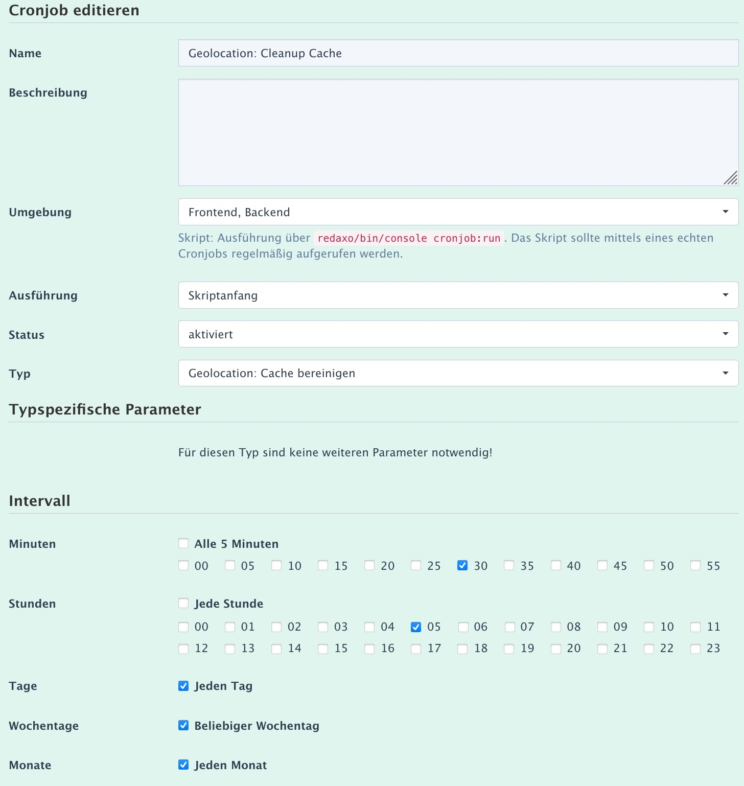

> - [Übersicht](#overview)
> - Installation und Einstellungen
>   - [Installation](install.md)
>   - [Einstellungen](settings.md)
> - [Kartensätze verwalten](mapset.md)
> - [Karten/Layer verwalten](layer.md)
> - [Karten-Proxy und -Cache](proxy_cache.md)
> - [Für Entwickler](devphp.md)
>   - [PHP](devphp.md)
>   - [Javascript](devjs.md)
>   - [JS-Tools](devtools.md)

#Karten-Proxy und -Cache

## Inhalte

In einer Redaxo-Instanz fungiert **Geolocation** als Abruf-Proxy-Srver für Kartenausschnitte vom
Server des Anbieters mit gleichzeitiger Möglichkeit, die abgerufenen Kartenausschnitte (Kacheln)
zwischenzuspeichern (Cache).

- [Übersicht](#into)
- [Abruf-URL für Kartenkacheln](#url)
- [Der Proxy-Server](#proxy)
- [Caching](#cache)
- [Cache-Cronjob](#cron)


<a name="intro"></a>
## Übersicht

Die Leaflet-Karten bestehen aus Kartenkacheln (Tiles), die von einem entsprechenden Server
bereitgestellt werden. Anbieter sind z.B. OpenStreetMap, Google, Apple oder Here. Details zum
Erfassen und Verwalten sind in der Anleitung zur [Verwaltung der Karten](layer.md) zu finden.

In der REDAXO-Instanz fungiert **Geolocation** als

- **Proxy**-Server:
    - Abruf von Kartenkacheln eines Anbieters indirekt über den Server der REDAXO-Instanz

- **Cache**-Server:
    - Zwischenspeichern von Kartenkacheln im Cache-Verzeichnis der REDAXO-Instanz
    - Cache-Verwaltung per Cron-Job

Zur Nutzung der Proxy/Cache-Funktionalität ist es lediglich notwendig, in der
[Kartenverwaltung](layer.md) der Webseite die gewünschten URLs zu konfigurieren.
Das **Geolocation**-Javascript erzeugt die Karten per LeafletJS und nutzt immer den hier
beschriebenen ProxyCache.

Der Proxy kann auch mit Karten eingesetzt werden, die mit anderer Software
(z.B. [OpenLayers](https://openlayers.org/)) erzeugt werden; allerdings muss die URL dann
entsprechend im JS angegeben werden. **Geolocation** sollte dazu als "[nur Proxy](install.md#proxy)"
installiert werden.  

> Es ist nicht notwendig, das zu **Geolocation** gehörende Javascript zu laden, um die
> Proxy-Funktionalität zu nutzen. In der [Installationsbeschreibung](install.md#proxy) ist beschrieben,
> wie **Geolocation** Proxy-optimiert installiert werden kann.

<a name="url"></a>
## Abruf-URL für Kartenkacheln

Die Kartenkacheln können mit einer standardisierten URL vom Server der REDAXO-Instanz abgerufen
werden. Die URL unterscheiden sich nur über die Datensatznummer, unter der die Karten-URL in der
[Karten-Verwaltung](layer.md) erfasst wurde.

```html
index.php?geolayer=«id»&x={x}&y={y}&z={z}
```
oder
```html
?geolayer=«id»&x={x}&y={y}&z={z}
```

Erkennt die `boot.php` von **Geolocation** den URL-Parameter `geolayer` wird versucht, die
entsprechende Kartenkachel mit der Koordinate `{x}/{y}` und Zoom-Faktor `{z}` an den Client
auszuliefern.

Statt `geolayer` kann &mdash; z.B. um Namenskonflikte zu umgehen &mdash; ein individueller
Parameter-Name über die [Systemparameter](install.md#parameter) gesetzt werden.

Das weitere Vorgehen unterscheidet sich abhängig davon, ob Kacheln im Cache gehalten werden oder
nicht.

<a name="proxy"></a>
## Der Proxy-Server

Die REDAXO-Instanz fungiert als Proxy-Server zwischen dem Client und dem Server des Kartenanbieters.

1. Wenn die `«id»` nicht in der Karten-Tabelle gefunden wird, sendet der Server `404 Not Found`.
2. Wenn der Karten-Datensatz auf "offline" gesetzt ist, sendet der Server `404 Not Found`.
3. Aus der URL werden die Parameter `x`, `y` und `z` extrahiert.
4. Mit den Parametern sowie dem zufällig ausgewählten Sub-Domänen-Kürzel wird die Anbieter-URL
   befüllt.
5. Beim Karten-Server wird die Kartenkachel abgerufen.
5. Die Rückgabe vom Tile-Server wird bearbeitet:
    - Fehler: schicke Fehlercode und Fehlermeldung an den Client
    - Erfolg: schicke die Kachel an den Client.

<a name="cache"></a>
## Caching

Das Verfahren mit Caching erweitert die Proxy-Abfrage um die Speicherung der Kacheln in einem
Cache-Verzeichnis . Für jeden Kartentyp wird ein separates Verzeichnis geführt, dessen Name wiederum
die `«id»` ist.

```
/redaxo/cache/addons/geolocation/«id»
```

Voraussetzung ist, dass in der Konfiguration für den Kartentyp `«id»` die 'Aufbewahrungsdauer im
Cache (TTL)' auf mehr als 0 Minuten eingestellt ist.

1. Wenn die `«id»` nicht in der Karten-Tabelle gefunden wird, sendet der Server `404 Not Found`.
2. Wenn der Karten-Datensatz auf "offline" gesetzt ist, sendet der Server `404 Not Found`.
3. Aus der URL werden die Parameter `x`, `y` und `z` extrahiert.
4. Aus den Parametern wird der Cache-Dateiname erzeugt.
5. Die Cache-Datei wird abgerufen
    - Wenn gefunden und nicht abgelaufen (TTL überschritten): schicke die Datei aus dem Cache an den
      Client. Fertig.
    - sonst: Cache-Datei löschen und weiter mit 6.
6. Mit den Parametern sowie dem zufällig ausgewählten Sub-Domänen-Kürzel wird die Anbieter-URL
   befüllt.
7. Beim Karten-Server wird die Kartenkachel abgerufen.
8. Die Rückgabe vom Tile-Server wird bearbeitet:
    - Fehler: schicke Fehlercode und Fehlermeldung an den Client
    - Erfolg: speichere die Kachel im Cache und sende sie an den Client.

<a name="cron"></a>
## Cache-Cronjob

Der Cache wird regelmäßig bereinigt. Dazu startet ein Cronjob `Geolocation: Cleanup Cache`
regelmäßig und führt diese Arbeitsschritte aus:

1. Lösche alle Dateien, deren Aufbewahrungsdauer (TTL) abgelaufen ist.
2. Wenn danach mehr als die zulässige Höchstanzahl Dateien verbleibt, wird die Aufbewahrungsdauer
   halbiert und Schritt 1 erneut durchgeführt.

Die Schritte werden so oft wiederholt, bis die maximale Anzahl Dateien unterschritten ist.

Der Cronjob wird automatisch mit folgenden Parametern installiert:
- Einmal am Tag (05:30 Uhr)
- Backend/Frontend
- Scriptanfang
- aktiviert



Umkonfigurieren des Cronjobs ist möglich; die Daten werden beim Re-Installieren **nicht**
überschrieben. Wurde der Cronjob umbenannt oder gelöscht, wird beim Re-Installieren der
Cronjob `Geolocation: Cleanup Cache` neu angelegt.

Die bei der Installation benutzen Job-Parameter können mit Instanz-individuellen
[Systemparametern](install.md#parameter) überschrieben werden.
