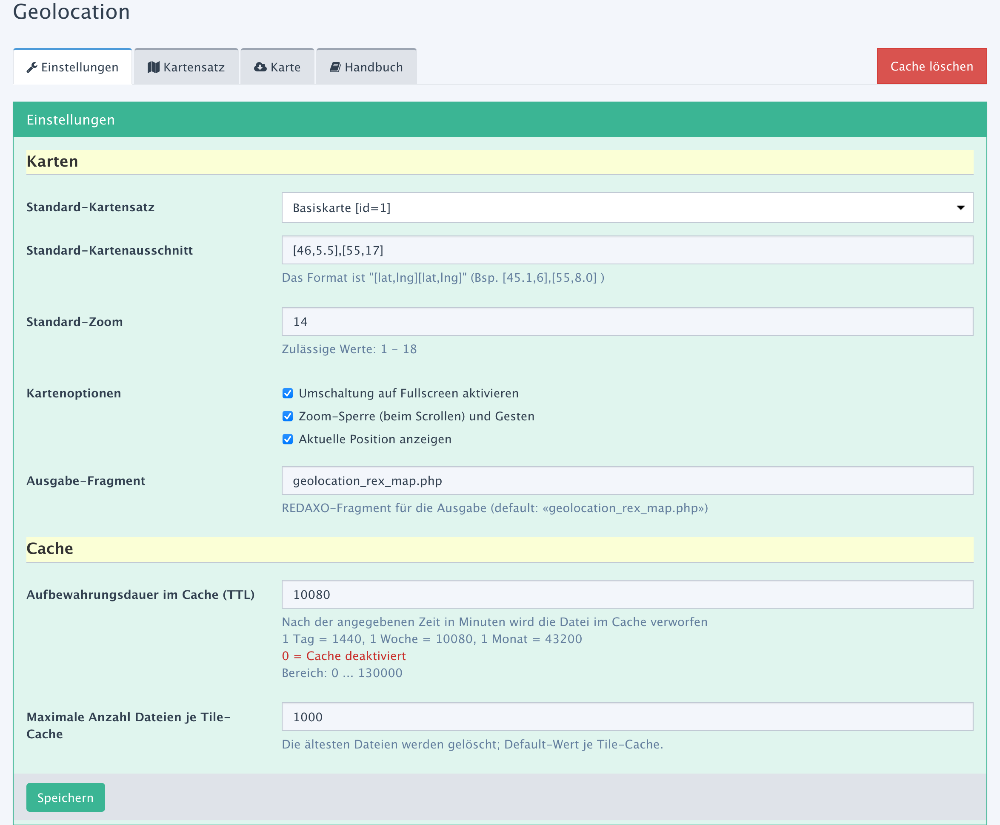

> **Hauptmenü**
> - [Installation und Einstellungen](install.md)
>   - [Installation](install.md)
>   - __Einstellungen__
> - [Kartensätze verwalten](mapset.md)
> - [Karten/Layer verwalten](layer.md)
> - [Karten-Proxy und -Cache](proxy_cache.md)
> - [Für Entwickler](devphp.md)
>   - [PHP](devphp.md)
>   - [Javascript](devjs.md)
>   - [JS-Tools](devtools.md)
>   - [geoJSON](devgeojson.md)
>   - [Rechnen (PHP)](devmath.md)

# Einstellungen

## Übersicht

Das Formular für allgemeine Einstellungen fasst Grundeinstellungen zusammen, die in anderen
Bereichen als Vorgabewerte herangezogen werden. Die Daten werden in der Systemkonfiguration (Tabelle
*rex_config*) gespeichert. Karten-Parameter werden direkt in die Javascript-Komponenten
übertragen, indem die [Asset-Dateien neu zusammengestellt](install.md#ownjscss) werden.



## Karten

**Hinweis:** Wenn das Addon als reines [Proxy-Addon](install.md#proxy) konfiguriert ist, sind die
Eingabefelder für Karten ausgeblendet.

Die Einstellungen sind Vorbelegungen bzw. Parameter für die Darstellung von Karten. Sofern
**Geolocation** nur als Karten-Proxy eingesetzt wird, sind die Einträge irrelevant. In reinen
[Proxy-Modus](install.md#proxy) ist die Sektion ausgeblendet.

- **Kartensatz**

    Der hier ausgewählte Kartensatz wird immer dann beim Aufbau einer Karte herangezogen, wenn
    kein individueller Kartensatz ausgewählt wurde bzw. dient als Vorbelegung in Auswahllisten.

    Beispiel-Code für eigene Scripte:

    ```php
    // ID abrufen und Mapset öffnen
    $mapsetId = \rex_config::get(\FriendsOfRedaxo\Geolocation\ADDON,'default_map');
    $mapset = \FriendsOfRedaxo\Geolocation\Mapset::get($mapsetId);

    // Mapset öffnen mit der Default-ID bzw. Fallback auf die Default-ID
    $mapset = \FriendsOfRedaxo\Geolocation\Mapset::take();
    $mapsetId = $mapset->getId();
    ```

- **Kartenausschnitt**  
    Der angegebene Kartenausschnitt wird als Vorgabewert benutzt, wenn das Tool `bounds` keine
    gültigen Daten hat bzw. wenn die Karte anderweitig nicht auf einen gültigen Auschnitt
    positioniert werden kann.

    Die Angabe ist immer ein Satz aus zwei Koordinaten, die die gegenüberliegenden Ecken eines
    Rechtecks beschreiben. Die Schreibweise ist `[latA,lngA],[latB,lngB]`, also jeweils "Längengrad,
    Breitengrad".

    Beispiel-Code:

    ```php
    // Koordinaten abrufen
    $bounds = \rex_config::get(\FriendsOfRedaxo\Geolocation\ADDON,'map_bounds');
    ```
    ```js
    // Koordinaten abrufen
    let bounds = Geolocation.default.bounds;
    ```

- **Zoom**  
    Der angegebene Zoom-Level wird als Vorgabewert benutzt. Zulässig sind Werte zwischen 2 und 18.

    Beispiel-Code für eigene Scripte:

    ```php
    // Zoom-Level abrufen
    $zoom = \rex_config::get(\FriendsOfRedaxo\Geolocation\ADDON,'map_zoom');
    ```
    ```js
    // Zoom-Level abrufen
    let zoom = Geolocation.default.zoom;
    ```
    > Der Wert wird zur Zeit nicht benutzt, wird aber in das JS übertragen und kann in eigenen Tools
    > ([Beispiel](devtools.md#tcenter) ) eingesetzt werden.

- **Kartenoptionen**  
    Die von **Geolocation** erzeugten Karten können mit unterschiedlichen Zusatzfunktionen versehen
    werden.

    - Im Zoom-Control oben links in der Karte einen Button für Vollbild-Ansicht bereitstellen.
    - Eine Zoom-Sperre und Gestensteuerung aktivieren. Damit wird z.B. ungewollter Zoom beim
      Scrollen der Seite verhindert.
    - Im Zoom-Controll oben links in der Karte einen Button bereitstellen, über den die Karte auf
      die aktuell Position ausgerichtet wird.

    Beispiel-Code für eigene Scripte:

    ```php
    // Liste der Optionen abrufen ('|fullscreen|gestureHandling|locateControl|')
    $options = \rex_config::get(\FriendsOfRedaxo\Geolocation\ADDON,'map_components');
    $hasFullscreen = false !== strpos($options,'|fullscreen|');
    $hasGestureHandling = false !== strpos($options,'|gestureHandling|');
    $hasLocateControl = false !== strpos($options,'|locateControl|');
    $optionsArray = explode('|',trim($options.'|'));
    ```
    ```js
    // Optionen abrufen (true/false)
    let hasFullscreen = Geolocation.default.mapOptions.fullscreen;
    let hasGestureHandling = Geolocation.default.mapOptions.gestureHandling;
    let hasLocateControl = Geolocation.default.mapOptions.locateControl;
    ```

- **Ausgabe-Fragment**  
    PHP-seitig verfügt **Geolocation** über leistungsfähige Methoden, das Karten-HTML einfach zu
    generieren. Dabei wird i.d.R. das Fragment *geolocation_rex_map.php* genutzt. Wenn eine andere
    HTML-Auslegung gewünscht ist, kann hier das alternative Standard-Fragment festgelegt werden.

    Die Eingabe darf nicht leer sein und muss auf `.php` enden.

    In den [Kartensätzen](mapset.md#mapset_out) kann ein abweichendes Fragment als Default-Wert für den
    Kartensatz festgelegt werden.

    Beispiel-Code für eigene Scripte:

    ```php
    // Default-Ausgabefragment abrufen
    // aus der Tabelle rex_config
    $fragment = \rex_config::get(\FriendsOfRedaxo\Geolocation\ADDON,'map_outfragment');
    // als Konstante
    $fragment = \FriendsOfRedaxo\Geolocation\OUT;
    ```

<a name="cache"></a>
## Cache

Die hier angegebenen Werte dienen bei der Erfassung neuer Karten-Server als Vorbelegung für das
Cache-Verhalten.

- **Aufbewahrungsdauer im Cache (TTL)**  
    In Minuten wird angegeben, wie lange eine Datei im Cache verbleibt, bevor sie gelöscht wird.
    Dabei entsprechen
    - **0 = Cache ist deaktiviert**
    - 1440 = 1 Tag
    - 10080 = 1 Woche
    - 43200 = 1 Monat (30 Tage)

    Der Maximalwert ist 130000, also ein Quartal.
    ```php
    // Vorgabewert für die Time-to-live
    $ttl = \rex_config::get(\FriendsOfRedaxo\Geolocation\ADDON,'cache_ttl');
    // ... oder ...
    $ttl = \FriendsOfRedaxo\Geolocation\TTL_DEF;
    ```

- **Maximale Anzahl Dateien je Karten-Cache**  
    Um nicht insgesamt zu viel Plattenplatz mit Kartenbildern zu belegen, kann der Platz begrenzt
    werden über die Anzahl Dateien. Gelöscht wird erst über den [Cron-Job](proxy_cache.md#cron).

    Beim Speichern wird nicht überprüft, ob die Obergrenze erreicht ist. Erst der Cron-Job nutzt den
    Wert. Ein voller Cache (kein Plattenplatz) würde dazu führen, dass eine Datei nicht neu im Cache
    gespeichert wird; sie wird unabhängig vom Caching dennoch an den Client ausgeliefert.
    ```php
    // Vorgabewert für die maximale Anzahl Dateien im Cache
    $maxCacheFiles = \rex_config::get(\FriendsOfRedaxo\Geolocation\ADDON,'cache_maxfiles');
    // ... oder ...
    $maxCacheFiles = \FriendsOfRedaxo\Geolocation\CFM_DEF;
    ```
